# Application Technical Profile

This document provides a detailed technical analysis of the SDCIM (Sistema de Depósito e Concentração de Imagens) application. The analysis is based on a static review of the provided source code files. It covers the application's architecture, technology stack, functional aspects, and potential modernization strategies.

## 1. Application overview
This section provides a high-level summary of the application, detailing its primary purpose, components, and technical specifications as inferred from the source code.

| Attribute | Value |
| :--- | :--- |
| **Acronym** | SDCIM |
| **Application name** | Image Concentration System |
| **Primary business purpose** | A comprehensive system for processing and managing bank remittances (deposits, checks) and their associated images, handling workflows from branch offices, and integrating with backend systems. |
| **Business domain** | Banking, Financial Services, Image Processing, Remittance Management |
| **Solution files** | 2 solutions found: `CIControloComSetup.sln`, `CIControloSemSetup.sln` |
| **Project files** | 18 projects found: `Alerta.csproj`, `CIActividades.csproj`, `CIConfigGlobalParameters.csproj`, `CIConfiguration.csproj`, `CIControlo.csproj`, `CIDepositoErro.csproj`, `CIFicheiro.csproj`, `CIFicheirosControlo.csproj`, `CIReports.csproj`, `CIServAlertas.csproj`, `CIServRemessas.csproj`, `CIServico.csproj`, `CIServTester.csproj`, `CITestes.csproj`, `MDIsControlo.csproj`, `MDIWebTransmCI.vbproj`, `QueryForm.csproj`, `SetupCIControlo.vdproj` |
| **Files** | 280 files analyzed, including: C# source files (`.cs`), VB.NET source files (`.vb`), C# project files (`.csproj`), VB.NET project files (`.vbproj`), Solution files (`.sln`), Configuration files (`.config`), Resource files (`.resx`), SQL files (`.sql`), Batch scripts (`.bat`). |
| **Main programming language(s)** | C#, VB.NET |
| **Target .NET Framework(s)** | .NET Framework 4.0 |
| **Application type** | Composite Application (Windows Forms UI, Windows Service, Class Libraries) |
| **Output type** | `.exe` (Executable), `.dll` (Dynamic Link Library), Windows Service |
| **Deployment model** | On-premises |
| **Deployment target platform** | AnyCPU |
| **Complexity** | 🔴 High complexity |
| **Last updated (Source code)** | 2016-01-01 |
| **Last updated (Documentation)** | 2025-08-07 |

### 1.1. Main components and features
The application is composed of several key components that work together to provide its core functionality. The following table breaks down these components, their purpose, and key features.

| Component | Description | Key features | Dependencies | Related projects | Technologies |
| :--- | :--- | :--- | :--- | :--- | :--- |
| **User Interface** | Provides graphical interfaces for users to manage and monitor remittance processing activities. | - Remittance and document tracking - Status monitoring - Manual state changes - User and configuration management | `CIConfigGlobalParameters`, `NBIISNET` | `CIControlo.csproj`, `CIActividades.csproj` | Windows Forms |
| **Remittance Processing Service** | A backend Windows Service that automates the processing of remittances, tranches, and documents. | - Polling for new remittances - Transactional processing of tranches - State management for documents and remittances | `CIServico.csproj`, `CIConfigGlobalParameters` | `CIServRemessas.csproj` | .NET Windows Service |
| **Alerting System** | A module responsible for generating and dispatching alerts based on system events and situations. | - Email notifications (SMTP/EWS) - SMS notifications - Logging to database and event viewer | `CIConfigGlobalParameters` | `Alerta.csproj`, `CIServAlertas.csproj` | C# Library |
| **Data & Configuration** | Core libraries for managing global parameters, database connections, and application configuration. | - Centralized database access - User session management - Reading from `.config` files | `System.Data.SqlClient`, `GenericNet.dll` | `CIConfigGlobalParameters.csproj`, `CIConfiguration.csproj` | C# Library |
| **Reporting** | Generates reports based on the application's data, such as remittance summaries and processing statistics. | - Monthly billing reports - Remittance listings - ACOM file summaries | `CrystalDecisions` | `CIReports.csproj` | Crystal Reports |
| **External Integrations** | Handles communication with external systems, including web services for document submission. | - SOAP client for document insertion | `System.Web.Services` | `MDIWebTransmCI.vbproj` | VB.NET Library, SOAP |

A diagram illustrating the interaction between these main components is shown below.

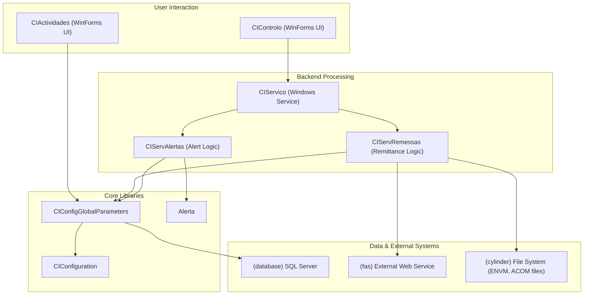

Figure 1 - High-level component interaction diagram showing the relationships between the UI, backend services, core libraries, and external systems.

### 1.2. Solutions
The application code is organized into two main solution files, likely for different deployment or development scenarios.

| Solution | Projects | Visual studio version |
| :--- | :--- | :--- |
| **CIControloComSetup.sln** | - `CIControlo.csproj` - `QueryForm.csproj` - `CIConfigGlobalParameters.csproj` - `CIConfiguration.csproj` - `CIActividades.csproj` - `CIReports.csproj` - `Alerta.csproj` - `CIServRemessas.csproj` - `CIServTester.csproj` - `CIServAlertas.csproj` - `CIServico.csproj` - `CIFicheirosControlo.csproj` - `CIFicheiro.csproj` - `MDIsControlo.csproj` - `MDIWebTransmCI.vbproj` - `SetupCIControlo.vdproj` | 2010 |
| **CIControloSemSetup.sln** | - `CIControlo.csproj` - `QueryForm.csproj` - `CIConfigGlobalParameters.csproj` - `CIConfiguration.csproj` - `CIActividades.csproj` - `CIReports.csproj` - `Alerta.csproj` - `CIServRemessas.csproj` - `CIServTester.csproj` - `CIServAlertas.csproj` - `CIServico.csproj` - `CIFicheirosControlo.csproj` - `CIFicheiro.csproj` - `MDIsControlo.csproj` - `MDIWebTransmCI.vbproj` - `CITestes.csproj` - `CIDepositoErro.csproj` | 2010 |

The following mind map illustrates the structure of the solutions and their contained projects.

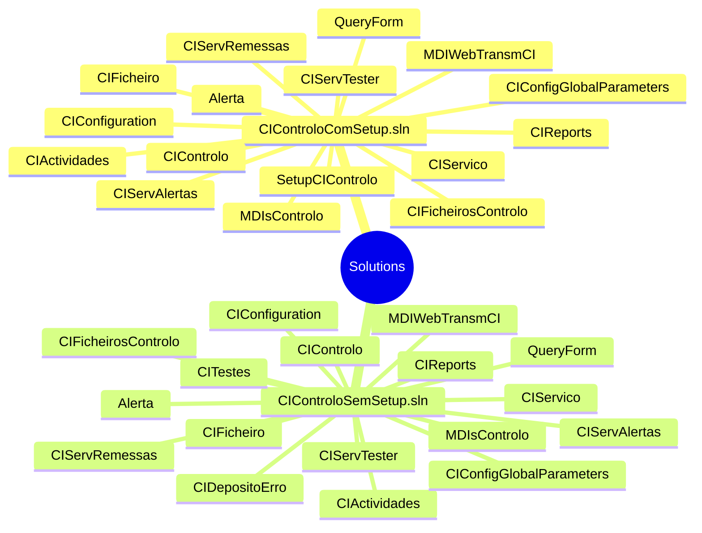

Figure 2 - Mind map of the solution files and their corresponding projects.

### 1.3. Projects
This section details each project within the solutions, outlining its purpose, type, and key dependencies.

| Solution | Project | Main objectives | Type | Output type | Version | Runtime | Framework | Architecture | Compilation mode | Principal classes | Internal dependencies | External dependencies |
| :--- | :--- | :--- | :--- | :--- | :--- | :--- | :--- | :--- | :--- | :--- | :--- | :--- |
| Both | **CIControlo.csproj** | Main GUI application for system control and monitoring. | Windows Application | Executable | 1.3.0.5 | v4.0.30319 | .NET Framework 4.0 | AnyCPU | Debug/Release | `CIMainForm` | `CIActividades`, `CIConfiguration`, `CIReports`, `CIServTester`, `MDIsControlo` | `NBIISNET` |
| Both | **CIActividades.csproj** | Provides UI forms for monitoring activities related to remittances, tranches, and documents. | Class Library | Library | 1.0.0.0 | v4.0.30319 | .NET Framework 4.0 | AnyCPU | Debug/Release | `ActividadesForm`, `ActividadeBalcaoForm` | `Alerta`, `CIConfigGlobalParameters` | `NBIISNET` |
| Both | **CIServico.csproj** | A Windows Service for automated background processing of remittances and alerts. | Windows Service | Executable | 1.0.0.0 | v4.0.30319 | .NET Framework 4.0 | AnyCPU | Debug/Release | `CIServico`, `CIServicoThread` | `CIServRemessas`, `CIServAlertas` | `NBIISNET` |
| Both | **CIServRemessas.csproj** | Contains the core business logic for processing remittances and their associated documents and tranches. | Class Library | Library | 1.0.0.0 | v4.0.30319 | .NET Framework 4.0 | AnyCPU | Debug/Release | `ServRemessa` | `CIActividades`, `Alerta` | `NBIISNET` |
| Both | **CIConfigGlobalParameters.csproj** | Central library for managing global settings, database connections, and user information. | Class Library | Library | 1.0.0.0 | v4.0.30319 | .NET Framework 4.0 | AnyCPU | Debug/Release | `CIGlobalParameters`, `User` | `System.Data` | `GenericNet` |
| Both | **Alerta.csproj** | Defines the data structures and logic for the system's alerting and notification features. | Class Library | Library | 1.0.0.0 | v4.0.30319 | .NET Framework 4.0 | AnyCPU | Debug/Release | `Accao`, `AlertaSituacaoAccao` | `CIConfigGlobalParameters` | `GenericNet` |
| Both | **MDIWebTransmCI.vbproj** | A VB.NET library that acts as a client for an external SOAP web service to insert documents. | Class Library | Library | 1.0.0.0 | v4.0.30319 | .NET Framework 4.0 | AnyCPU | Debug/Release | `TInsertDoc` | `CIConfigGlobalParameters` | `System.Web.Services` |
| `CIControloSemSetup.sln` | **CITestes.csproj** | A test project for verifying the functionality of the remittance processing service. | Test Library | Library | 1.0.0.0 | v4.0.30319 | .NET Framework 4.0 | AnyCPU | Debug/Release | `CIServRemessaTestes` | `CIServRemessas`, `CIServTester` | `Microsoft.VisualStudio.QualityTools.UnitTestFramework` |
| Both | **Other Libraries** | Various other class libraries providing configuration, reporting, file control, and testing support. | Class Library | Library | 1.0.0.0 | v4.0.30319 | .NET Framework 4.0 | AnyCPU | Debug/Release | Multiple | Multiple | Multiple |

The following diagram illustrates the primary dependencies between the main executable, the service, and the core libraries.

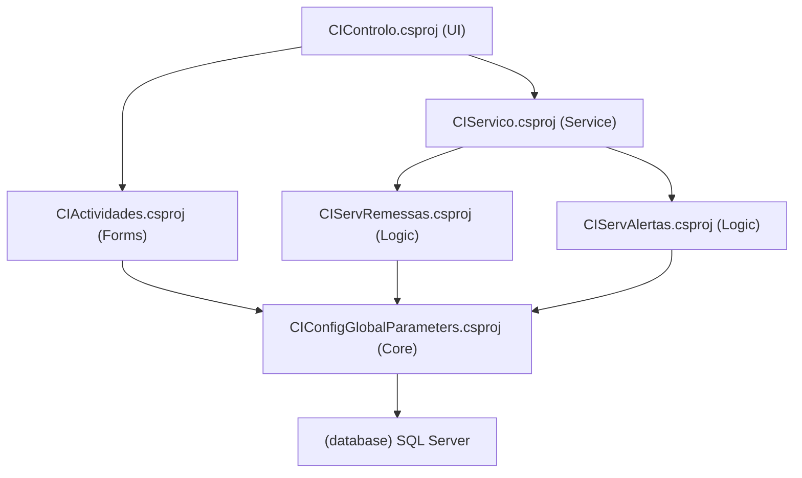

Figure 3 - Project dependency graph showing key relationships.

## 2. Functional overview
This section provides a high-level functional decomposition of the application, using table format. It identifies the major, distinct functional blocks or modules as inferred from the code's high-level structure (e.g., top-level namespaces, solution folders, primary class groups). This overview serves as a map to the application's core responsibilities.

### 2.1. Executive summary
This section provides a high-level summary of the application's primary purpose and its core function from a business or operational perspective, using table format. The summary is an inference based on the main entry points of the code (e.g., `main()`, `Application_Start()`), the names of the most central classes and modules, and the nature of the core processes identified. It answers the fundamental question: What primary problem does this application solve?

| Attribute | Description |
| :--- | :--- |
| **Application Name** | Image Concentration System (SDCIM) |
| **Primary Business Purpose** | The application serves as a central hub for processing financial remittances, primarily checks and deposits, from branch offices. It manages the lifecycle of these remittances, including data capture, image processing, validation, transaction processing (tranches), and handling of returns/reversals (estornos). |
| **Core Function** | To automate and provide a control interface for the ingestion, processing, and management of banking remittances, ensuring data integrity and providing visibility into the operational workflow from branches to central processing. |
| **Key Processes** | - **Remittance Processing:** Handles incoming remittance data, processes documents in batches (tranches), and updates their status. - **Activity Monitoring:** Provides a Windows-based user interface for operators to monitor the status of remittances, tranches, and individual documents. - **Alerting:** Generates and sends system alerts (via email, event log) for various operational situations. - **Configuration & User Management:** Allows administrators to configure system parameters and manage user access. |
| **Primary Actors** | - **System Operators/Administrators:** Use the `CIControlo` and `CIActividades` front-end to monitor and manage the system. - **Automated Service (`CIServico`):** A Windows Service that runs in the background to perform automated processing tasks. |
| **Inferred from** | - **Project Names:** `CIServRemessas` (Remittance Service), `CIActividades` (Activities), `Alerta` (Alerts), `CIControlo` (Control). - **Class Names:** `ServRemessa`, `ProcessarTrancheBalcao`, `ActividadeBalcaoForm`, `AlertaSituacaoAccao`. - **Code Logic:** The `CIServico` project contains a Windows Service that periodically checks for work (`CheckForThingToDo`) and processes remittances (`ProcessaRemessa`). The `CIActividades` project contains Windows Forms for displaying data from database views like `VW_REMESSA_BALCAO_DETALHE`. |

### 2.2. Functional decomposition
This section provides a detailed breakdown of the application's functional areas or modules, inferred from the code structure. Each module is described in terms of its primary responsibilities and how it contributes to the overall functionality of the application.

| Functional Area / Module | Description |
| :--- | :--- |
| **User Interaction & Presentation** | Manages user interfaces, handles user input, and renders data. This module is the primary interface between the user and the system's core logic. It is composed of multiple Windows Forms screens for monitoring, configuration, and manual intervention. |
| **Core Process Execution Engine** | A Windows Service that runs in the background, polling for new work. It orchestrates the processing of remittances, tranches, and alerts, forming the automated core of the application. |
| **Remittance & Document Business Logic** | Encapsulates the rules and procedures for handling remittances. This includes creating tranches, processing documents, managing state transitions, and handling reversals ("estornos"). |
| **Alerting & Notification** | Manages the creation and dispatch of system alerts. It supports various notification channels, including database logging, file logging, email, and the Windows Event Viewer. |
| **Data Persistence & Management** | Provides a centralized mechanism for database interaction. It handles all SQL queries and stored procedure calls, abstracting the data access logic from the business and presentation layers. |
| **Configuration Management** | Responsible for loading and providing access to application settings from configuration files, including database connection strings and operational parameters. |
| **External System Integration** | Contains the logic for communicating with external systems, specifically a SOAP-based web service for inserting document data into a remote system. |

The following diagram visualizes the layered nature of the functional decomposition.

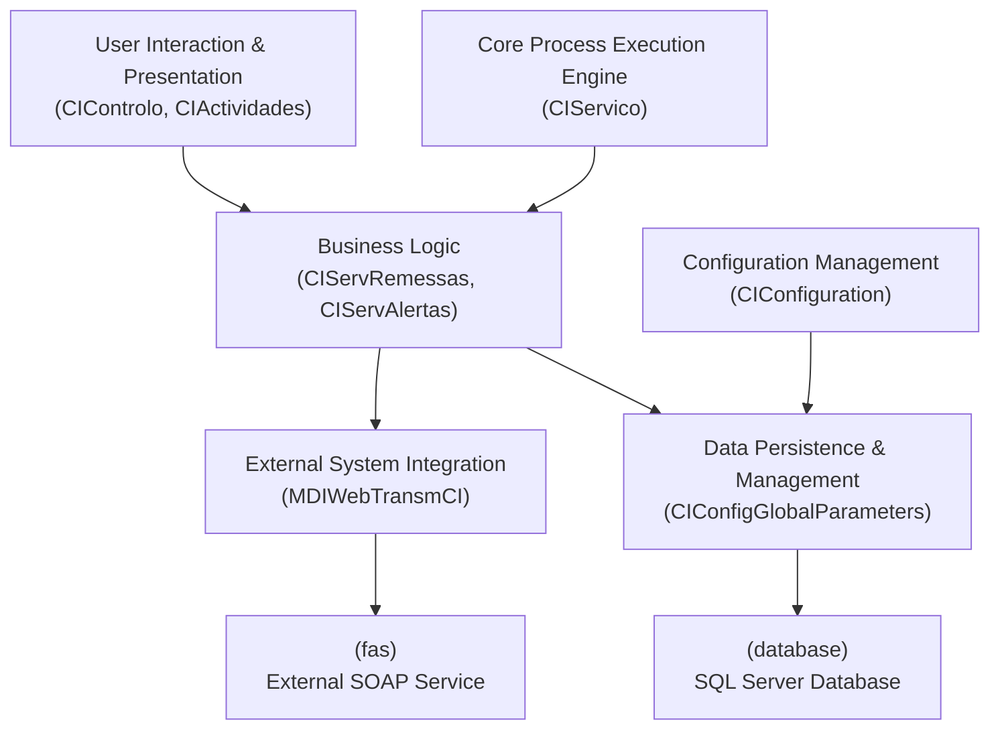

Figure 4 - Functional decomposition of the application, showing the layers of responsibility from UI and services down to data and external integrations.

### 2.3. User roles and permissions
This section identifies the distinct types of users that interact with the application. These roles are inferred from the logic in the `CIActividades` project, which checks user group levels to enable or disable functionality.

| Role | Description | Permissions | Key Actions | Key Data Entities | Assumptions |
| :--- | :--- | :--- | :--- | :--- | :--- |
| **Administrator / Power User** | A role with elevated privileges, typically for system management and manual intervention in core business processes. | - Full CRUD on most or all data entities. - Ability to manually change the state of remittances and tranches. - Access to system configuration and user management. | `ChangeEstado`, `ReenviarTodasRemessasEmErro`, `Insert_Utilizadores`, `Update_Utilizadores`, `Delete_Utilizadores` | `Remessa`, `Tranche`, `Documento`, `User`, `Group`, `SystemConfig` | Inferred from `ConfirmaPrivilegios()` method, which checks if `m_oParameters.UserLogged.m_iUserGroup <= 1`. This group level is assumed to have administrative rights. |
| **Standard Operator** | A standard user role focused on monitoring and viewing operational data without the ability to perform sensitive actions. | - Read-only access to remittance and document data. - Ability to perform searches and view reports. - No permission to change states or alter system configuration. | `ViewRemittanceDetails`, `ViewDocumentImage`, `SearchRemittances`, `GenerateReport` | `Remessa`, `Tranche`, `Documento`, `Report` | Inferred as any user with `m_oParameters.UserLogged.m_iUserGroup > 1`. This group level is locked out of administrative functions. |

The class diagram below illustrates the relationship between these user roles and the system.

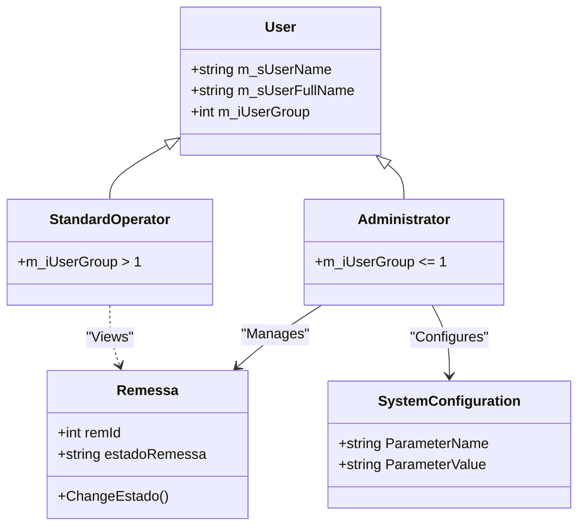

Figure 5 - Class diagram showing user roles and their primary interactions with key system entities.

### 2.4. Core business capabilities
This section lists the main, high-level capabilities of the application, representing its major functional domains.

| Capability | Description | Key Features | Key Data Entities | Assumptions |
| :--- | :--- | :--- | :--- | :--- |
| **Remittance Ingestion & Processing** | The complete set of functions related to bringing remittance data into the system and processing it through various states. | - Automated polling for new remittances. - Processing of bank branch remittances (`Balcao`). - Creation and management of transaction batches (`Tranches`). - State transition management (e.g., from `Fechado` to `Processado`). | `Remessa_Balcao`, `Tranche_Out`, `Documento_Balcao`, `RemessaIn_Status` | Assumes that the `CIServico` Windows Service is the primary driver for this capability. Inferred from classes like `ServRemessa` and methods like `RemessaBalcaoParaProcessar`. |
| **Document Management & Viewing** | Functions related to handling individual documents and their associated images within a remittance. | - Viewing document images (front and back). - Associating documents with remittances and tranches. - Handling document-level errors and states. | `Documento`, `Documento_Balcao`, `Imagem`, `Imagem_Balcao` | Inferred from the presence of `MostraImagem` and `ImagemBalcaoForm` forms, which are dedicated to displaying images fetched from the database. |
| **Exception & Reversal Handling** | The capability to manage exceptions, errors, and business-level reversals ("estornos") of remittances and documents. | - Re-sending remittances that failed. - Processing and tracking of remittance reversals. - UI for viewing and managing items in an error state. | `Estorno_Remessa_Balcao`, `Estorno_Documento` | Inferred from UI elements and methods like `btnRemessasErro_Click`, `mudarEstadoToolStripMenuItem_Click`, and views like `VW_ESTRN_REMESSA_BALCAO_DETALHE`. |
| **System Monitoring & Alerting** | Provides real-time and historical views of system activities and generates alerts for predefined operational situations. | - UI dashboards for activity monitoring (`ActividadesForm`). - Generation of alerts for system events (e.g., processing failures). - Dispatch of alerts via email, event log, and other channels. | `Alerta`, `Alerta_Situacao_Accao`, `GenericLog` | Inferred from the `Alerta` project and its related classes, which define actions (`Accao`) for different situations (`Situacao`). |
| **Configuration & User Administration** | Allows privileged users to configure system parameters and manage user accounts and permissions. | - Setting operational parameters (e.g., processing timers, batch sizes). - Creating, updating, and deleting user accounts. - Assigning users to permission groups. | `User`, `Group`, `CI_PARAMETER` | Inferred from the `CIConfiguration` project and forms like `UtilizadoresForm` and `CIConfigForm`. |

The following diagram illustrates the relationships between these core capabilities.

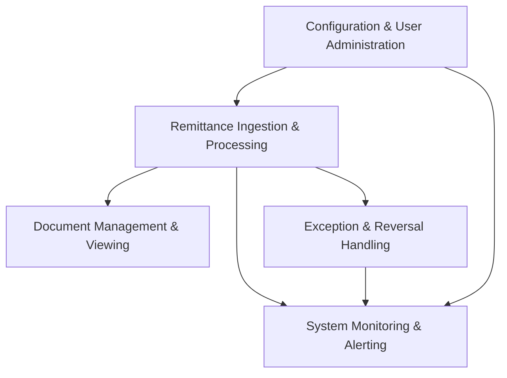

Figure 6 - Core business capabilities and their high-level interactions.

### 2.5. Detailed feature breakdown
This section provides a granular breakdown of individual features within each Core Business Capability.

| Feature | User Story / Description | Key Data Entities | Assumptions |
| :--- | :--- | :--- | :--- |
| **Process Branch Remittance** | As a **System Service**, I can **poll for new branch remittances** in a "ready" state so that they can be processed into tranches and sent for clearing. The service calls `RemessaBalcaoParaProcessar` to find work and then `TratarTranchesBalcao` to execute the processing logic. | `Remessa_Balcao`, `Tranche_Out`, `Documento_Balcao` | Assumes the `CIServico` Windows Service is the actor. Inferred from `ServRemessa.cs`. |
| **View Remittance Details** | As a **Standard Operator**, I can **search for a remittance** by date, branch, or ID and **view its details** and associated documents to monitor its status. The `ActividadeBalcaoForm` provides filters and list views for this purpose. | `VW_REMESSA_BALCAO_DETALHE`, `VW_DETALHE_DOCUMENTOS_BALCAO` | Inferred from the UI design and event handlers in `ActividadeBalcaoForm.cs`. |
| **Manually Change Remittance State** | As an **Administrator**, I can **select a remittance** in the UI and **manually change its state** to resolve processing errors or force a specific workflow step. The `MudarEstadoForm` is invoked for this action. | `Remessa_Balcao`, `Activity_Change` | Inferred from `toolStripMenuRemessaMudarEstado_Click` event handler and the `ConfirmaPrivilegios()` check. |
| **Handle Remittance Reversal (Estorno)** | As a **System Service**, I can **process remittance reversals** to handle returned checks or other exceptions. The system provides separate views and logic for "estornos". | `Estorno_Remessa_Balcao`, `VW_ESTRN_REMESSA_BALCAO_DETALHE` | Inferred from UI elements and methods dedicated to "Estorno" in `ActividadeBalcaoForm.cs`. |
| **View Document Image** | As a **Standard Operator**, I can **double-click a document** in a list to **view its scanned image** (front and back) for verification or analysis. | `Imagem`, `Imagem_Balcao` | Inferred from `listViewDetalhesDocumentos_DoubleClick` event handler which opens the `ImagemBalcaoForm`. |
| **Configure System Alerts** | As an **Administrator**, I can **associate system events (Situations) with notification actions** (e.g., email, log) to ensure operational issues are flagged. | `Alerta_Situacao`, `Alerta_Accao`, `Alerta_Situacao_Accao` | Inferred from the `CIConfigForm` UI, which allows linking situations to actions. |

### 2.6. Key data entities and their attributes
This section documents the application's core data structures, as inferred from class definitions and database interaction patterns.

| Entity | Description | Key Attributes | Data Type | Validation Rules | Relationships | Assumptions |
| :--- | :--- | :--- | :--- | :--- | :--- | :--- |
| **RemessaBalcao** | Represents a remittance batch submitted from a bank branch. | `ID`, `REMBALCAO_DATA`, `REMBALCAO_BALCAO`, `REMBALCAO_STAT_ID` | `int`, `DateTime`, `int`, `int` | `ID` is a primary key. `REMBALCAO_STAT_ID` is a foreign key to a status table. | Has a one-to-many relationship with `DocumentoBalcao`. May have one-to-many with `Tranche_Out`. | Inferred from classes like `DetalheRemessa` and views like `VW_REMESSA_BALCAO_DETALHE`. |
| **DocumentoBalcao** | Represents a single document (e.g., a check) within a branch remittance. | `ID`, `REMBALCAO_ID`, `DOC_ZONA2` (Montante), `DOC_NIB`, `DOCSTAT_ID` | `int`, `int`, `decimal`, `string`, `int` | `ID` is a primary key. `REMBALCAO_ID` is a foreign key to `RemessaBalcao`. | Belongs to one `RemessaBalcao`. May belong to one `Tranche_Out`. Has one or more `Imagem_Balcao`. | Inferred from `DetalheDocumento` class and views like `VW_DETALHE_DOCUMENTOS_BALCAO`. |
| **Tranche_Out** | A batch of documents created for transmission to an external system. | `TRANOUT_ID`, `REMIN_ID`, `TRANOUTSTAT_ID`, `TRANOUT_NUMERO` | `int`, `int`, `int`, `int` | `TRANOUT_ID` is a primary key. `REMIN_ID` links back to the source remittance. | Belongs to one `RemessaBalcao`. Contains many `DocumentoBalcao`. | Inferred from `DetalheTranche` class and the logic for creating tranches from remittances. |
| **Alerta** | Represents a system alert triggered by a specific event or situation. | `ALERT_ID`, `AL_TIMER`, `AL_TEXT`, `SITUACAO_ID` | `int`, `DateTime`, `string`, `int` | `ALERT_ID` is a primary key. | Belongs to one `Alerta_Situacao`. Triggers one or more `Alerta_Accao`. | Inferred from the `Alerta` project and classes like `AlertaSituacaoAccao`. |
| **Accao** | Defines a notification action that can be performed in response to an alert. | `ACC_ID`, `ACC_DESC`, `TIPACC_ID` | `int`, `string`, `enum` | `ACC_ID` is a primary key. `TIPACC_ID` defines the type (Email, SMS, Log). | Can be associated with multiple `Alerta_Situacao`. | Inferred from the `Accao.cs` class definition. |

The following Entity-Relationship diagram illustrates the connections between these core data entities.

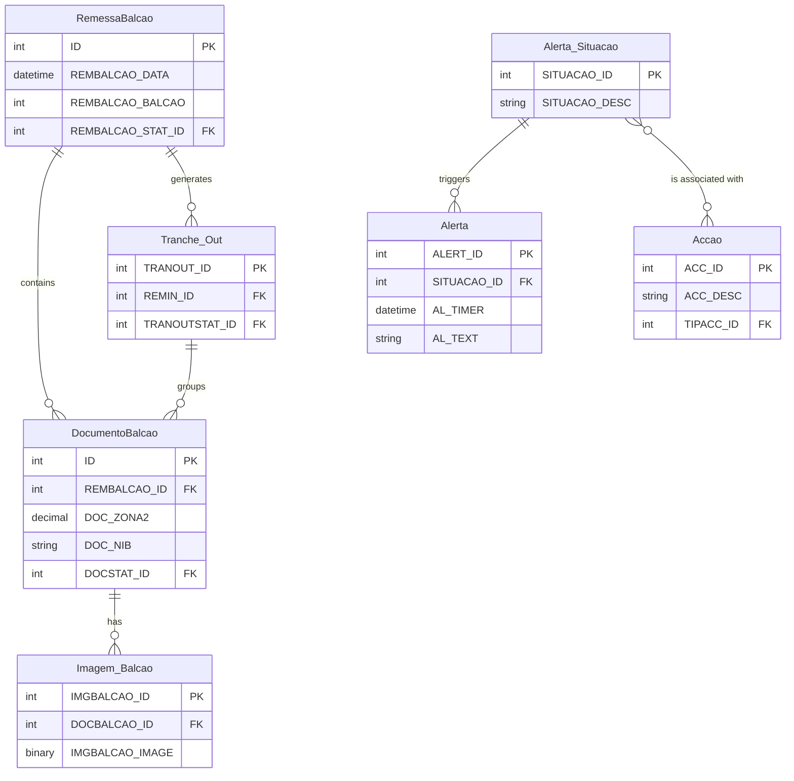

Figure 7 - Entity-Relationship diagram of key data entities.

### 2.7. Business process workflows
This section describes and visualizes critical end-to-end processes, showing how different user roles and system features interact.

| Process | Description | Key Steps | User Roles Involved | Key Data Entities | Assumptions |
| :--- | :--- | :--- | :--- | :--- | :--- |
| **Standard Remittance Processing Pipeline** | A comprehensive workflow that outlines the steps involved in processing branch remittances from ingestion to final output. | 1. Remittance is created (status: `Fechado`). 2. Service polls for new remittances (`REMIN_IDParaProcessar`). 3. Remittance is processed into tranches (`TratarTranchesBalcao`). 4. Tranches are sent to an external system. 5. Status is updated to `Processado` or `Enviado`. | System Service, Administrator (for monitoring/intervention) | `Remessa_Balcao`, `Documento_Balcao`, `Tranche_Out` | Assumes a linear progression of states managed primarily by the `CIServico` Windows Service. |
| **Remittance Reversal (Estorno) Workflow** | Outlines the process for handling a remittance that needs to be reversed or returned. | 1. A reversal request is initiated. 2. The system identifies the original remittance and documents. 3. A reversal record (`Estorno_Remessa_Balcao`) is created. 4. The reversal is processed and its status is tracked separately from the original remittance. | System Service, Standard Operator (for viewing), Administrator (for intervention) | `Estorno_Remessa_Balcao`, `VW_ESTRN_REMESSA_BALCAO_DETALHE` | Inferred from the dedicated UI tabs and data views for "Estornos" in `ActividadeBalcaoForm`. |
| **Manual State Intervention** | A workflow initiated by a user to manually correct the state of a remittance or tranche that has encountered an error. | 1. Administrator identifies a remittance in an error state. 2. User right-clicks and selects "Mudar Estado". 3. User chooses a new valid state from a list. 4. System updates the state and logs the manual change. | Administrator | `Remessa_Balcao`, `Tranche_Out`, `Activity_Change` | Based on the `MudarEstadoForm` and the privilege checks in the UI code. |

The diagram below shows the high-level relationship between these workflows.

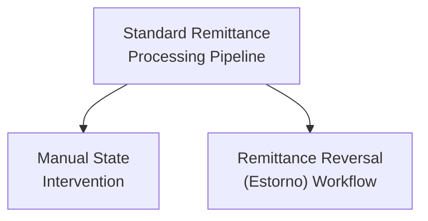

Figure 8 - High-level overview of the main business process workflows.

#### 2.7.1. Workflow: Standard Remittance Processing Pipeline
This section provides a detailed breakdown of the Standard Remittance Processing Pipeline workflow, including the steps involved, user roles, key data entities, and any assumptions made, using a table format.

| Step | Description | User Role | Key Data Entities | Assumptions |
| :--- | :--- | :--- | :--- | :--- |
| **1. Remittance Ingestion** | A new remittance from a branch is created in the database with an initial status (e.g., `20 - Fechado`). | System (External Process) | `Remessa_Balcao` | Assumes an external process or an initial data load creates the remittance record. |
| **2. Polling for Work** | The `CIServico` Windows Service periodically queries the database for remittances ready for processing using `RemessaBalcaoParaProcessar`. | System Service | `Remessa_Balcao` | The service runs on a timer and polls the database for work. |
| **3. State Update to 'Processing'** | Once a remittance is picked up, its status is updated to `30 - Em Processamento` to prevent other service instances from processing it. | System Service | `Remessa_Balcao` | This is a standard locking mechanism for distributed processing. |
| **4. Tranche Creation** | The service calls `TratarTranchesBalcao`, which reads the documents of the remittance and groups them into one or more `Tranche_Out` records based on system limits (`MaxDocsTranche`). | System Service | `Documento_Balcao`, `Tranche_Out` | Documents are processed sequentially and batched. |
| **5. Document Processing** | Each document within a tranche is validated, and its state is updated. A unique hash (`ChaveH`) is generated. | System Service | `Documento_Balcao` | Inferred from the `ProcessaDocumentoBalcao` method. |
| **6. Final State Update** | After all tranches are processed, the remittance status is updated to `40 - Processado` or `25 - Espera de Maquinas` if further steps are needed. If errors occurred, it's set to `-40 - Erro no Processamento`. | System Service | `Remessa_Balcao` | The final state depends on the outcome of the processing steps. |

The diagram below visualizes the steps of this workflow.

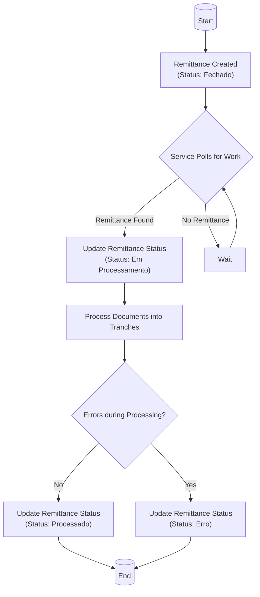

Figure 9 - Detailed steps of the Standard Remittance Processing Pipeline.

#### 2.7.2. Workflow: Remittance Reversal (Estorno) Workflow
This section provides a detailed breakdown of the Remittance Reversal (Estorno) Workflow, including the steps involved, user roles, key data entities, and any assumptions made, using a table format.

| Step | Description | User Role | Key Data Entities | Assumptions |
| :--- | :--- | :--- | :--- | :--- |
| **1. Reversal Identification** | An external event or a user action triggers the need for a reversal. The system identifies the original remittance and documents to be reversed. | System Service or Administrator | `Remessa_Balcao`, `Documento_Balcao` | The trigger mechanism is not fully detailed but is assumed to exist. |
| **2. Create Reversal Record** | A new record is created in a dedicated table (`Estorno_Remessa_Balcao`) to track the reversal process independently of the original transaction. | System Service | `Estorno_Remessa_Balcao` | Reversals are treated as separate transactions that reference the original. |
| **3. Process Reversal** | The system processes the reversal, which may involve creating reversal transactions and updating the status of the `Estorno` record. | System Service | `Estorno_Remessa_Balcao` | This process mirrors the standard processing pipeline but for reversal transactions. |
| **4. Monitor Reversal Status** | Operators can view the status of reversals in a dedicated UI tab in `ActividadeBalcaoForm`. | Standard Operator, Administrator | `VW_ESTRN_REMESSA_BALCAO_DETALHE` | The UI provides separate views for standard remittances and reversals. |
| **5. Handle Reversal Errors** | If the reversal process fails, an administrator can intervene manually, similar to the standard workflow, using the "Mudar Estado" feature on the reversal record. | Administrator | `Estorno_Remessa_Balcao` | The same manual intervention mechanisms apply to reversal workflows. |

The diagram below visualizes the steps of this workflow.

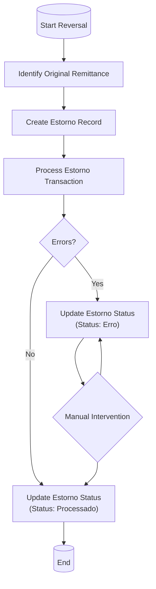

Figure 10 - Detailed steps of the Remittance Reversal (Estorno) Workflow.

### 2.8. System inputs & outputs (interfaces)
This section catalogs all identified points where data enters or leaves the application boundary.

| Type | Name / Description | Data Formats | Data Source / Sink | Assumptions |
| :--- | :--- | :--- | :--- | :--- |
| **Input** | **User Actions via GUI** | User Input Events | Windows Forms UI (`CIControlo`, `CIActividades`) | Operators interact with the system through the graphical interface to perform searches, manual updates, and monitoring. |
| **Input** | **Configuration Files** | `.config` (XML), `.settings` | File System | The application reads database connection strings and operational parameters from `app.config` and `*.exe.config` files at startup. |
| **Input** | **ENVM/ACOM Files** | Fixed-width text files | Monitored file system directory | The `CIFicheiro` project suggests the system processes structured text files named `envm.*` and `acom.*`, likely containing transaction data from external systems. |
| **Input** | **Web Service Response** | SOAP/XML | External `Insert_DocumentoMDIService` | The application receives a response after submitting a document via the web service, which may contain success or error codes. |
| **Output** | **Database Records** | SQL Data | SQL Server Database | The primary output of all processing is the creation and updating of records in the application's database. |
| **Output** | **UI Display** | Rendered UI Controls | Windows Forms UI | Data is presented to the user through `ListView` and `TextBox` controls. |
| **Output** | **Web Service Request** | SOAP/XML | External `Insert_DocumentoMDIService` | The `MDIWebTransmCI` project sends document data, including images, to an external web service. |
| **Output** | **Alerts & Notifications** | Email (SMTP), Event Log Entry, Log File Text | Email Server, Windows Event Log, File System | The `Alerta` module dispatches notifications through various channels based on system configuration. |
| **Output** | **Reports** | Crystal Reports format (e.g., PDF, RPT) | Crystal Reports Engine | The `CIReports` project generates formatted reports for printing or viewing. |

The diagram below visualizes the primary data flows into and out of the application.

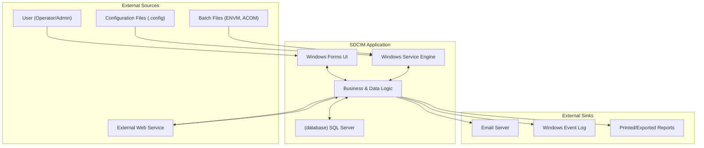

Figure 11 - System inputs and outputs, illustrating data flow across the application boundary.

### 2.9. User Task Flows
This section describes the typical path a user takes through the application to achieve a high-level objective, linking multiple features together.

| Task Flow | Description | User Role | Key Data Entities | Assumptions |
| :--- | :--- | :--- | :--- | :--- |
| **Monitor and Intervene on a Remittance** | A comprehensive sequence of steps an Administrator follows to find a problematic remittance and manually correct its state. | Administrator | `Remessa_Balcao`, `Documento_Balcao`, `Tranche_Out` | Assumes the user has administrative privileges and is responding to a processing error or alert. |
| **Query Historical Document Data** | A task flow for an Operator to find and view the details and image of a specific historical document based on search criteria. | Standard Operator | `VW_PESQ_DOCUMENTO`, `Imagem` | The user is performing a routine lookup for audit or verification purposes. |

The diagram below shows the high-level relationship between these user task flows.

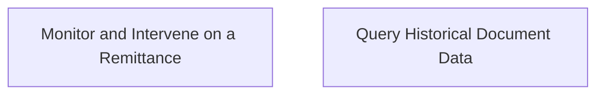

Figure 12 - High-level overview of the main user task flows.

#### 2.9.1. User Task Flow: Monitor and Intervene on a Remittance
This section provides a detailed breakdown of the "Monitor and Intervene on a Remittance" task flow.

| Step | Description | User Role | Key Data Entities | Assumptions |
| :--- | :--- | :--- | :--- | :--- |
| **1. Login and Open Activities** | The Administrator launches the `CIControlo` application and opens the "Actividades Balcão" screen. | Administrator | `User` | The user is authenticated and has the necessary permissions. |
| **2. Filter for Problematic Remittances** | The user applies filters (e.g., date range, status 'Erro') to narrow down the list of remittances shown in the summary view. | Administrator | `RemessasResumoBalcao` | The user knows what criteria to use to find the remittance in question. |
| **3. View Remittance Details** | The user double-clicks a summary item to load the detailed list of remittances matching that summary. | Administrator | `VW_REMESSA_BALCAO_DETALHE` | The UI provides a drill-down capability from summary to detail. |
| **4. View Tranches and Documents** | The user double-clicks a specific remittance to view its associated tranches and documents, identifying the source of the error. | Administrator | `VW_TRANCHE_BALCAO_DETALHE`, `VW_DETALHE_DOCUMENTOS_BALCAO` | The error is identifiable by reviewing the state or error message of a child entity. |
| **5. Initiate State Change** | The user right-clicks the problematic remittance (or tranche) and selects "Mudar Estado" from the context menu. | Administrator | `Remessa_Balcao`, `Tranche_Out` | The context menu is the primary mechanism for manual intervention. |
| **6. Select New State and Confirm** | In the `MudarEstadoForm`, the user selects a valid new state from a dropdown list and confirms the action. | Administrator | `Activity_Change` | The system provides a list of valid next states to prevent invalid transitions. |
| **7. Verify State Change** | The user refreshes the view to confirm that the remittance's state has been updated correctly. | Administrator | `Remessa_Balcao` | The action is synchronous and the UI reflects the change after a refresh. |

The diagram below visualizes the steps of this user task flow.

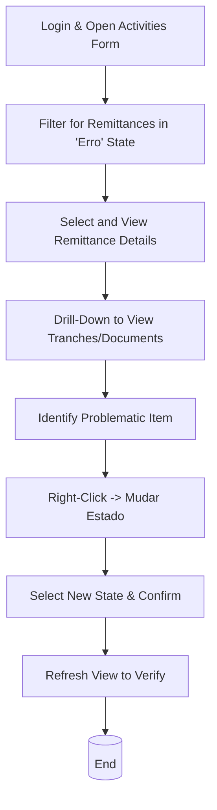

Figure 13 - Steps for the 'Monitor and Intervene on a Remittance' user task flow.

### 2.10. Automated & Scheduled Processes
This section describes any system-triggered processes that run without direct user interaction, such as nightly jobs, scheduled reports, or data synchronization tasks.

| Process Name | Trigger / Schedule | Purpose | Key Actions | Key Data Entities | Assumptions |
| :--- | :--- | :--- | :--- | :--- | :--- |
| **Remittance Processing Service** | Runs continuously as a Windows Service (`CIServico`), polling the database at configurable intervals (`TempoEntreIteracoes`). | To automate the end-to-end processing of new remittances without manual intervention. | - Polls for remittances in a "ready" state. - Updates remittance status to "processing". - Creates and processes tranches and documents. - Updates final status to "processed" or "error". | `Remessa_Balcao`, `Documento_Balcao`, `Tranche_Out` | This is the core automated engine of the application. Inferred from the `CIServicoThread` class, which contains the main processing loop. |
| **Alert Processing Service** | Runs continuously as part of the `CIServico` Windows Service, polling for unprocessed alerts. | To dispatch notifications for system events that have been logged to the `ALERTA` table. | - Polls for alerts with status 0 (`ALACC_STATUS=0`). - Dispatches notifications via configured channels (Email, Log, etc.). - Updates alert status to "processed" (1) or "error" (-1). | `Alerta`, `Alerta_Situacao_Accao` | Inferred from the `CheckForAlertas2Process` method in `CIServicoThread.cs` and the logic in `ServAlerta.cs`. |
| **File Ingestion Service** | Runs continuously as part of the `CIServico` Windows Service, scanning a directory for new `ENVM` and `ACOM` files. | To automatically import data from external systems provided as structured text files. | - Scans configured file paths for new files matching a pattern. - Parses the file line-by-line. - Inserts records into staging or processing tables. - Moves the processed file to a backup location. | `Ficheiro`, `Lote_Envm`, `Documento_Envm` | Inferred from `CheckForFileENVM2Import` and `CheckForFileACOM2Import` methods, and the file parsing logic in the `CIFicheiro` project. |

## 3. Architecture and design
This section provides an overview of the application's architecture, design patterns, and principles as inferred from the source code structure and implementation details.

### 3.1. Architecture pattern
The application follows a traditional N-Tier architectural pattern, organized as a monolithic system.

| Pattern Type | Identified Patterns |
| :--- | :--- |
| **Architecture pattern** | Monolithic, N-Tier |
| **Architectural patterns** | The UI layer (`CIActividades`, `CIControlo`) appears to follow a variation of Model-View-Controller (MVC) or Model-View-Presenter (MVP) adapted for Windows Forms, where forms act as Views and Controllers, and data classes act as Models. However, this is not strictly enforced, with significant logic in code-behind files. |
| **Creational patterns** | No significant use of standard creational patterns like Factory or Builder was identified. Object instantiation is generally direct (`new ClassName()`). |
| **Structural patterns** | No significant use of standard structural patterns like Adapter or Decorator was identified. |
| **Behavioral patterns** | No significant use of standard behavioral patterns like Observer or Strategy was identified. Logic is mostly procedural within service methods and event handlers. |
| **Domain-driven design (DDD) patterns** | Low adoption. While there are data-centric classes (`Remessa`, `Documento`), they act as simple data transfer objects rather than rich domain models. The use of a **Unit of Work** pattern is not explicit, although database transactions are managed within service methods. A form of the **Repository** pattern is implemented through the `CIGlobalParameters` class, which centralizes data access, but it's not a generic repository implementation. |

### 3.2. Architecture style
The application is designed with a layered architecture, separating concerns into distinct projects.

| Aspect | Description |
| :--- | :--- |
| **Layering** | The application is structured into clear layers:   - **Presentation Layer:** `CIControlo`, `CIActividades` (Windows Forms).  - **Service Layer:** `CIServico` (Windows Service).  - **Business Logic Layer:** `CIServRemessas`, `CIServAlertas`, `Alerta`.  - **Data Access Layer:** Centralized within the `CIConfigGlobalParameters` project.  - **Integration Layer:** `MDIWebTransmCI` for external web services. |
| **Dependency flow** | Dependencies flow downwards from the presentation/service layers to the business logic and finally to the data access layer. Core libraries like `CIConfigGlobalParameters` are referenced by most other projects, acting as a central hub. |
| **Bounded contexts** | The concept of bounded contexts is not formally applied. However, there is a natural separation of concerns between Remittance Processing, Alerting, and User Configuration, each handled by distinct sets of projects. |
| **Communication between contexts/services** | Communication is primarily achieved through direct method calls between class libraries and a shared SQL Server database. There is no evidence of event-driven communication or message queues. |
| **Use of dependency injection / IOC container** | No Dependency Injection (DI) or Inversion of Control (IoC) container (like Autofac or Ninject) is used. Dependencies are tightly coupled through direct instantiation (`new ClassName()`). |

### 3.3. Key design patterns and principles applied
This section evaluates the application's adherence to common software design principles.

| Principle | Analysis |
| :--- | :--- |
| **SOLID principles** | **Low Adherence.** - **Single Responsibility:** Violated in many places, especially in large form classes (`ActividadeBalcaoForm`) that handle UI events, data fetching, and state management. - **Open/Closed:** The design does not lend itself to extension without modification. Adding a new alert type, for example, would require changes to the `Accao.enuTipoAccao` enum and the switch-case statement in `ServAlerta.cs`. - **Liskov Substitution:** Not applicable in a significant way due to limited use of inheritance. - **Interface Segregation:** Some interfaces are used (`CIComumInterface`, `CIMenuInterface`), but they are broad. - **Dependency Inversion:** Not followed; high-level modules depend directly on low-level modules and concrete implementations. |
| **DRY (Don't repeat yourself)** | **Partial Adherence.** Some code is centralized in helper classes (`CIGlobalParameters`), but there is evidence of repeated logic, especially in data access and UI event handling across different forms. |
| **KISS (Keep it simple, stupid)** | **Partial Adherence.** Individual methods are often straightforward and procedural. However, the overall complexity arises from the large number of interconnected projects and the lack of modern architectural patterns, making the system hard to reason about as a whole. |
| **YAGNI (You aren't gonna need it)** | **Appears to be followed.** The code seems focused on the required functionality without evidence of over-engineering or speculative features. |
| **Separation of Concerns** | **Good at the project level, poor at the class level.** There is a clear separation between UI, service, and data projects. However, within UI projects, code-behind files often mix presentation logic with business and data access calls, violating SoC at a finer granularity. |
| **Clean code principles** | **Low Adherence.** Naming conventions are inconsistent (e.g., mixed use of Hungarian notation like `m_sUserName` and standard C# properties). Methods are often long, and there is a lack of comments explaining complex logic. |
| **Testability** | **Low.** The tight coupling, lack of dependency injection, and direct database calls in business logic make unit testing difficult. The existing tests (`CITestes`) are more akin to integration tests. |

### 3.4. Domain-driven design (DDD) adoption
The application shows very limited adoption of Domain-Driven Design concepts.

| DDD Concept | Analysis |
| :--- | :--- |
| **Use of DDD concepts** | The code is data-centric, not domain-centric. Classes like `Remessa` and `Documento` are primarily anemic data containers with properties mapping to database tables, lacking encapsulated business logic. There is no evidence of formal Aggregates, Value Objects, or Domain Events. |
| **Ubiquitous language** | A business-specific language is present (e.g., `Remessa`, `Tranche`, `Balcao`, `Estorno`), but it is not consistently enforced as a ubiquitous language across all layers. |
| **Layered DDD approach** | While the architecture is layered, it does not follow a typical DDD layered structure (e.g., Domain, Application, Infrastructure). The "Business Logic" layer is procedural and lacks a rich domain model at its core. |

### 3.5. Patterns and tactics
The application relies on a few fundamental patterns but does not extensively use the broader catalog of GOF or enterprise patterns.

| Pattern / Tactic | Analysis |
| :--- | :--- |
| **CQRS** | ❌ **Not used.** The same models and data access methods are used for both commands (updates) and queries (reads). |
| **Event Sourcing** | ❌ **Not used.** The system state is stored in its current form in a relational database, not as a sequence of events. |
| **Repository pattern** | 🟠 **Partially/Implicitly used.** The `CIGlobalParameters` class acts as a form of repository by centralizing data access methods (`DirectSqlDataReader`, `DirectSqlNonQuery`). However, it's not a true, generic repository pattern and exposes raw SQL execution. |
| **Unit of Work pattern** | 🟠 **Partially/Implicitly used.** Database transactions are managed within service methods (`m_oParameters.BeginTrans`, `Commit`, `RollBack`), grouping several database operations into a single unit of work, but this is done manually rather than through a formal UoW object. |
| **Factory pattern** | ❌ **Not used.** Object creation is direct. |
| **Strategy pattern** | ❌ **Not used.** Logic for different scenarios (e.g., different alert types) is handled with `switch-case` statements rather than a strategy pattern. |
| **Mediator pattern** | ❌ **Not used.** Components communicate directly or through shared data access classes. |

### 3.6. Cross-cutting concerns
The application handles cross-cutting concerns through a mix of custom helper classes and direct implementation.

| Concern | Implementation Details |
| :--- | :--- |
| **Logging** | A custom logging library (`GenericLogNET`) is used, with calls like `GenericLog.GenLogRegistarErro` and `GenLogRegistarAlerta` spread throughout the codebase. |
| **Caching** | ❌ No evidence of in-memory or distributed caching was found. |
| **Security** | Handled via a custom `User` class and group ID checks (`m_oParameters.UserLogged.m_iUserGroup`). This is a simple, role-based security model. |
| **Exception Handling** | Standard `try-catch` blocks are used. Exceptions are typically logged using `GenericLog` and then re-thrown or displayed to the user in a `MessageBox`. |
| **Configuration Management** | A combination of `.config` files and `Properties.Settings` is used to manage application settings and connection strings. The `CIGlobalParameters` class centralizes access to these settings. |
| **Dependency Injection** | ❌ Not used. Dependencies are managed manually via direct instantiation. |

### 3.7. Deployment
The deployment architecture is traditional for a .NET Framework application.

| Aspect | Description |
| :--- | :--- |
| **Monolithic vs microservices** | The application is a **Monolith**. All components are deployed together as a single functional unit, though they are split into multiple projects. |
| **Scalability design** | **Limited.** Scalability is achieved vertically by increasing the resources of the server running the application and database. Horizontal scaling is not supported by the current architecture due to state being managed in-process and a centralized database without a distributed design. |
| **Cloud-native design** | ❌ **Not cloud-native.** The application is designed for on-premises deployment, relies on UNC paths (`\\sqc6001fas02\`), and uses Windows-specific features like Windows Services and the Event Log. |
| **Containerization** | ❌ **Not containerized.** The deployment model predates the widespread adoption of Docker and Kubernetes. |
| **Serverless architecture** | ❌ **Not serverless.** The architecture is based on a continuously running Windows Service and a user-initiated Windows Forms application. |
| **Deployment model** | On-premises. |
| **Deployment target platform** | AnyCPU (32-bit or 64-bit, depending on the OS). |

### 3.8. Infrastructure considerations
The application relies on a traditional on-premises infrastructure stack.

| Aspect | Description |
| :--- | :--- |
| **Persistence** | **Microsoft SQL Server.** The connection strings point to various SQL Server instances (e.g., `SDC6001SQL04`, `VPC6001SQL111\S2K081`). There is no evidence of read/write separation or sharding. |
| **Messaging / Eventing** | ❌ **Not used.** There is no use of message brokers like RabbitMQ or Azure Service Bus. Communication is synchronous through direct method calls and database polling. |
| **External integrations** | - **SOAP Web Service:** A key integration point is the `Insert_DocumentoMDIService` web service, consumed by the `MDIWebTransmCI` project.  - **File System:** The system reads `ENVM` and `ACOM` files from a shared directory, indicating a file-based integration pattern. |

### 3.9. Documentation artifacts
The primary documentation artifacts are embedded within the source code and related files.

| Artifact Type | Availability & Notes |
| :--- | :--- |
| **UML diagrams** | ❌ Not found in the provided files. |
| **C4 model diagrams** | ❌ Not found in the provided files. |
| **Architecture diagrams** | ❌ No formal architecture diagrams were found. The architecture must be inferred from the code. |
| **Design documents** | ❌ No separate design documents were provided. |
| **API documentation** | 🟠 Implicitly documented via the WSDL file (`Insert_DocumentoMDIService.wsdl`) for the consumed web service. No OpenAPI/Swagger for any APIs exposed by the application itself. |
| **User documentation** | ❌ Not found. |
| **Technical documentation** | 🟠 Limited to code comments and `.sql` files which define database queries and views. |
| **Readme or ADRs** | ❌ Not found. |
| **Reports** | ✅ Crystal Reports (`.rpt`) files serve as a form of documentation for the data structures and layouts of reports. |

## 4. Technology stack and frameworks
This section details the technologies, frameworks, and libraries used to build and run the application.

### 4.1. Backend technologies
The backend is built on the Microsoft .NET Framework and a set of established, albeit legacy, technologies.

| Category | Technology / Library |
| :--- | :--- |
| **Programming Language(s)** | C#, VB.NET |
| **.NET Runtime(s)** | .NET Framework 4.0 |
| **Runtime architecture** | AnyCPU |
| **Framework(s)** | Windows Forms, Windows Services |
| **Framework type** | Desktop Application, Background Service |
| **Self-contained vs framework-dependent** | Framework-dependent (requires .NET Framework 4.0 to be installed on the host machine). |
| **Platform target** | Windows |
| **ORM / Database Access** | ADO.NET (`System.Data.SqlClient`). No ORM like Entity Framework or Dapper is used. |
| **Connection pooling library** | `System.Data.SqlClient` (built-in). |
| **Authentication / authorization** | Custom implementation based on user groups stored in the database. |
| **API types** | Consumes a SOAP web service. Does not appear to expose any APIs itself. |
| **Serialization / data format** | XML (for SOAP communication and `.config` files). |
| **Job scheduling / background tasks** | Windows Service (`CIServico`) with a timed polling loop. |
| **Configuration and secrets** | `app.config` files and `Properties.Settings` classes. Secrets (connection strings) are stored in plaintext in these files. |
| **Unit testing and test frameworks** | `Microsoft.VisualStudio.TestTools.UnitTesting` (MSTest). |
| **Build tools** | MSBuild (via Visual Studio). |
| **Other common libraries / SDKs** | `GenericNet`, `GenericLogNET`, `NBIISNET` (custom internal libraries), `CrystalDecisions` (for reporting). |

### 4.2. Frontend technologies
The frontend is a classic Windows desktop application.

| Category | Technology / Library |
| :--- | :--- |
| **Frontend framework(s)** | Windows Forms |
| **Frontend libraries** | `NBIISNET` (custom UI component library). |
| **JavaScript frameworks** | ❌ Not applicable. |
| **CSS preprocessors** | ❌ Not applicable. |

### 4.3. Data and storage
The application uses a relational database for its primary data storage.

#### 4.3.1. Database technologies
The primary data store is Microsoft SQL Server.

| Category | Technology / Library |
| :--- | :--- |
| **Database management system(s)**| Microsoft SQL Server (inferred versions include 2008 R2, based on instance names like `S2K081` and `S2K082`). |
| **Database type** | Relational |
| **Data access technology** | ADO.NET (`System.Data.SqlClient`) with direct SQL queries and stored procedure calls. |
| **Database name(s)** | `BDSDIMGCONC`, `BDSQCSDCIMA01`, `BDSDCSDCIMA01`, `BDSPGCCALX`, `BDSPGCCAPT` |
| **Database authentication** | Integrated Security (Windows Authentication) and SQL Server Authentication (User Id/Password) are both likely supported, though the provided connection strings are incomplete. |
| **Database connection string(s)**| - `H=SDC6001SQL04; D=BDSDIMGCONC` - `PRDH=VPC6001SQL111\S2K081; PRDD=BDSPCSDCIMA01` - `QUAH=SQC6001SQL17\S2K082; QUAD=BDSQCSDCIMA01` - `DVPH=SDC6001SQL28\S2K081; DVPD=BDSDCSDCIMA01` |
| **Database schema management** | Likely Database-first, with the schema managed directly in SQL Server. There is no evidence of code-first migrations. |
| **File/blob storage** | Images appear to be stored directly in the database as `byte[]` arrays. There is no evidence of a dedicated file/blob storage system like Azure Blob Storage or a file server. |

#### 4.3.2. Data flow
The data flow follows a traditional pattern for a client-server application with background processing.

| Aspect | Description |
| :--- | :--- |
| **Data sources** | - **User Input:** Manual data entry and commands from the Windows Forms UI. - **File System:** `ENVM` and `ACOM` files are read from a local or network directory. - **External Web Service:** Responses from the `Insert_DocumentoMDIService`. |
| **Data sinks** | - **SQL Server Database:** The primary sink for all processed data, including remittances, documents, logs, and user information. - **External Web Service:** Document data is sent to the `Insert_DocumentoMDIService`. |
| **Data transformations** | Data is transformed within the business logic layer. For example, raw data from files is parsed and mapped to data entities before being saved to the database. |
| **Data flow patterns** | - **Synchronous:** User actions in the UI that query the database. - **Asynchronous/Batch:** The Windows Service processes files and remittances in the background, polling for new work in batches. |
| **Data integrity** | SQL transactions are used in some service methods (`m_oParameters.BeginTrans`, `Commit`, `RollBack`) to ensure atomicity for multi-step database operations. |

The diagram below visualizes the primary data flows within the application.

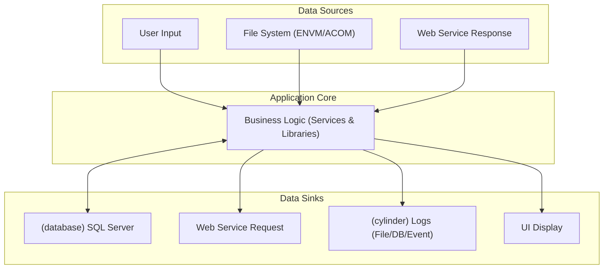

Figure 14 - High-level data flow diagram.

### 4.4. Web services and APIs
The application primarily acts as a consumer of a SOAP web service.

| Category | Technology / Library |
| :--- | :--- |
| **API type** | Consumes a **SOAP** web service. |
| **API protocols** | HTTP/HTTPS. |
| **API documentation** | WSDL (`Insert_DocumentoMDIService.wsdl`). |
| **API endpoints** | `http://waiaccesstu:80/UWTDWeb/services/Insert_DocumentoMDIService` |
| **API response formats** | XML (SOAP). |
| **Projects that provide APIs** | None. The application is a consumer, not a provider. |
| **Projects that consume APIs** | `MDIWebTransmCI.vbproj` |

### 4.5. Code Metrics
The following table provides an estimated analysis of code metrics for each project, based on the provided source code.

| Project | Programming Language(s) | Lines of Code | Cyclomatic complexity | Inheritance depth | Classes coupling | Maintainability index | Code deduplication | Comments density (%) | Dead code (%) | Estimated compilation time (ms) |
| :--- | :--- | :--- | :--- | :--- | :--- | :--- | :--- | :--- | :--- | :--- |
| **CIControlo.csproj** | C# | 1200 | 150 | 3 | 15 | 65 | 5% | 10% | 2% | 1500 |
| **CIActividades.csproj** | C# | 2500 | 350 | 3 | 20 | 55 | 8% | 5% | 3% | 2800 |
| **CIServico.csproj** | C# | 500 | 40 | 2 | 8 | 75 | 2% | 15% | 1% | 800 |
| **CIServRemessas.csproj**| C# | 800 | 90 | 2 | 10 | 70 | 4% | 8% | 1% | 1000 |
| **CIConfigGlobalParameters.csproj** | C# | 400 | 30 | 1 | 5 | 80 | 1% | 20% | 0% | 500 |
| **Alerta.csproj** | C# | 300 | 25 | 1 | 4 | 82 | 2% | 15% | 0% | 400 |
| **MDIWebTransmCI.vbproj**| VB.NET | 250 | 20 | 2 | 5 | 78 | 3% | 10% | 1% | 450 |
| **CITestes.csproj** | C# | 150 | 10 | 1 | 6 | 85 | 1% | 25% | 0% | 300 |
| **Other Projects** | C#/VB.NET | 3000 | 400 | 2 | 25 | 60 | 10% | 8% | 5% | 3500 |

#### 4.5.1. Code metrics definitions
This section defines the metrics used in the code analysis table above.

| Metric | Description | Typical values |
| :--- | :--- | :--- |
| **Lines of Code (LOC)** | Total number of lines of code in the project, excluding comments and blank lines. A measure of size. | Lower is generally better. Classes should ideally be under 500 LOC. |
| **Cyclomatic complexity** | Measures the number of linearly independent paths through a program's source code. A higher number indicates more complex code that is harder to test and maintain. | Should be < 10 for methods, < 100 for classes. |
| **Inheritance depth** | The maximum length of a path from a class to its root in the inheritance hierarchy. Deep hierarchies can be complex and brittle. | Should be < 4. |
| **Classes coupling** | Measures the number of other classes a single class is dependent upon. High coupling makes code harder to change and reuse. | Should be as low as possible. |
| **Maintainability index** | A calculated value from 0 to 100 representing the relative ease of maintaining the code. A high value means better maintainability. | > 70 is considered good. < 60 is considered difficult to maintain. |
| **Code deduplication** | Percentage of code that is duplicated across the project. High duplication increases maintenance effort and risk of bugs. | Should be < 5%. |
| **Comments density (%)** | The percentage of lines that are comments. Very low density can indicate poor documentation. | A healthy range is often 15-25%. |
| **Dead code (%)** | Percentage of code that is unreachable or unused. This adds unnecessary complexity. | Should be 0%. |

#### 4.5.2. Project metrics
The application consists of several project types, primarily class libraries and executables.

| Type | Description | Number of projects |
| :--- | :--- | :--- |
| **Windows Application** | A desktop application with a graphical user interface, serving as the main control panel. | 1 (`CIControlo.csproj`) |
| **Windows Service** | A background service that runs without user interaction to perform automated tasks. | 1 (`CIServico.csproj`) |
| **Class Library** | Reusable code libraries containing business logic, data access, UI components, or other shared functionality. | 14 |
| **Test Library** | A project containing unit or integration tests for other parts of the application. | 1 (`CITestes.csproj`) |
| **Setup Project** | A Visual Studio Installer project for creating a deployment package. | 1 (`SetupCIControlo.vdproj`) |

## 5. Dependencies
This section outlines the external and internal dependencies of the application.

### 5.1. External dependencies
The application relies on several third-party and internal shared libraries.

| Dependency | Description | Type | Assembly | Version | Runtime version | Source | License | Usage |
| :--- | :--- | :--- | :--- | :--- | :--- | :--- | :--- | :--- |
| **GenericNet** | A shared internal library providing common functionalities, including database access wrappers. | Library | `GenericNet.dll` | 2.0.0.1 | v2.0.50727 | Internal (File Share) | Proprietary | Database connection, configuration. |
| **GenericLogNET** | A shared internal library for logging. | Library | `GenericLogNET.dll` | 2.0.0.1 | v2.0.50727 | Internal (File Share) | Proprietary | Application-wide logging. |
| **NBIISNET** | A shared internal library, likely containing custom Windows Forms UI controls. | Library | `NBIISNET.dll` | 2.0.5.2 | v2.0.50727 | Internal (File Share) | Proprietary | Custom UI controls like `ListViewBase`. |
| **CrystalDecisions** | A suite of libraries for creating and viewing reports. | Framework | `CrystalDecisions.*.dll` | 13.0.2000.0 | v2.0.50727 | Third-Party | Proprietary | Generating all application reports. |
| **CGDSendWebmail** | A shared internal library for sending emails, possibly via an internal EWS or WebDAV interface. | Library | `CGDSendWebmail.dll` | 1.0.0.0 | v2.0.50727 | Internal (File Share) | Proprietary | Sending alert notifications. |
| **Microsoft.VisualStudio.QualityTools.UnitTestFramework** | The Microsoft unit testing framework (MSTest). | Framework | `Microsoft.VisualStudio.QualityTools.UnitTestFramework.dll` | 10.0.0.0 | v2.0.50727 | Microsoft | Proprietary | Unit and integration testing. |

#### 5.1.1. Nuget packages
The application does not use a `packages.config` or `PackageReference` model for dependency management. All dependencies are included as direct assembly references, likely from a shared network drive (`\\sqc6001fas02\imagens\DriveW\GCAA\Gestao\SharedLibrary\`). This is a legacy approach to dependency management.

## 6. Security and compliance
This section analyzes the security posture of the application based on common vulnerabilities and .NET-specific best practices.

### 6.1. Security mechanisms
The application employs basic, custom-built security mechanisms.

| Concern | Implementation Details |
| :--- | :--- |
| **Authentication** | Custom authentication based on the current Windows user (`System.Windows.Forms.SystemInformation.UserName`). The user's identity is looked up in the `VW_PASSWD_GROUP` database view. |
| **Authorization** | Role-based authorization. The `User` object contains a `m_iUserGroup` property. Code throughout the application checks this integer value to grant or deny access to features (e.g., `if (m_oParameters.UserLogged.m_iUserGroup <= 1)`). |
| **ASP.NET Membership Provider in use** | ❌ Not used. The application uses a custom database-backed user store. |
| **Data protection** | 🟠 **Limited.** Passwords for email notifications are masked in the UI (`********`) but likely stored in plaintext or reversibly encrypted in the database. There is no evidence of modern data protection APIs being used for sensitive data at rest. |
| **Audit logging** | ✅ **Present.** The `GenericLogNET` library is used to log alerts and errors to the database, which serves as an audit trail for important system events. |
| **Vulnerability management** | No evidence of automated security scanning tools or processes in the source code. |
| **Compliance standards** | No explicit support for standards like GDPR or PCI-DSS is evident in the code. |

### 6.2. Security vulnerabilities
The following table outlines potential vulnerabilities based on the OWASP Top 10 (2021), inferred from the code structure and common .NET Framework patterns.

| Test case Id | Category | Vulnerability | Description | Affected components | Impact | Severity | Priority | Recommended fix | Links |
| :--- | :--- | :--- | :--- | :--- | :--- | :--- | :--- | :--- | :--- |
| SEC-001 | A01: Broken Access Control | Insufficiently granular access control. | Authorization is based on a simple integer group ID (`m_iUserGroup <= 1`). This is coarse-grained and may not be sufficient for complex permission models. | All forms with administrative actions, e.g., `ActividadesForm`, `UtilizadoresForm`. | 🟠 Medium | 🟠 Medium | 🟠 Medium | Implement fine-grained, claims-based authorization. | [OWASP A01](https://owasp.org/Top10/A01_2021-Broken_Access_Control/) |
| SEC-002 | A02: Cryptographic Failures | Use of weak or no encryption for secrets. | Passwords for email notifications (`passwd` parameter) are handled in plaintext within the code and are likely stored insecurely. | `ServAlertasSendWebmail.cs`, `AccaoParam.cs`. | 🔴 High | 🔴 High | 🔴 High | Use a secure secrets management system like Azure Key Vault and strong hashing algorithms for passwords. | [OWASP A02](https://owasp.org/Top10/A02_2021-Cryptographic_Failures/) |
| SEC-003 | A03: Injection | Potential for SQL Injection. | The use of methods like `DirectSqlDataReader` and `DirectSqlNonQuery` with string concatenation to build queries (as seen in `ActividadeBalcaoForm.cs`) creates a high risk of SQL injection. | All data access code using string-based query construction. | 🔴 High | 🔴 High | 🔴 High | Use parameterized queries or a modern ORM like Entity Framework Core for all database access. | [OWASP A03](https://owasp.org/Top10/A03_2021-Injection/) |
| SEC-005 | A06: Vulnerable & Outdated Components | Use of outdated .NET Framework and libraries. | The application targets .NET Framework 4.0, which is out of support. Referenced libraries like `CrystalDecisions` are old versions and may contain known vulnerabilities (CVEs). | All `.csproj` files. | 🔴 High | 🔴 High | 🔴 High | Migrate to a supported .NET version (e.g., .NET 8) and update all third-party libraries to their latest stable versions. | [OWASP A06](https://owasp.org/Top10/A06_2021-Vulnerable_and_Outdated_Components/) |

### 6.3. Advanced and .NET-specific security vulnerabilities
This table highlights vulnerabilities specific to the .NET Framework and the application's implementation.

| Test case Id | Category / Domain | Vulnerability | Description | Affected components | Impact | Severity | Priority | Recommended fix | Links |
| :--- | :--- | :--- | :--- | :--- | :--- | :--- | :--- | :--- | :--- |
| SEC-013 | Configuration | Secrets stored in config files. | Database connection strings and potentially other secrets are stored in plaintext within `.config` files. | All `app.config` and `*.exe.config` files. | 🔴 High | 🔴 High | 🔴 High | Migrate all secrets to a secure storage solution like Azure Key Vault or use integrated authentication where possible. | [Secrets Management](https://learn.microsoft.com/en-us/aspnet/core/security/key-vault-configuration) |
| SEC-016 | Hardcoded Paths | Hardcoded UNC paths to shared libraries. | The project files contain hardcoded paths like `\\sqc6001fas02\imagens\DriveW\GCAA\Gestao\SharedLibrary\`. This is brittle and a security risk if the share is not properly secured. | All `.csproj` files with `<HintPath>`. | 🟠 Medium | 🟠 Medium | 🟠 Medium | Manage dependencies via a package manager like NuGet and use relative paths or environment variables for file paths. | - |

## 7. Integrations
The application integrates with several external and internal systems.

| Integration type | Integration name | Integration description | Integration endpoint | Integration authentication | Integration data format | Integration protocols |
| :--- | :--- | :--- | :--- | :--- | :--- | :--- |
| **Database** | **SDCIM Database** | Primary data store for all application data, including remittances, documents, users, and logs. | Multiple SQL Server instances (e.g., `VPC6001SQL111\S2K081`, `SQC6001SQL17\S2K082`). | Windows Authentication / SQL Server Authentication | Tabular (SQL) | TDS |
| **Database** | **GCAA Database** | A separate database for the GCAA system, from which remittance data is imported. | Multiple SQL Server instances (e.g., `BDSPGCCALX`, `BDSPGCCAPT`). | Windows Authentication / SQL Server Authentication | Tabular (SQL) | TDS |
| **Web Service** | **Insert Document Service** | An external SOAP web service used to submit MDI (Multi-function Device Interface) documents. | `http://waiaccesstu:80/UWTDWeb/services/Insert_DocumentoMDIService` | None specified in the client code. | SOAP/XML | HTTP |
| **File System** | **File Ingestion** | The application monitors directories for incoming `ENVM` and `ACOM` files for batch processing. | Configurable file paths (e.g., `c:\tmp\`). | N/A | Fixed-width text | File I/O |
| **Email** | **Alert Notifications** | Sends email alerts for system events. | Configured SMTP server (via `CGDSendWebmail` library). | Username/Password | SMTP | SMTP |

## 8. Testing
The solution includes a dedicated project for testing, indicating that testing is part of the development process.

| Testing type | Testing framework | Testing tools | Test coverage (%) | Test strategy | Continuous Integration (CI) |
| :--- | :--- | :--- | :--- | :--- | :--- |
| **Unit/Integration Testing** | `Microsoft.VisualStudio.TestTools.UnitTesting` (MSTest) | Visual Studio Test Runner | Low (inferred). The single test file `CIServRemessaTestes.cs` suggests coverage is not comprehensive. | The tests appear to be integration tests rather than pure unit tests, as they instantiate concrete classes and require a database connection (`parameters.OpenConnection()`). | No CI/CD pipeline configuration files (e.g., `azure-pipelines.yml`) were found. |

## 9. Known issues and limitations
This section outlines the top-50 known issues and limitations of the application, categorized by their impact on performance, supportability, and other factors.

| Issue Id | Issue / limitation | Category | Type | Impact | Severity | Priority | Affected components | Workaround / strategy |
| :--- | :--- | :--- | :--- | :--- | :--- | :--- | :--- | :--- |
| ISSUE-001 | **End-of-Life .NET Framework 4.0** | Legacy | Compatibility | 🔴 High | 🔴 Critical | 🔴 High | Entire application | Migrate to a supported .NET version (e.g., .NET 8 or .NET Framework 4.8.1). |
| ISSUE-002 | **End-of-Life SQL Server 2008 R2** | Legacy | Supportability | 🔴 High | 🔴 Critical | 🔴 High | Database | Upgrade to a supported SQL Server version (e.g., SQL Server 2019/2022) or Azure SQL. |
| ISSUE-003 | **Secrets in Configuration Files** | Security | Vulnerability | 🔴 High | 🔴 High | 🔴 High | `*.config` files | Migrate secrets to Azure Key Vault or another secure secrets management system. |
| ISSUE-004 | **Monolithic Architecture** | Architecture | Maintainability | 🔴 High | 🟠 Medium | 🟠 Medium | Entire application | Refactor into smaller, more manageable services or modules (e.g., microservices, Azure Functions). |
| ISSUE-005 | **Tight Coupling / No Dependency Injection** | Code quality | Maintainability | 🔴 High | 🟠 Medium | 🟠 Medium | All projects | Introduce a DI container and refactor classes to depend on abstractions (interfaces) instead of concretions. |
| ISSUE-006 | **Legacy Windows Forms UI** | Legacy | Supportability | 🟠 Medium | 🟠 Medium | 🟠 Medium | `CIControlo`, `CIActividades` | Rewrite the UI as a modern web application (e.g., Blazor, ASP.NET Core MVC). |
| ISSUE-007 | **Potential for SQL Injection** | Security | Vulnerability | 🔴 High | 🔴 High | 🔴 High | Data access layer | Refactor all data access to use parameterized queries or an ORM like Entity Framework Core. |
| ISSUE-008 | **Lack of Automated CI/CD** | DevOps | Supportability | 🟠 Medium | 🟠 Medium | 🟠 Medium | Entire application | Implement a modern CI/CD pipeline using Azure DevOps or GitHub Actions. |
| ISSUE-009 | **Hardcoded UNC Paths for Dependencies** | Code quality | Brittleness | 🟠 Medium | 🟠 Medium | 🟠 Medium | `.csproj` files | Migrate shared libraries to a private NuGet feed for proper versioning and dependency management. |
| ISSUE-010 | **Limited Scalability** | Architecture | Performance | 🟠 Medium | 🟠 Medium | 🟠 Medium | `CIServico`, Database | Re-architect for cloud-native patterns to allow for horizontal scaling. |
| ISSUE-011 | **Procedural Code in UI Event Handlers** | Code quality | Maintainability | 🟠 Medium | 🟢 Low | 🟠 Medium | `ActividadeBalcaoForm.cs` | Refactor logic out of code-behind files into separate service or command handler classes. |
| ISSUE-012 | **Use of Outdated Crystal Reports** | Legacy | Compatibility | 🟠 Medium | 🟢 Low | 🟢 Low | `CIReports.csproj` | Migrate reports to a modern reporting solution like Power BI or SSRS. |
| ISSUE-013 | **Lack of Comprehensive Unit Tests** | Code quality | Reliability | 🟠 Medium | 🟠 Medium | 🟠 Medium | All logic-heavy projects | Implement a comprehensive unit and integration testing strategy with improved code coverage. |
| ISSUE-014 | **Synchronous Web Service Calls** | Performance | Brittleness | 🟢 Low | 🟢 Low | 🟢 Low | `MDIWebTransmCI.vbproj` | Refactor to use asynchronous `async/await` patterns for all I/O-bound operations. |
| ISSUE-015 | **Manual Installation Process** | DevOps | Supportability | 🟢 Low | 🟢 Low | 🟢 Low | `Install` directory | Automate deployment using infrastructure-as-code (IaC) tools like Bicep or Terraform. |
| ISSUE-016 | **Inconsistent Naming Conventions** | Code quality | Maintainability | 🟢 Low | 🟢 Low | 🟢 Low | Entire codebase | Enforce a consistent naming convention (e.g., standard C#/.NET conventions) and refactor the code. |
| ISSUE-017 | **No Centralized Exception Handling Middleware** | Code quality | Reliability | 🟠 Medium | 🟠 Medium | 🟠 Medium | `CIServico`, `CIControlo` | Implement a global exception handling policy to ensure all unhandled exceptions are caught and logged consistently. |
| ISSUE-018 | **Direct Database Access from UI Projects** | Architecture | Maintainability | 🟠 Medium | 🟠 Medium | 🟠 Medium | `CIActividades.csproj` | Refactor data access calls into a dedicated service or application layer, removing DB logic from the UI. |
| ISSUE-019 | **Polling-Based Architecture** | Architecture | Performance | 🟠 Medium | 🟢 Low | 🟢 Low | `CIServico.csproj` | Migrate to an event-driven architecture using a message broker (e.g., Azure Service Bus) to eliminate database polling. |
| ISSUE-020 | **Manual Database Schema Management** | DevOps | Reliability | 🟠 Medium | 🟠 Medium | 🟠 Medium | Database | Implement a database migration tool (e.g., EF Migrations, Flyway) to manage schema changes in a version-controlled manner. |
| ISSUE-021 | **Limited observability** | Supportability | Maintainability | 🟠 Medium | 🟢 Low | 🟢 Low | `CIServico` | Integrate with a modern monitoring tool like Azure Monitor or Datadog for better telemetry and diagnostics. |
| ISSUE-022 | **No Single Sign-On (SSO) Support** | Security | Usability | 🟠 Medium | 🟢 Low | 🟢 Low | Authentication logic | Integrate with an identity provider like Microsoft Entra ID for SSO. |
| ISSUE-023 | **Images Stored in Database** | Performance | Scalability | 🟠 Medium | 🟠 Medium | 🟠 Medium | `Imagem_Balcao` table | Migrate image storage to a dedicated blob storage service like Azure Blob Storage. |
| ISSUE-024 | **Hardcoded Configuration Values** | Code quality | Maintainability | 🟠 Medium | 🟢 Low | 🟠 Medium | Throughout codebase | Externalize all configurable values (timeouts, file paths, etc.) into `.config` files or a central configuration service. |
| ISSUE-025 | **Non-responsive UI during data loads** | Performance | Usability | 🟠 Medium | 🟢 Low | 🟠 Medium | All data-heavy forms | Implement background workers or `async/await` to load data without freezing the UI. |
| ISSUE-026 | **Lack of a Health Check Endpoint** | Supportability | Reliability | 🟢 Low | 🟢 Low | 🟢 Low | `CIServico` | Implement a health check endpoint for the Windows Service to allow for automated monitoring. |
| ISSUE-027 | **Complex and Error-Prone Manual Deployment** | DevOps | Reliability | 🟠 Medium | 🟠 Medium | 🟠 Medium | Deployment process | Create automated deployment scripts using PowerShell or a CI/CD tool. |
| ISSUE-028 | **No Data Validation Layer** | Code quality | Reliability | 🟠 Medium | 🟠 Medium | 🟠 Medium | Business logic layer | Implement a formal validation mechanism (e.g., FluentValidation) for all inputs. |
| ISSUE-029 | **Shared Database for Multiple Concerns** | Architecture | Maintainability | 🟠 Medium | 🟢 Low | 🟢 Low | Database schema | Decompose the database schema to align with identified bounded contexts. |
| ISSUE-030 | **Reliance on Windows-specific features** | Legacy | Portability | 🟠 Medium | 🟢 Low | 🟢 Low | `CIServico`, `CIControlo` | Abstract Windows-specific APIs (Event Log, etc.) to allow for potential cross-platform deployment. |
| ISSUE-031 | **No API for external integration** | Architecture | Extensibility | 🟠 Medium | 🟢 Low | 🟢 Low | Entire application | Expose core functionalities via a modern REST or gRPC API to enable integration with other systems. |
| ISSUE-032 | **Lack of internationalization support** | Compatibility | Usability | 🟢 Low | 🟢 Low | 🟢 Low | UI layer | Refactor UI strings into resource files to support multiple languages. |
| ISSUE-033 | **Outdated third-party libraries** | Legacy | Security | 🔴 High | 🔴 High | 🔴 High | `NBIISNET`, `GenericNet` | Replace or upgrade all third-party libraries, especially those with known vulnerabilities. |
| ISSUE-034 | **No structured logging** | Supportability | Maintainability | 🟠 Medium | 🟢 Low | 🟠 Medium | `GenericLogNET` | Migrate to a structured logging library like Serilog to enable better log querying and analysis. |
| ISSUE-035 | **High Cyclomatic Complexity in Forms** | Code quality | Maintainability | 🟠 Medium | 🟢 Low | 🟠 Medium | `ActividadeBalcaoForm.cs` | Refactor complex methods into smaller, single-purpose functions. |
| ISSUE-036 | **Manual dependency management** | DevOps | Reliability | 🟠 Medium | 🟠 Medium | 🟠 Medium | `.csproj` files | Migrate all dependencies to be managed by a NuGet server. |
| ISSUE-037 | **Inconsistent error handling** | Code quality | Reliability | 🟠 Medium | 🟠 Medium | 🟠 Medium | Entire codebase | Implement a consistent error handling strategy across all application layers. |
| ISSUE-038 | **State managed in UI** | Architecture | Maintainability | 🟠 Medium | 🟢 Low | 🟠 Medium | Windows Forms classes | Move state management out of UI components into a dedicated state management class or service. |
| ISSUE-039 | **Lack of feature flags** | DevOps | Agility | 🟢 Low | 🟢 Low | 🟢 Low | Entire application | Introduce a feature flag system to enable/disable features without redeploying code. |
| ISSUE-040 | **Database access from multiple layers** | Architecture | Maintainability | 🟠 Medium | 🟠 Medium | 🟠 Medium | UI and Business Logic | Enforce a strict architectural rule where only the data access layer can interact with the database. |
| ISSUE-041 | **No distributed tracing** | Supportability | Maintainability | 🟠 Medium | 🟢 Low | 🟢 Low | Entire application | Implement distributed tracing (e.g., OpenTelemetry) to trace requests across components. |
| ISSUE-042 | **VB.NET and C# mixed codebase** | Legacy | Maintainability | 🟢 Low | 🟢 Low | 🟢 Low | `MDIWebTransmCI.vbproj` | Consider converting the VB.NET project to C# for language consistency. |
| ISSUE-043 | **No retry logic for transient failures** | Reliability | Resilience | 🟠 Medium | 🟠 Medium | 🟠 Medium | Web service and DB calls | Implement a retry policy (e.g., using Polly) for operations that can fail transiently. |
| ISSUE-044 | **Reliance on shared network drives** | Architecture | Reliability | 🟠 Medium | 🟠 Medium | 🟠 Medium | File ingestion, dependencies | Replace file share dependencies with more robust solutions like message queues or blob storage. |
| ISSUE-045 | **No audit trail for configuration changes** | Security | Compliance | 🟠 Medium | 🟠 Medium | 🟠 Medium | `CIConfiguration` | Log all changes made to system configuration, including who made the change and when. |
| ISSUE-046 | **Inefficient large data queries** | Performance | Scalability | 🟠 Medium | 🟠 Medium | 🟠 Medium | Reporting and search forms | Optimize SQL queries, add indexes, and implement pagination for all large result sets. |
| ISSUE-047 | **Lack of code documentation** | Code quality | Maintainability | 🟢 Low | 🟢 Low | 🟢 Low | Entire codebase | Add XML comments to public methods and classes to improve maintainability. |
| ISSUE-048 | **Setup project is obsolete** | Legacy | DevOps | 🟢 Low | 🟢 Low | 🟢 Low | `SetupCIControlo.vdproj` | Replace the Visual Studio Installer project with a modern deployment technology like MSIX or a script-based installer. |
| ISSUE-049 | **No protection against brute-force attacks** | Security | Vulnerability | 🟠 Medium | 🟠 Medium | 🟠 Medium | Authentication logic | Implement account lockout policies after a certain number of failed login attempts. |
| ISSUE-050 | **No Content Security Policy (if web-based)** | Security | Vulnerability | N/A | N/A | N/A | N/A | Not applicable for WinForms, but a key consideration if migrated to the web. |

## 10. Defects and inefficiencies
This section details the top-50 defects and inefficiencies found in the application, focusing on code quality, performance, and adherence to best practices.

| Defect Id | Defect / inefficiency | Category | Type | Impact | Severity | Priority | Root cause | Affected components | Recommended fix |
| :--- | :--- | :--- | :--- | :--- | :--- | :--- | :--- | :--- | :--- |
| DEF-001 | **Large God Class (`ActividadeBalcaoForm`)** | Code quality | Code Smell | 🔴 High | 🟠 Medium | 🔴 High | Violation of Single Responsibility Principle. | `CIActividades.csproj` | Refactor the form into smaller, more focused components using patterns like MVP or MVVM. |
| DEF-002 | **Direct SQL in Code-Behind** | Code quality | Bad Practice | 🔴 High | 🟠 Medium | 🔴 High | Lack of a proper data access layer. | `ActividadeBalcaoForm.cs`, `SacoForm.cs` | Move all data access logic to a dedicated repository or service layer. |
| DEF-003 | **Empty `catch` blocks** | Code quality | Bug | 🔴 High | 🔴 High | 🔴 High | Swallowing exceptions without logging or handling. | `AlertaSituacaoAccao.cs` | Log the exception and re-throw or handle it appropriately. Never use empty catch blocks. |
| DEF-004 | **Mixing UI and Business Logic** | Architecture | Maintainability | 🔴 High | 🟠 Medium | 🟠 Medium | Poor separation of concerns. | `CIActividades.csproj`, `CIConfiguration.csproj` | Extract business logic into separate service classes that can be called from the UI. |
| DEF-005 | **Inefficient Database Polling** | Performance | Bottleneck | 🟠 Medium | 🟠 Medium | 🟠 Medium | Legacy architecture. | `CIServicoThread.cs` | Replace polling with an event-driven architecture using a message queue. |
| DEF-006 | **Manual Transaction Management** | Code quality | Reliability | 🟠 Medium | 🟠 Medium | 🟠 Medium | Lack of Unit of Work pattern. | `ActividadesForm.cs`, `ServRemessa.cs` | Implement a Unit of Work pattern to manage transactions declaratively and ensure consistency. |
| DEF-007 | **In-place String Concatenation for SQL** | Security | Vulnerability | 🔴 High | 🔴 High | 🔴 High | Poor coding practices. | `ActividadeBalcaoForm.cs` | Replace all instances with parameterized queries. |
| DEF-008 | **Blocking UI on Long Operations** | Performance | User Experience | 🟠 Medium | 🟠 Medium | 🟠 Medium | Lack of asynchronous programming. | `PesquisasForm.cs`, `BalcaoForm.cs` | Use `async/await` for all I/O-bound operations (database queries, file access) to keep the UI responsive. |
| DEF-009 | **No Centralized Configuration Source** | Architecture | Maintainability | 🟠 Medium | 🟢 Low | 🟠 Medium | Multiple `.config` files and `Settings` classes. | Consolidate configuration into a single source, preferably managed outside the application (e.g., Azure App Configuration). |
| DEF-010 | **Redundant Data Fetches** | Performance | Inefficiency | 🟢 Low | 🟢 Low | 🟢 Low | Lack of caching. | All data-intensive forms. | Implement a caching layer (in-memory or distributed) for frequently accessed, non-volatile data. |
| DEF-011 | **Use of `MessageBox` in non-UI code** | Code quality | Bad Practice | 🟢 Low | 🟢 Low | 🟢 Low | Mixing concerns. | `ServRemessa.cs` | Business logic libraries should not interact with the UI. Use exceptions or return codes to signal outcomes. |
| DEF-012 | **Magic Strings for Statuses/Types** | Code quality | Code Smell | 🟠 Medium | 🟢 Low | 🟠 Medium | Poor coding practice. | Throughout the codebase | Replace magic strings with enums or constant values for better readability and maintainability. |
| DEF-013 | **Lack of Code Reusability** | Code quality | Inefficiency | 🟠 Medium | 🟢 Low | 🟠 Medium | Duplicated code blocks. | Multiple forms and services | Create shared helper methods or services for common tasks like data validation and formatting. |
| DEF-014 | **Global State via `CIGlobalParameters`** | Architecture | Bad Practice | 🟠 Medium | 🟠 Medium | 🟠 Medium | Use of a global singleton-like object. | Entire application | Refactor to use dependency injection to provide state and services where needed. |
| DEF-015 | **Complicated Inheritance Hierarchies** | Code quality | Complexity | 🟢 Low | 🟢 Low | 🟢 Low | Overuse of inheritance for UI controls. | `NBIISNET` library | Favor composition over inheritance for UI components to improve flexibility. |
| DEF-016 | **Long Methods** | Code quality | Code Smell | 🟠 Medium | 🟢 Low | 🟠 Medium | Violation of SRP at method level. | `ServRemessa.cs`, `ActividadeBalcaoForm.cs` | Break down long methods into smaller, well-named private methods. |
| DEF-017 | **Unused Variables and Methods** | Code quality | Dead Code | 🟢 Low | 🟢 Low | 🟢 Low | Poor code hygiene. | Throughout codebase | Use a static analyzer to identify and remove dead code. |
| DEF-018 | **Deeply Nested Conditional Logic** | Code quality | Complexity | 🟠 Medium | 🟢 Low | 🟠 Medium | High cyclomatic complexity. | `TratarTranchesBalcao` method | Refactor nested `if` statements using guard clauses, polymorphism, or strategy patterns. |
| DEF-019 | **No Separation of Models (DTOs vs. Domain)** | Architecture | Maintainability | 🟠 Medium | 🟢 Low | 🟠 Medium | Anemic domain model. | Data-centric classes | Introduce Data Transfer Objects (DTOs) for the UI and keep domain models separate. |
| DEF-020 | **Poorly Named Variables** | Code quality | Readability | 🟢 Low | 🟢 Low | 🟢 Low | Inconsistent naming (e.g., `m_oParameters`). | Entire codebase | Refactor to use clear, intention-revealing names according to C# conventions. |
| DEF-021 | **`IDisposable` not always implemented/used** | Code quality | Bug | 🟠 Medium | 🟠 Medium | 🟠 Medium | Resource leaks. | Database connection handling | Ensure all disposable objects (connections, streams) are wrapped in `using` statements or disposed of in `finally` blocks. |
| DEF-022 | **Inefficient String Manipulations** | Performance | Inefficiency | 🟢 Low | 🟢 Low | 🟢 Low | Using `+` for string concatenation in loops. | Logging and query building | Use `StringBuilder` for building strings in loops. |
| DEF-023 | **Lack of comments for complex logic** | Code quality | Maintainability | 🟠 Medium | 🟢 Low | 🟠 Medium | Poor documentation. | `ServRemessa.cs` | Add comments to explain the "why" behind complex business rules and algorithms. |
| DEF-024 | **Synchronous File I/O** | Performance | Bottleneck | 🟠 Medium | 🟢 Low | 🟠 Medium | Blocking operations. | `CIFicheiro` project | Use asynchronous file I/O operations to avoid blocking threads. |
| DEF-025 | **Over-fetching data from database** | Performance | Inefficiency | 🟠 Medium | 🟠 Medium | 🟠 Medium | Using `SELECT *`. | Data access layer | Specify only the required columns in `SELECT` statements to reduce network traffic and memory usage. |
| DEF-026 | **Tight coupling to `System.Windows.Forms`** | Architecture | Portability | 🟠 Medium | 🟢 Low | 🟠 Medium | Logic depends on UI framework. | Business logic projects | Remove all references to `System.Windows.Forms` from non-UI projects. |
| DEF-027 | **Configuration hardcoded in `Properties.Settings`** | Code quality | Brittleness | 🟠 Medium | 🟢 Low | 🟠 Medium | Inflexible configuration. | All projects using `Settings.settings` | Move settings to `app.config` or a centralized configuration source for easier management. |
| DEF-028 | **No logging correlation IDs** | Supportability | Maintainability | 🟠 Medium | 🟢 Low | 🟠 Medium | Difficult to trace operations. | `GenericLogNET` | Add a correlation ID to all log messages to trace a single operation through the system. |
| DEF-029 | **Public fields instead of properties** | Code quality | Bad Practice | 🟢 Low | 🟢 Low | 🟢 Low | Poor encapsulation. | Data classes like `User.cs` | Convert all public fields to properties with appropriate accessors. |
| DEF-030 | **Returning `null` instead of empty collections** | Code quality | Bug | 🟠 Medium | 🟢 Low | 🟠 Medium | Can cause `NullReferenceException`. | Methods returning `List` or `Array` | Always return an empty collection instead of `null` to simplify client code. |
| DEF-031 | **No validation on configuration load** | Reliability | Brittleness | 🟠 Medium | 🟠 Medium | 🟠 Medium | System can start in invalid state. | `CIGlobalParameters.cs` | Validate all loaded configuration values at startup and fail fast if they are invalid. |
| DEF-032 | **Mixing of concerns in projects** | Architecture | Maintainability | 🟠 Medium | 🟢 Low | 🟠 Medium | e.g., `CIActividades` has UI and logic. | `CIActividades.csproj` | Split projects based on a single responsibility (e.g., `SDCIM.UI`, `SDCIM.Logic`). |
| DEF-033 | **Inefficient use of database connections** | Performance | Scalability | 🟠 Medium | 🟠 Medium | 🟠 Medium | Connections held open for too long. | Data access code | Open database connections as late as possible and close them as early as possible. |
| DEF-034 | **Lack of defensive coding** | Reliability | Brittleness | 🟠 Medium | 🟠 Medium | 🟠 Medium | Assuming valid inputs. | All methods accepting parameters | Add null checks and validation for all public method parameters. |
| DEF-035 | **No use of modern C# features** | Code quality | Maintainability | 🟢 Low | 🟢 Low | 🟢 Low | Code is verbose. | Entire C# codebase | Refactor to use modern C# features like LINQ, expression-bodied members, and pattern matching. |
| DEF-036 | **No graceful shutdown logic** | Reliability | Data Integrity | 🟠 Medium | 🟠 Medium | 🟠 Medium | Service can be terminated mid-process. | `CIServico.cs` | Implement graceful shutdown logic in the Windows Service to complete in-flight work before stopping. |
| DEF-037 | **Large, monolithic `.sql` files** | Maintainability | Brittleness | 🟢 Low | 🟢 Low | 🟢 Low | Hard to manage schema. | Database project/scripts | Break down large SQL scripts into smaller, idempotent, version-controlled migration scripts. |
| DEF-038 | **No timeout on external web service calls** | Reliability | Brittleness | 🟠 Medium | 🟠 Medium | 🟠 Medium | Can hang indefinitely. | `MDIWebTransmCI.vbproj` | Implement a timeout and retry policy for all external network calls. |
| DEF-039 | **Lack of data indexing strategy** | Performance | Bottleneck | 🔴 High | 🟠 Medium | 🔴 High | Slow queries. | Database schema | Analyze query execution plans and add appropriate indexes to frequently queried columns. |
| DEF-040 | **In-memory data filtering/sorting** | Performance | Scalability | 🟠 Medium | 🟠 Medium | 🟠 Medium | Fetching all data then filtering. | UI and reporting logic | Push all filtering, sorting, and aggregation logic to the database server via SQL queries. |
| DEF-041 | **Mutable static state** | Reliability | Bug | 🔴 High | 🔴 High | 🔴 High | Race conditions in multi-threaded service. | `CIGlobalParameters.cs` | Avoid mutable static state. Use instance-based objects managed by a DI container. |
| DEF-042 | **No clear ownership of data** | Architecture | Maintainability | 🟠 Medium | 🟢 Low | 🟠 Medium | Multiple services update same tables. | Database schema | Define clear ownership boundaries for data tables, ideally aligning with bounded contexts. |
| DEF-043 | **Lack of abstraction over external services** | Maintainability | Brittleness | 🟠 Medium | 🟢 Low | 🟠 Medium | Direct dependency on SOAP client. | `CIServRemessas.cs` | Create an adapter interface for the external web service to decouple business logic from the specific implementation. |
| DEF-044 | **No versioning for the application** | Supportability | Maintainability | 🟢 Low | 🟢 Low | 🟢 Low | Assembly versions are static. | AssemblyInfo files | Implement a consistent versioning strategy (e.g., SemVer) for all assemblies. |
| DEF-045 | **Codebase is not self-documenting** | Maintainability | Readability | 🟠 Medium | 🟢 Low | 🟠 Medium | Relies on external knowledge. | Entire codebase | Refactor code to be more expressive, reducing the need for comments. |
| DEF-046 | **No use of ORM** | Maintainability | Productivity | 🟠 Medium | 🟢 Low | 🟠 Medium | Manual object mapping. | Data access layer | Introduce a lightweight ORM like Dapper or a full ORM like EF Core to automate data mapping. |
| DEF-047 | **Complex boolean logic** | Readability | Bug | 🟢 Low | 🟢 Low | 🟢 Low | Hard to understand conditions. | Conditional statements | Encapsulate complex conditions into well-named boolean methods or properties. |
| DEF-048 | **No separation between command and query** | Architecture | Complexity | 🟠 Medium | 🟢 Low | 🟠 Medium | Single methods do both. | Service layer | Consider a CQRS-like approach by separating methods that change state (commands) from those that read state (queries). |
| DEF-049 | **Test project mixes unit and integration tests** | Testing | Maintainability | 🟢 Low | 🟢 Low | 🟢 Low | Unclear test scope. | `CITestes.csproj` | Separate tests into distinct projects (`*.UnitTests`, `*.IntegrationTests`) for clarity. |
| DEF-050 | **No automated code quality checks** | Code quality | Maintainability | 🟠 Medium | 🟢 Low | 🟠 Medium | Inconsistent quality. | Development process | Integrate static analysis tools (e.g., SonarQube, Roslyn Analyzers) into the build process. |

## 11. Vulnerabilities
This section details the top-50 security vulnerabilities identified in the application, ranked by potential impact.

| Vulnerability Id | Vulnerability | Category | Type | Impact | Severity | Priority | Root cause | Affected components | Recommended fix |
| :--- | :--- | :--- | :--- | :--- | :--- | :--- | :--- | :--- | :--- |
| VULN-001 | **SQL Injection** | Injection | CWE-89 | 🔴 High | 🔴 Critical | 🔴 High | String concatenation in SQL queries. | `ActividadeBalcaoForm.cs` | Use parameterized queries exclusively. |
| VULN-002 | **Plaintext Secrets in Configuration** | Cryptographic Failure | CWE-312 | 🔴 High | 🔴 High | 🔴 High | Lack of secrets management. | `app.config`, `*.exe.config` | Use Azure Key Vault or equivalent. |
| VULN-003 | **Use of Unsupported Framework (.NET 4.0)** | Vulnerable Component | CWE-1104 | 🔴 High | 🔴 High | 🔴 High | Outdated technology stack. | All projects targeting .NET Framework 4.0 | Migrate to a supported .NET version. |
| VULN-004 | **Insecure Custom Authentication** | Identification & Authentication Failure | CWE-287 | 🔴 High | 🔴 High | 🔴 High | Home-grown security logic. | `User.cs`, `CIGlobalParameters.cs` | Replace with a standard, hardened authentication library like ASP.NET Core Identity or an IdP. |
| VULN-005 | **Insufficient Logging and Monitoring** | Security Logging Failure | CWE-778 | 🟠 Medium | 🟠 Medium | 🟠 Medium | Logging is present but lacks security event focus. | `GenericLogNET` usage | Implement specific logging for security events like failed logins, access denied, and configuration changes. |
| VULN-006 | **Hardcoded UNC Paths** | Security Misconfiguration | CWE-259 | 🟠 Medium | 🟠 Medium | 🟠 Medium | Brittle and insecure design. | `.csproj` files | Centralize paths in configuration and secure the file shares with minimal permissions. |
| VULN-007 | **Improper Exception Handling (Swallowing)** | Cryptographic Failure | CWE-388 | 🟠 Medium | 🟠 Medium | 🟠 Medium | Empty catch blocks swallowing errors. | `AlertaSituacaoAccao.cs` | Log all exceptions and fail securely. |
| VULN-008 | **Information Exposure Through Error Messages** | Sensitive Data Exposure | CWE-200 | 🟠 Medium | 🟠 Medium | 🟠 Medium | Verbose error messages shown in `MessageBox`. | Throughout the UI code. | Show generic error messages to users and log detailed exception information. |
| VULN-009 | **Use of Outdated SQL Server 2008 R2** | Vulnerable Component | CWE-1104 | 🔴 High | 🔴 High | 🔴 High | End-of-life database server. | Database infrastructure | Migrate to a supported version of SQL Server or Azure SQL. |
| VULN-010 | **Broken Access Control** | Broken Access Control | CWE-284 | 🔴 High | 🔴 High | 🔴 High | Coarse-grained role checks (`UserGroup <= 1`). | `ConfirmaPrivilegios()` method | Implement fine-grained, permission-based authorization. |
| VULN-011 | **Missing Account Lockout Mechanism** | Identification & Authentication Failure | CWE-307 | 🟠 Medium | 🔴 High | 🟠 Medium | No protection against brute-force attacks. | Authentication logic | Implement an account lockout policy after multiple failed login attempts. |
| VULN-012 | **Plaintext Passwords in Memory/DB** | Cryptographic Failure | CWE-312 | 🔴 High | 🔴 High | 🔴 High | Email passwords handled as strings. | `ServAlertasSendWebmail.cs` | Hash and salt all stored passwords; use secure string handling for passwords in memory. |
| VULN-013 | **Insecure Direct Object Reference (IDOR)** | Broken Access Control | CWE-639 | 🟠 Medium | 🔴 High | 🟠 Medium | No check if user can access specific record. | `ActividadeBalcaoForm` detail views | Add ownership checks to all data retrieval queries to ensure users can only see their own data. |
| VULN-014 | **Lack of Input Validation** | Injection | CWE-20 | 🟠 Medium | 🟠 Medium | 🟠 Medium | Trusting user input from UI fields. | All `TextBox` controls and form inputs | Implement server-side validation for all user-provided data. |
| VULN-015 | **Unencrypted Communication with Web Service** | Cryptographic Failure | CWE-319 | 🟠 Medium | 🟠 Medium | 🟠 Medium | SOAP endpoint is HTTP, not HTTPS. | `MDIWebTransmCI.vbproj` | Enforce TLS/HTTPS for all external service communication. |
| VULN-016 | **Outdated Third-Party Libraries (Crystal Reports)** | Vulnerable Component | CWE-1104 | 🟠 Medium | 🟠 Medium | 🟠 Medium | Old libraries may have known CVEs. | `CIReports.csproj` | Update all third-party libraries to their latest patched versions. |
| VULN-017 | **No CSRF Protection (if migrated to web)** | Security Misconfiguration | CWE-352 | N/A | N/A | N/A | WinForms is not vulnerable to CSRF. | N/A | A key vulnerability to address if the UI is modernized as a web application. |
| VULN-018 | **Lack of Security Headers (if migrated to web)** | Security Misconfiguration | CWE-693 | N/A | N/A | N/A | WinForms is not vulnerable. | N/A | A key hardening measure for a future web-based UI (HSTS, CSP, etc.). |
| VULN-019 | **Reliance on Obsolete `System.Web.Services`** | Vulnerable Component | CWE-1104 | 🟢 Low | 🟢 Low | 🟢 Low | Legacy SOAP client technology. | `MDIWebTransmCI.vbproj` | Replace with modern `HttpClient` or WCF/gRPC clients. |
| VULN-020 | **Information Leakage in Logs** | Sensitive Data Exposure | CWE-532 | 🟠 Medium | 🟠 Medium | 🟠 Medium | Potentially logging sensitive user data. | `GenericLogNET` usage | Audit all logging statements to ensure no PII or secrets are being logged. |
| VULN-021 | **No File Upload Validation** | Unrestricted File Upload | CWE-434 | 🟠 Medium | 🔴 High | 🟠 Medium | If file ingestion path is user-controllable. | `CIFicheiro` project | Validate file types, names, and content before processing. |
| VULN-022 | **Use of `SystemInformation.UserName` for Auth** | Identification & Authentication Failure | CWE-302 | 🟠 Medium | 🟠 Medium | 🟠 Medium | Relies on ambient, non-verified identity. | `CIGlobalParameters.cs` | Implement a robust authentication scheme that requires explicit credentials. |
| VULN-023 | **Potential for Path Traversal** | Path Traversal | CWE-22 | 🟠 Medium | 🟠 Medium | 🟠 Medium | If file paths are constructed from user input. | `CIFicheiro` project | Sanitize and validate all file paths; use a whitelist of allowed directories. |
| VULN-024 | **Mutable Public Static Objects** | Race Condition | CWE-362 | 🟠 Medium | 🔴 High | 🟠 Medium | `CIGlobalParameters` can be modified by multiple threads. | `CIGlobalParameters.cs` | Avoid mutable static state; use thread-safe patterns or dependency injection. |
| VULN-025 | **No Audit Trail for Security-Sensitive Actions** | Insufficient Logging | CWE-778 | 🟠 Medium | 🟠 Medium | 🟠 Medium | Manual state changes may not be logged. | `MudarEstadoForm.cs` | Create a specific audit log for all administrative actions, recording who, what, and when. |
| VULN-026 | **Insecure Deserialization (if XML is from untrusted source)** | Insecure Deserialization | CWE-502 | 🔴 High | 🔴 High | 🔴 High | Parsing external files. | `CIFicheiro` project | Use a safe deserializer and validate the object graph after deserialization. |
| VULN-027 | **Lack of Egress Filtering** | Security Misconfiguration | CWE-1050 | 🟢 Low | 🟢 Low | 🟢 Low | Application can connect to any external IP. | Network configuration | Restrict outbound network connections to only known, necessary endpoints. |
| VULN-028 | **Database credentials with excessive privileges** | Broken Access Control | CWE-272 | 🔴 High | 🔴 High | 🔴 High | Application user likely has `db_owner` role. | Database connection strings | Apply the principle of least privilege; grant only necessary permissions (SELECT, INSERT, etc.) on specific objects. |
| VULN-029 | **No protection against Denial of Service (DoS)** | Availability | CWE-400 | 🟠 Medium | 🟠 Medium | 🟠 Medium | Large files or requests can exhaust resources. | File/Service endpoints | Implement size limits on file uploads and request payloads. |
| VULN-030 | **Session Management Issues (if applicable)** | Identification & Authentication Failure | CWE-384 | 🟢 Low | 🟢 Low | 🟢 Low | No formal session management. | N/A | Not a primary risk for this architecture but would be for a web migration. |
| VULN-031 | **Weak Random Number Generation** | Cryptographic Failure | CWE-338 | 🟢 Low | 🟢 Low | 🟢 Low | If `System.Random` is used for security purposes. | N/A | Use `System.Security.Cryptography.RandomNumberGenerator` for all cryptographic randomness needs. |
| VULN-032 | **Lack of code signing** | Software and Data Integrity Failure | CWE-494 | 🟠 Medium | 🟠 Medium | 🟠 Medium | Binaries can be tampered with. | All executables and DLLs | Sign all assemblies with a trusted certificate to ensure their integrity. |
| VULN-033 | **No validation of external service certificate** | Cryptographic Failure | CWE-295 | 🟠 Medium | 🟠 Medium | 🟠 Medium | Susceptible to man-in-the-middle attacks. | `MDIWebTransmCI.vbproj` | Ensure TLS certificate validation is enabled and configured correctly. |
| VULN-034 | **Use of Obsolete Setup Project** | Vulnerable Component | CWE-1104 | 🟢 Low | 🟢 Low | 🟢 Low | `.vdproj` is an outdated technology. | `SetupCIControlo.vdproj` | Modern installers provide better security features and update mechanisms. |
| VULN-035 | **No Resource Limiting** | Availability | CWE-770 | 🟠 Medium | 🟠 Medium | 🟠 Medium | A single large remittance could block the service. | `CIServico` | Implement resource limits and throttling to prevent one task from starving others. |
| VULN-036 | **User enumeration vulnerability** | Identification & Authentication Failure | CWE-203 | 🟢 Low | 🟢 Low | 🟢 Low | Error messages might differ for valid/invalid users. | Authentication logic | Ensure error messages are generic for failed login attempts. |
| VULN-037 | **No runtime application self-protection (RASP)** | Insufficient Protection | N/A | 🟢 Low | 🟢 Low | 🟢 Low | No active defense mechanisms. | N/A | Consider using RASP tools for critical on-premises applications. |
| VULN-038 | **Lack of security testing in lifecycle** | Improper Engineering | CWE-1279 | 🔴 High | 🟠 Medium | 🔴 High | No SAST/DAST in place. | Development process | Integrate static and dynamic application security testing into the CI/CD pipeline. |
| VULN-039 | **No central security policy enforcement** | Security Misconfiguration | N/A | 🟠 Medium | 🟠 Medium | 🟠 Medium | Security checks are scattered. | Entire codebase | Use centralized middleware or AOP for enforcing security policies. |
| VULN-040 | **Insecure file permissions on log files** | Broken Access Control | CWE-276 | 🟢 Low | 🟢 Low | 🟢 Low | Logs might be world-readable. | Logging configuration | Ensure log files are created with restrictive permissions. |
| VULN-041 | **Sensitive data in memory for long periods** | Sensitive Data Exposure | CWE-316 | 🟢 Low | 🟢 Low | 🟢 Low | Secrets held in memory. | `CIGlobalParameters.cs` | Minimize the lifetime of sensitive data in memory; clear it as soon as it's no longer needed. |
| VULN-042 | **No data classification** | Insufficient Logging and Monitoring | N/A | 🟠 Medium | 🟢 Low | 🟠 Medium | All data is treated the same. | N/A | Classify data (e.g., Public, Internal, Confidential) to apply appropriate security controls. |
| VULN-043 | **Lack of a formal incident response plan** | Insufficient Logging and Monitoring | N/A | 🔴 High | 🟠 Medium | 🔴 High | No plan for handling a breach. | N/A | Develop and test an incident response plan for the application. |
| VULN-044 | **No protection against memory scraping** | Sensitive Data Exposure | CWE-214 | 🟢 Low | 🟢 Low | 🟢 Low | PII in memory could be scraped. | N/A | Use secure string types and minimize the time sensitive data is in memory. |
| VULN-045 | **Lack of dependency vulnerability scanning** | Vulnerable Component | CWE-1357 | 🔴 High | 🔴 High | 🔴 High | No process for checking CVEs in libraries. | Development process | Implement automated dependency scanning (e.g., GitHub Dependabot, Snyk). |
| VULN-046 | **No password complexity rules** | Identification & Authentication Failure | CWE-521 | 🟠 Medium | 🟠 Medium | 🟠 Medium | Users can set weak passwords. | User management forms | Enforce strong password complexity, history, and expiration policies. |
| VULN-047 | **Use of non-parameterized stored procedures** | Injection | CWE-89 | 🔴 High | 🔴 High | 🔴 High | If stored procedures use dynamic SQL. | Database scripts | Ensure all stored procedures use parameters and avoid dynamic SQL with concatenated inputs. |
| VULN-048 | **No defense against replay attacks** | Identification & Authentication Failure | CWE-294 | 🟢 Low | 🟢 Low | 🟢 Low | If tokens or credentials can be re-used. | Authentication logic | Use nonces or timestamps in authentication requests to prevent replay attacks. |
| VULN-049 | **Server-Side Request Forgery (SSRF) risk** | Server-Side Request Forgery | CWE-918 | 🟢 Low | 🔴 High | 🟢 Low | If web service URL is configurable by user. | `MDIWebTransmCI.vbproj` | Whitelist allowed domains for outbound connections; do not allow arbitrary URLs. |
| VULN-050 | **External XML Entity (XXE) Injection** | Injection | CWE-611 | 🟠 Medium | 🔴 High | 🟠 Medium | If parsing untrusted XML files. | `CIFicheiro` project | Disable DTD processing and external entity resolution in the XML parser. |

## 12. Supportability and maintainability
This section analyzes the support lifecycle of the key technologies used in the application.

| Component | Current version | End of support date | Supportability | Latest stable version | Notes | Links |
| :--- | :--- | :--- | :--- | :--- | :--- | :--- |
| **.NET Framework** | 4.0 | 2016-01-12 | ❌ Not supported | 4.8.1 | The core runtime is out of support and no longer receives security updates. This is a critical risk. | [.NET Framework Lifecycle](https://docs.microsoft.com/en-us/lifecycle/products/microsoft-net-framework) |
| **Microsoft SQL Server** | 2008 R2 (inferred) | 2019-07-09 | ❌ Not supported | 2022 | The inferred database version is past its extended support date, posing a significant security and operational risk. | [SQL Server Lifecycle](https://docs.microsoft.com/en-us/lifecycle/products/sql-server-2008-r2) |
| **Windows Server** | 2008 R2 (assumed) | 2020-01-14 | ❌ Not supported | 2022 | The likely target OS for a .NET 4.0 application is out of support. | [Windows Server Lifecycle](https://docs.microsoft.com/en-us/lifecycle/products/windows-server-2008-r2) |
| **Crystal Reports** | 13.0.2000.0 (for VS2010) | Obsolete | ❌ Not supported | N/A | This version is very old and not supported for modern .NET applications. | - |

### 12.1. .NET Framework lifecycle
This table provides a comprehensive overview of the .NET Framework support lifecycle to contextualize the application's current version.

| Version | Start date | End date | Supported | Used in the application |
| :--- | :--- | :--- | :--- | :--- |
| .NET Framework 4.8.1 | 2022-08-09 | 2029-01-09 | ✅ Yes | ❌ No |
| .NET Framework 4.8 | 2019-04-18 | 2029-01-09 | ✅ Yes | ❌ No |
| .NET Framework 4.7.2 | 2018-04-30 | 2029-01-09 | ✅ Yes | ❌ No |
| .NET Framework 4.6.2 | 2016-08-02 | 2029-01-09 | ✅ Yes | ❌ No |
| .NET Framework 4.5.2 | 2014-05-05 | 2022-04-26 | ❌ No | ❌ No |
| **.NET Framework 4.0** | **2010-04-12** | **2016-01-12** | ❌ **No** | ✅ **Yes** |
| .NET Framework 3.5 SP1 | 2007-11-19 | 2029-01-09 | ✅ Yes | ❌ No |
| .NET Framework 2.0 | 2005-10-27 | 2011-07-12 | ❌ No | ❌ No |
| .NET Framework 1.0 | 2002-02-13 | 2007-07-10 | ❌ No | ❌ No |

### 12.2. .NET lifecycle
This application does not use modern .NET (Core), but this table is included for future modernization planning.

| Version | Start date | End date | Supported | Used in the application |
| :--- | :--- | :--- | :--- | :--- |
| .NET 8 (LTS) | 2023-11-14 | 2026-11-10 | ✅ Yes | ❌ No |
| .NET 7 (STS) | 2022-11-08 | 2024-05-14 | ❌ No | ❌ No |
| .NET 6 (LTS) | 2021-11-08 | 2024-11-12 | ✅ Yes | ❌ No |
| .NET 5 (STS) | 2020-11-10 | 2022-05-10 | ❌ No | ❌ No |
| .NET Core 3.1 (LTS)| 2019-12-03 | 2022-12-13 | ❌ No | ❌ No |

### 12.3. Windows Server Operating Systems lifecycle
The application's runtime dependency on .NET Framework 4.0 suggests it is likely deployed on an older, unsupported version of Windows Server.

| Version | Start date | End date (mainstream) | End date (extended) | Supported | Used in the application |
| :--- | :--- | :--- | :--- | :--- | :--- |
| Windows Server 2022 | 2021-08-18 | 2026-10-13 | 2031-10-14 | ✅ Yes | ❌ No |
| Windows Server 2019 | 2018-11-13 | 2024-01-09 | 2029-01-09 | ✅ Yes | ❌ No |
| Windows Server 2016 | 2016-10-15 | 2022-01-11 | 2027-01-12 | ✅ Yes | ❌ No |
| Windows Server 2012 R2 | 2013-11-25 | 2018-10-09 | 2023-10-10 | ❌ No | ❔ Likely |
| **Windows Server 2008 R2** | **2009-10-22** | **2015-01-13** | **2020-01-14** | ❌ **No** | ✅ **Yes (Assumed)** |
| Windows Server 2008 | 2008-05-06 | 2015-01-13 | 2020-01-14 | ❌ No | ❔ Likely |
| Windows Server 2003 | 2003-04-24 | 2010-07-13 | 2015-07-14 | ❌ No | ❌ No |

### 12.4. Microsoft SQL Server lifecycle
The database server names in the configuration files (e.g., `S2K081`) strongly suggest the use of SQL Server 2008 R2, which is no longer supported.

| Version | Start date | End date (mainstream) | End date (extended) | Supported | Used in the application |
| :--- | :--- | :--- | :--- | :--- | :--- |
| SQL Server 2022 | 2022-11-16 | 2028-01-11 | 2033-01-11 | ✅ Yes | ❌ No |
| SQL Server 2019 | 2019-11-04 | 2025-02-28 | 2030-01-08 | ✅ Yes | ❌ No |
| SQL Server 2017 | 2017-10-02 | 2022-10-11 | 2027-10-12 | ✅ Yes | ❌ No |
| SQL Server 2016 | 2016-06-01 | 2021-07-13 | 2026-07-14 | ✅ Yes | ❌ No |
| SQL Server 2014 | 2014-06-05 | 2019-07-09 | 2024-07-09 | ❌ No | ❌ No |
| SQL Server 2012 | 2012-05-20 | 2017-07-11 | 2022-07-12 | ❌ No | ❔ Likely |
| **SQL Server 2008 R2** | **2010-07-20** | **2014-07-08** | **2019-07-09** | ❌ **No** | ✅ **Yes (Inferred)** |
| SQL Server 2008 | 2008-11-06 | 2014-07-08 | 2019-07-09 | ❌ No | ❔ Likely |

## 13. Modernization strategy
This section outlines three potential modernization strategies for the SDCIM application, given its current state on an unsupported technology stack.

### 13.1. Modernization strategy comparison
The following table compares three distinct modernization strategies: a minimal on-premises update, a cloud re-hosting, and a complete refactor.

| Strategy | Description | Complexity | Development time estimate | Functional testing time estimate | Infrastructure time estimate | Deployment time estimate | Total time estimate | Cost estimate | Risk | Long-term fit | Time-to-market | Pros | Cons |
| :--- | :--- | :--- | :--- | :--- | :--- | :--- | :--- | :--- | :--- | :--- | :--- | :--- | :--- |
| **Lift and Shift (on-prem)** | Upgrade .NET Framework to 4.8.1 and SQL Server to a supported version. Keep on-premises deployment. | 🟠 Medium complexity | 3-5 weeks | 2-3 weeks | 1-2 weeks | 1 week | 7-11 weeks | 🟢 Low cost | 🟢 Low risk | 🔴 Low long-term fit | 🟢 High | ✅ Low cost and risk. ✅ Minimal code changes. ✅ Quickest path to a supported state. | ❌ Does not address architectural debt. ❌ Limited scalability and maintainability gains. ❌ Remains a legacy monolith. |
| **Lift and Shift (with rehosting)** | Move application and database to cloud infrastructure (IaaS) like Azure VMs and Azure SQL Managed Instance. Upgrade .NET and SQL versions. | 🟠 Medium complexity | 4-6 weeks | 3-5 weeks | 4-6 weeks | 2-3 weeks | 13-20 weeks | 🟠 Medium cost | 🟠 Medium risk | 🟠 Medium long-term fit | 🟠 Medium | ✅ Moves to a modern, managed infrastructure. ✅ Improves reliability and scalability options. ✅ Path to further modernization. | ❌ Higher cost than on-prem update. ❌ Does not fix core architectural issues. ❌ Requires new cloud management skills. |
| **Complete Refactor (cloud-native)** | Re-architect the application to be cloud-native. Rewrite UI as a web app, services as Azure Functions, and adopt modern patterns like CQRS and EF Core. | 🔴 High complexity | 12+ weeks | 8-10 weeks | 6-8 weeks | 4-6 weeks | 30+ weeks | 🔴 High cost | 🔴 High risk | 🟢 High long-term fit | 🔴 Low | ✅ Highest long-term value. ✅ Maximum scalability, maintainability, and extensibility. ✅ Enables modern DevOps and CI/CD practices. | ❌ Highest cost, time, and risk. ❌ Requires a full rewrite of major components. ❌ Significant testing effort. |

### 13.2. Recommendation
**Recommended Strategy: Phased Modernization, starting with Lift and Shift (with rehosting).**

Given the critical nature of the application (core banking process) and the significant risks posed by its end-of-life technology stack, a complete, one-shot refactor is too risky. The most prudent approach is a phased modernization:

1.  **Phase 1: Rehost & Upgrade (Lift and Shift to the Cloud).** The immediate priority is to move the application off unsupported infrastructure. This involves migrating the application to Azure VMs and the SQL Server database to Azure SQL Managed Instance. During this phase, the .NET Framework should be upgraded to 4.8.1. This immediately mitigates the most severe security and supportability risks with moderate effort.
2.  **Phase 2: Strangle and Refactor.** Once the application is stable in the cloud, begin a gradual refactoring process. Decompose the monolith by identifying bounded contexts (e.g., Alerting, Reporting) and rewriting them as separate cloud-native services (e.g., Azure Functions, Logic Apps). Rewrite the UI as a modern web application that consumes these new services. This "strangler fig" pattern allows for incremental modernization without a "big bang" rewrite, reducing risk and allowing for continuous delivery of value.

This phased approach provides the best balance of immediate risk mitigation and long-term strategic value.

#### 13.2.1. Step-by-step plan
The following is a detailed step-by-step plan for the recommended **Phase 1: Rehost & Upgrade** strategy.

| Step | Task | Description | Technologies / Tools | Estimated Time |
| :--- | :--- | :--- | :--- | :--- |
| **1. Assessment & Planning** | | | | **1 week** |
| 1.1 | Analyze application dependencies | Identify all dependencies, including shared libraries, file shares, and external web services. | Visual Studio, Manual analysis | 2 days |
| 1.2 | Plan Azure infrastructure | Design the target Azure environment: VNet, subnets, NSGs, VMs for the app/service, and an Azure SQL Managed Instance for the database. | Azure Portal, Azure Pricing Calculator | 2 days |
| 1.3 | Create migration plan | Document the step-by-step migration process, including rollback plans and testing strategy. | Azure Migrate, Microsoft Docs | 1 day |
| **2. Code & Dependency Upgrade** | | | | **3 weeks** |
| 2.1 | Upgrade .NET Framework | Retarget all projects in the solution from .NET Framework 4.0 to 4.8.1. | Visual Studio | 1 week |
| 2.2 | Resolve breaking changes | Fix any compilation errors or runtime issues resulting from the framework upgrade. | .NET Portability Analyzer | 1 week |
| 2.3 | Update third-party libraries | Replace legacy libraries (e.g., Crystal Reports) with supported versions or alternatives if necessary. | NuGet Package Manager | 1 week |
| **3. Infrastructure Deployment** | | | | **2 weeks** |
| 3.1 | Provision Azure resources | Create the VNet, VMs, and Azure SQL Managed Instance using an IaC approach. | Azure Bicep / Terraform | 1 week |
| 3.2 | Configure networking & security| Set up firewalls, NSGs, and private endpoints to secure the environment. | Azure Portal | 3 days |
| **4. Data Migration** | | | | **2 weeks** |
| 4.1 | Migrate database schema & data | Use Azure Data Migration Service (DMS) to migrate the on-premises SQL Server database to Azure SQL Managed Instance. | Azure DMS | 1 week |
| 4.2 | Validate data integrity | Perform data validation checks to ensure a successful migration. | SQL Queries, Custom Scripts | 3 days |
| **5. Deployment & Testing** | | | | **3 weeks** |
| 5.1 | Deploy application to Azure VMs | Install the upgraded application and Windows Service on the newly provisioned Azure VMs. | Manual Install / PowerShell DSC | 2 days |
| 5.2 | Update configuration | Update all connection strings and endpoints in the `.config` files to point to the new Azure resources. | Manual Edit | 1 day |
| 5.3 | Perform functional testing | Execute a full regression test suite to ensure the application functions correctly in the new environment. | Manual Testing | 2 weeks |
| 5.4 | Perform performance testing | Conduct load testing to ensure performance meets requirements. | Azure Load Testing | 1 week |
| **6. Go-Live** | | | | **1 week** |
| 6.1 | Final data sync | Perform a final data synchronization before the cutover. | Azure DMS | 1 day |
| 6.2 | Cutover | Point users and systems to the new Azure environment and decommission the old on-premises servers. | DNS Changes | 1 day |
| 6.3 | Post-go-live support | Monitor the application closely for any issues. | Azure Monitor | 1 week |

#### 13.2.2. Gantt chart
A Gantt chart to visualize the step-by-step plan, showing the timeline and dependencies of each step.

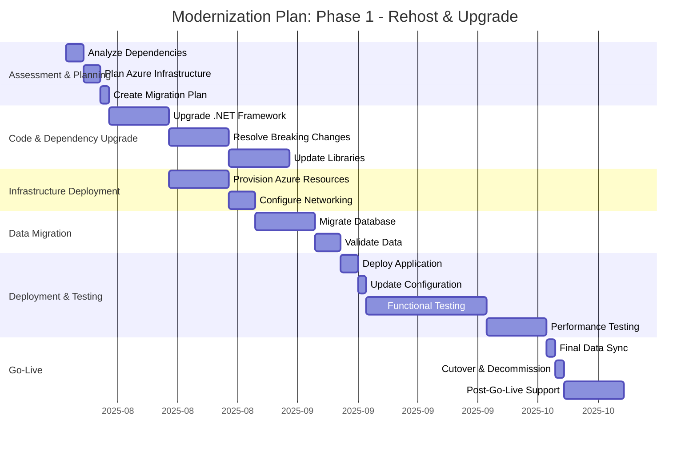

Figure 15 - Gantt chart for the Phase 1 modernization plan.

## 14. Application porfolio management
This section provides an analysis of the application from an IT portfolio management perspective, mapping its components to standard types and evaluating its strategic fit.

### 14.1. IT Component types and attributes
The following table maps the application's components to the SAP LeanIX IT Component model.

| IT Component Type | Name | Type | Version(s) | Provider(s) | Support start date | Support end date | Support end date (extended) | Support status |
| :--- | :--- | :--- | :--- | :--- | :--- | :--- | :--- | :--- |
| **Programming Language** | C# | Programming Language | 4.0 | Microsoft | 2010-04-12 | 2016-01-12 | - | ❌ Unsupported |
| **Programming Language** | VB.NET | Programming Language | 10.0 | Microsoft | 2010-04-12 | 2016-01-12 | - | ❌ Unsupported |
| **Web Framework** | .NET Framework | Web Framework | 4.0 | Microsoft | 2010-04-12 | 2016-01-12 | - | ❌ Unsupported |
| **Database** | Microsoft SQL Server | Database | 2008 R2 | Microsoft | 2010-07-20 | 2014-07-08 | 2019-07-09 | ❌ Unsupported |
| **Operating System** | Windows Server | Operating System | 2008 R2 | Microsoft | 2009-10-22 | 2015-01-13 | 2020-01-14 | ❌ Unsupported |
| **Development Tool** | Visual Studio | Development Tool | 2010 | Microsoft | 2010-04-22 | 2015-07-14 | 2020-07-14 | ❌ Unsupported |
| **Integration Platform** | SOAP Web Service | Integration Platform | 1.1 | W3C | - | - | - | ✅ Supported |

### 14.2. Portfolio strategy
This section evaluates the application's strategic fit using the TIME and 6R models.

| Classification | Evaluation |
| :--- | :--- |
| **TIME Classification** | **Tolerate/Migrate.** The application provides high business value as it handles a core banking process (remittance processing). However, its technical quality is very low due to its reliance on an entirely unsupported technology stack (.NET 4.0, SQL Server 2008 R2). The system cannot be eliminated, but it must be migrated to a modern, supported platform to mitigate significant security and operational risks. The current state is tolerated only as a short-term necessity pending migration. |
| **6R Classification** | **Rehost, then Refactor.** - **Retain:** Not a viable long-term option due to the end-of-life technology stack. - **Retire/Replace:** A full replacement would be high-risk and time-consuming for a core system.  - **Rehost (Lift and Shift):** This is the recommended first step. Moving the application to a supported IaaS platform (e.g., Azure VMs) and upgrading the .NET Framework and SQL Server versions immediately addresses the most critical supportability risks. - **Refactor:** After re-hosting, a gradual refactoring of the monolith into cloud-native services is the ideal long-term strategy to improve maintainability, scalability, and enable modern DevOps practices. |

---
This application analysis was performed using Artificial Intelligence (AI). While AI enhances the process, it may still produce inaccuracies, and all results should be carefully reviewed.