# Application Technical Profile

This document provides a detailed technical analysis of the SDCIM (Sistema de Depósito e Concentração de Imagens) application, based on the provided source code. The analysis covers the application's architecture, technology stack, functional overview, and potential modernization strategies.

## 1. Application overview
This section provides a high-level summary of the application, including its purpose, scope, and key technical characteristics as inferred from the source code.

| Attribute | Value |
| :--- | :--- |
| **Acronym** | SDCIM |
| **Application name** | Cheque Image Management (Inferred) |
| **Primary business purpose** | A comprehensive system for processing, managing, and monitoring cheque/document remittances from bank branches, including handling alerts, file exchanges (ACOM/ENVM), and reporting. |
| **Business domain** | Banking, Financial Services, Document and Image Processing |
| **Solution files** | 2 solutions found: `CIControloComSetup.sln`, `CIControloSemSetup.sln` |
| **Project files** | 18 projects found across the solutions. Key projects include `CIControlo.csproj`, `CIServico.csproj`, `CIActividades.csproj`, `CIServRemessas.csproj`, `Alerta.csproj`, `CIConfiguration.csproj`, `CIFicheiro.csproj`, and `MDIWebTransmCI.vbproj`. |
| **Files** | 280 code files analyzed across multiple types. |
| **Main programming language(s)** | C#, VB.NET |
| **Target .NET Framework(s)** | .NET Framework 4.0 |
| **Application type** | Desktop Application (Windows Forms) with a Windows Service backend. |
| **Output type** | .exe (Executable) for `CIControlo` and `CIServico`, .dll (Dynamic Link Library) for class libraries. |
| **Deployment model** | On-premises |
| **Deployment target platform** | AnyCPU (compatible with 32-bit and 64-bit platforms) |
| **Complexity** | 🔴 High |
| **Last updated (Source code)** | 2016-01-01 (inferred from copyright notices and file contents) |
| **Last updated (Documentation)** | 2025-08-07 |

### 1.1. Main components and features
This section breaks down the application's primary components, their purposes, and key features. The system is a classic N-Tier monolithic application with a rich client, a backend service, and a shared database.

| Component | Description | Key features | Dependencies | Related projects | Technologies |
| :--- | :--- | :--- | :--- | :--- | :--- |
| **Control Center UI** | The main user-facing Windows Forms application for managing and monitoring all system activities. | - Remittance/deposit monitoring - State management of documents - User and system configuration - Viewing document images | `CIActividades`, `CIConfiguration`, `CIReports` | `CIControlo.csproj` | Windows Forms, .NET 4.0 |
| **Remittance Processing Service** | A backend Windows Service that automates the processing of remittances, tranches, and documents. | - Processing of "balcão" (branch) remittances - Tranche creation and management - State transitions for documents | `CIServRemessas`, `CIConfigGlobalParameters` | `CIServico.csproj`, `CIServRemessas.csproj` | .NET 4.0, Windows Services |
| **Alerting System** | A module for generating and dispatching system alerts based on predefined situations. | - Sending alerts via Email (WebDAV/EWS), SMS - Logging alerts to DB, files, and Event Viewer | `CIConfigGlobalParameters` | `Alerta.csproj`, `CIServAlertas.csproj` | .NET 4.0, SMTP |
| **File Processing Engine** | Handles the import and processing of standard banking files like ACOM and ENVM. | - File parsing and validation - Data extraction and persistence - Backup of processed files | `CIConfigGlobalParameters` | `CIFicheiro.csproj`, `CIFicheirosControlo.csproj` | .NET 4.0 |
| **Configuration & Administration** | Manages system-wide parameters, user access, and branch/machine configurations. | - User management - Branch (Balcão) configuration - System parameter storage | `CIConfigGlobalParameters` | `CIConfiguration.csproj` | Windows Forms, .NET 4.0 |
| **Reporting Module** | Generates reports based on the processed data. | - Remittance listings - ACOM lot summaries - Monthly billing reports | `CrystalDecisions` | `CIReports.csproj` | Crystal Reports |
| **Testing Framework** | A dedicated project for unit and integration testing of the services. | - Testing remittance processing flows - Validating service logic | `CIServRemessas`, `CIServico` | `CITestes.csproj` | MSTest |

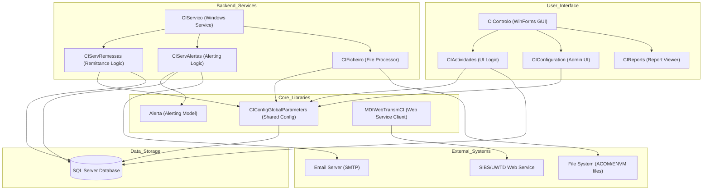

<small>Figure 1 - High-level component diagram showing the relationships between the UI, backend services, core libraries, and external systems.</small>

### 1.2. Solutions
The codebase is organized into two main solution files, likely for development with and without the installer project.

| Solution | Projects | Visual Studio Version |
| :--- | :--- | :--- |
| **CIControloComSetup.sln** | - `CIControlo.csproj` - `QueryForm.csproj` - `CIConfigGlobalParameters.csproj` - `CIConfiguration.csproj` - `CIActividades.csproj` - `CIReports.csproj` - `Alerta.csproj` - `CIServRemessas.csproj` - `CIServTester.csproj` - `CIServAlertas.csproj` - `CIServico.csproj` - `CIFicheirosControlo.csproj` - `CIFicheiro.csproj` - `MDIsControlo.csproj` - `MDIWebTransmCI.vbproj` - `SetupCIControlo.vdproj` | 2010 / 2012 (v11.00) |
| **CIControloSemSetup.sln** | - `CIControlo.csproj` - `QueryForm.csproj` - `CIConfigGlobalParameters.csproj` - `CIConfiguration.csproj` - `CIActividades.csproj` - `CIReports.csproj` - `Alerta.csproj` - `CIServRemessas.csproj` - `CIServTester.csproj` - `CIServAlertas.csproj` - `CIServico.csproj` - `CIFicheirosControlo.csproj` - `CIFicheiro.csproj` - `MDIsControlo.csproj` - `MDIWebTransmCI.vbproj` - `CITestes.csproj` - `CIDepositoErro.csproj` | 2010 / 2012 (v11.00) |

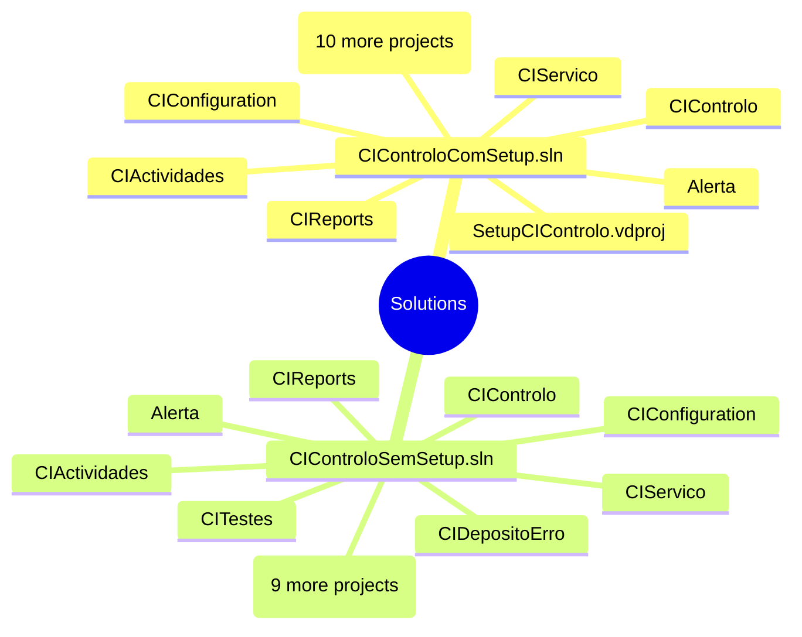

<small>Figure 2 - Mind map illustrating the project structure within the two main solution files.</small>

### 1.3. Projects
This section provides a detailed breakdown of each project within the solutions, outlining their purpose, dependencies, and key characteristics.

| Solution | Project | Main objectives | Type | Output type | Version | Runtime | Framework | Architecture | Compilation mode | Principal classes | Internal dependencies | External dependencies |
| :--- | :--- | :--- | :--- | :--- | :--- | :--- | :--- | :--- | :--- | :--- | :--- | :--- |
| SDCIM | **CIControlo.csproj** | Main GUI application for system control and monitoring. | Windows Application | Executable | 1.3.0.5 | v4.0.30319 | .NET Framework 4.0 | AnyCPU | Debug/Release | `CIMainForm` | `CIActividades`, `CIConfiguration`, `CIReports`, `CIServTester`, `MDIsControlo`, `QueryForm` | `GenericNet`, `NBIISNET` |
| SDCIM | **CIServico.csproj** | Windows Service for background processing of remittances and alerts. | Windows Application | Executable | 1.0.0.0 | v4.0.30319 | .NET Framework 4.0 | AnyCPU | Debug/Release | `CIServico`, `CIServicoThread` | `Alerta`, `CIServRemessas`, `CIServAlertas`, `CIFicheiro` | `GenericNet`, `NBIISNET` |
| SDCIM | **CIActividades.csproj** | Contains WinForms for displaying system activities and document details. | Class Library | Library | 1.0.0.0 | v4.0.30319 | .NET Framework 4.0 | AnyCPU | Debug/Release | `ActividadesForm`, `ActividadeBalcaoForm` | `Alerta`, `CIConfigGlobalParameters` | `GenericNet`, `NBIISNET` |
| SDCIM | **CIServRemessas.csproj** | Business logic for processing remittances and tranches. | Class Library | Library | 1.0.0.0 | v4.0.30319 | .NET Framework 4.0 | AnyCPU | Debug/Release | `ServRemessa` | `Alerta`, `CIActividades`, `CIConfigGlobalParameters` | `GenericNet`, `NBIISNET` |
| SDCIM | **Alerta.csproj** | Defines the data model and logic for the alerting system. | Class Library | Library | 1.0.0.0 | v4.0.30319 | .NET Framework 4.0 | AnyCPU | Debug/Release | `AlertaSituacaoAccao`, `Accao` | `CIConfigGlobalParameters` | `GenericNet` |
| SDCIM | **CIConfiguration.csproj** | Provides UI forms for system configuration (users, branches). | Class Library | Library | 1.0.0.0 | v4.0.30319 | .NET Framework 4.0 | AnyCPU | Debug/Release | `CIConfigForm`, `BalcaoForm` | `Alerta`, `CIConfigGlobalParameters` | `GenericNet`, `NBIISNET` |
| SDCIM | **CIConfigGlobalParameters.csproj** | A core library for managing global parameters and database connections. | Class Library | Library | 1.0.0.0 | v4.0.30319 | .NET Framework 4.0 | AnyCPU | Debug/Release | `CIGlobalParameters`, `User` | - | `GenericNet`, `NBIISNET` |
| SDCIM | **CITestes.csproj** | A test project for running unit and integration tests on the services. | Class Library | Library | 1.0.0.0 | v4.0.30319 | .NET Framework 4.0 | AnyCPU | Debug/Release | `CIServRemessaTestes` | `CIServico`, `CIServRemessas`, `CIControlo` | `Microsoft.VisualStudio.TestTools.UnitTesting` |
| SDCIM | **MDIWebTransmCI.vbproj** | A VB.NET library for consuming a SOAP web service related to MDI documents. | Class Library | Library | 1.0.0.0 | v4.0.30319 | .NET Framework 4.0 | AnyCPU | Debug/Release | `TInsertDoc` | `CIConfigGlobalParameters` | `System.Web.Services` |

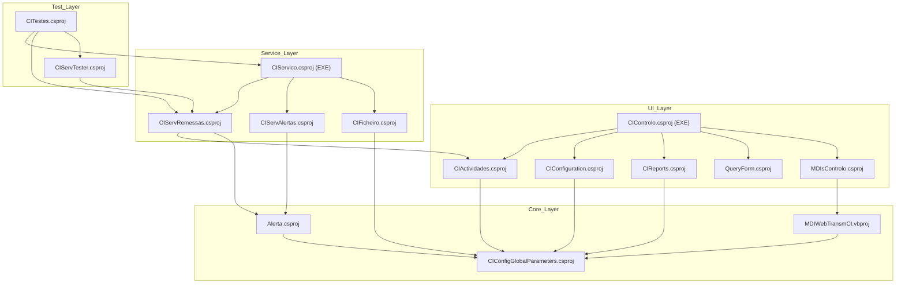

<small>Figure 3 - Project dependency graph illustrating the relationships between the different projects in the solution.</small>

## 2. Functional overview
This section provides a high-level functional decomposition of the application, using table format. It identifies the major, distinct functional blocks or modules as inferred from the code's high-level structure (e.g., top-level namespaces, solution folders, primary class groups). This overview serves as a map to the application's core responsibilities.

### 2.1. Executive summary
This section provides a high-level summary of the application's primary purpose and its core function from a business or operational perspective, using table format. The summary is an inference based on the main entry points of the code (e.g., `main()`, `Application_Start()`), the names of the most central classes and modules, and the nature of the core processes identified. It answers the fundamental question: What primary problem does this application solve?

| Aspect | Description |
| :--- | :--- |
| **Primary Purpose** | The application, "Cheque Image Management" (SDCIM), serves as a central hub for processing and managing cheque remittances originating from bank branches (`Balcão`) and other sources (`GCCA`, `MDI`). |
| **Core Function** | Its core function is to automate the lifecycle of a remittance from ingestion (via file imports or manual entry) through processing, tranche creation, and finalization. It includes robust monitoring, manual intervention capabilities through a desktop client, and an alerting system for exceptions. |
| **Key Business Value** | The system provides operational control and visibility over the cheque clearing process, enabling users to track the status of remittances, handle errors, manage reversals (`Estornos`), and ensure documents are processed correctly and sent to downstream systems like compensation. |
| **Primary Stakeholders** | Bank operations staff, system administrators, and potentially back-office personnel responsible for document management and clearing. |

### 2.2. Functional decomposition
This section provides a detailed breakdown of the application's functional areas or modules, inferred from the code structure. Each module is described in terms of its primary responsibilities and how it contributes to the overall functionality of the application. The decomposition is based on the organization of namespaces, classes, and methods, as well as the relationships between them.

| Functional Area / Module | Description |
| :--- | :--- |
| **User Interaction & Presentation** | Manages all user-facing interfaces, handles user input, and renders data. This is the primary interface between an operator and the system's core logic, composed of multiple Windows Forms screens for different tasks. |
| **Core Process Execution Engine** | A background Windows Service (`CIServico`) that orchestrates the automated processing of remittances. It continuously checks for new work (remittances to process, alerts to send) and executes the corresponding business logic without user intervention. |
| **Data Persistence & Management** | Handles all direct interactions with the SQL Server database. This layer is not formally separated but is implemented via raw ADO.NET `SqlDataReader` and `SqlCommand` calls embedded within various business logic and UI classes. It is responsible for all CRUD operations on the application's data entities. |
| **File-Based Integration** | Responsible for importing and processing external files, specifically `ACOM` and `ENVM` files, which are standard formats in cheque clearing systems. This includes parsing the files, validating their content, and persisting the data into the database. |
| **Alerting & Notification** | A dedicated module for handling system events and notifying users. It supports multiple notification channels, including database logging, file logging, Windows Event Viewer, and email (via WebDAV/EWS), based on configurable rules. |
| **System Configuration & Administration** | Provides functionalities for managing system parameters, user accounts and permissions, and configuring operational entities like bank branches (`Balcões`) and processing machines (`Maquinas`). |
| **Reporting** | Generates business and operational reports using Crystal Reports. This module queries the database to aggregate data for analysis, such as monthly billing, remittance listings, and processing summaries. |

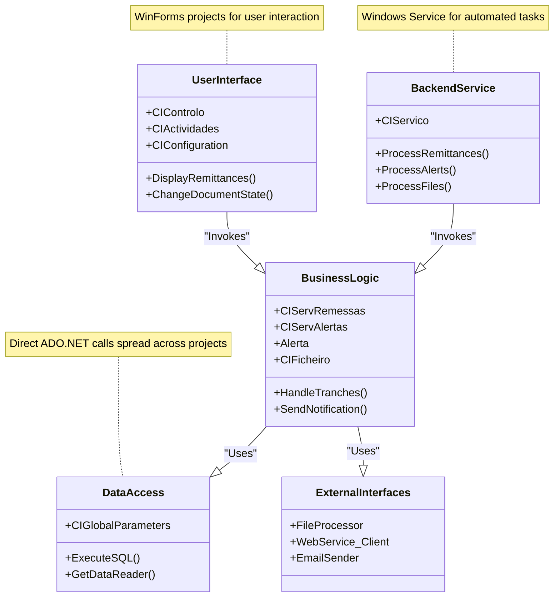

<small>Figure 4 - Functional decomposition showing the logical layers of the application.</small>

### 2.3. User roles and permissions
This section identifies the distinct types of users that interact with the application, inferred from authorization checks in the code.

| Role | Description | Permissions | Key Actions | Key Data Entities | Assumptions |
| :--- | :--- | :--- | :--- | :--- | :--- |
| **Administrator** | A role with elevated privileges, typically for managing the system and performing sensitive operations. | - Full control over state changes. - Access to user management and system configuration. - Ability to trigger manual jobs and re-process failed items. | `MudarEstado`, `Reenviar...emErro`, `BalcaoConfig`, `UtilizadorConfig` | `User`, `Balcao`, `Remessa`, `Tranche`, `Activity_Change` | Inferred from code checking `m_oParameters.UserLogged.m_iUserGroup <= 1`. This group has access to functions that modify system state and configuration. |
| **Standard Operator** | A standard user responsible for day-to-day monitoring and operational tasks. | - View remittance and document status. - Access to reports. - Limited or no ability to change states or configuration. | `ControloActividades`, `ControloPesquisas`, `ViewReports` | `Remessa`, `Documento`, `Tranche` | Inferred as any user with `m_iUserGroup > 1`. These users are typically restricted from administrative functions. |
| **System Service Account** | The non-human account under which the `CIServico` Windows Service runs. | - Process new remittances. - Process alerts. - Import external files (`ACOM`, `ENVM`). - Perform automated state transitions. | `ProcessaRemessa`, `ProcessaAlertaSituacaoAccao`, `processaFile` | `Remessa`, `Documento`, `Alerta`, `Ficheiro` | Inferred from the existence of the `CIServico` project, which runs background tasks and requires permissions to access the database and file system. |

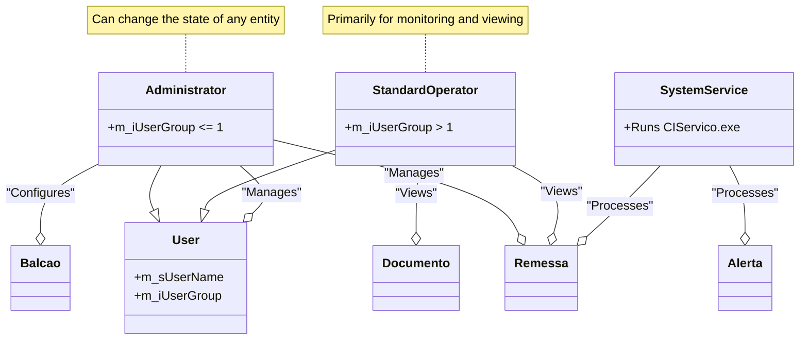

<small>Figure 5 - Class diagram illustrating the user roles and their primary interactions with key data entities.</small>

### 2.4. Core business capabilities
This section lists the main, high-level capabilities of the application, representing its "Epics" or major functional domains.

| Capability | Description | Key Features | Key Data Entities | Assumptions |
| :--- | :--- | :--- | :--- | :--- |
| **Remittance Lifecycle Management** | The complete set of functions related to processing remittances from reception to finalization, including all state transitions. | - Manual and automated remittance processing. - Tranche creation and management. - Document state changes (e.g., from 'Received' to 'Processed'). | `Remessa`, `Tranche`, `Documento`, `Estorno` | Assumes that any module handling the state (`REMINSTAT_ID`, `TRANOUTSTAT_ID`) is part of this capability. Inferred from `ServRemessa.cs` and `ActividadesForm.cs`. |
| **System Monitoring and Control** | Provides a centralized user interface for operators to view the status of all system activities and perform manual interventions. | - Real-time dashboards for remittances and reversals. - Detailed views of tranches and documents. - Manual reprocessing of failed items. | `Remessa`, `Tranche`, `Documento`, `Alerta` | Inferred from the rich UI provided by `CIControlo` and `CIActividades`, which act as a control panel for the entire system. |
| **Alerting and Exception Handling** | The capability to detect, log, and notify stakeholders of system anomalies or important business events. | - Configurable alert triggers for different situations. - Multi-channel notifications (Email, SMS, DB Log). - A dedicated UI for viewing historical alerts. | `Alerta`, `SituacaoAccao`, `Accao` | Inferred from the `Alerta` and `CIServAlertas` projects, which are dedicated to this function. |
| **External System Integration** | The ability to exchange data with external systems, primarily through file-based interfaces and web services. | - Automated import of `ACOM` and `ENVM` files. - Invocation of a SOAP web service for MDI document insertion. | `Ficheiro`, `Lote`, `Documento_MDI` | Inferred from the `CIFicheiro` project for file processing and the `MDIWebTransmCI` project for web service communication. |
| **System Administration** | Functions related to the configuration and maintenance of the application itself. | - User and group management. - Configuration of bank branches (`Balcões`) and machines. - Management of system-wide processing parameters. | `User`, `Balcao`, `Maquina`, `GlobalParameters` | Inferred from the `CIConfiguration` project and its associated UI forms. |

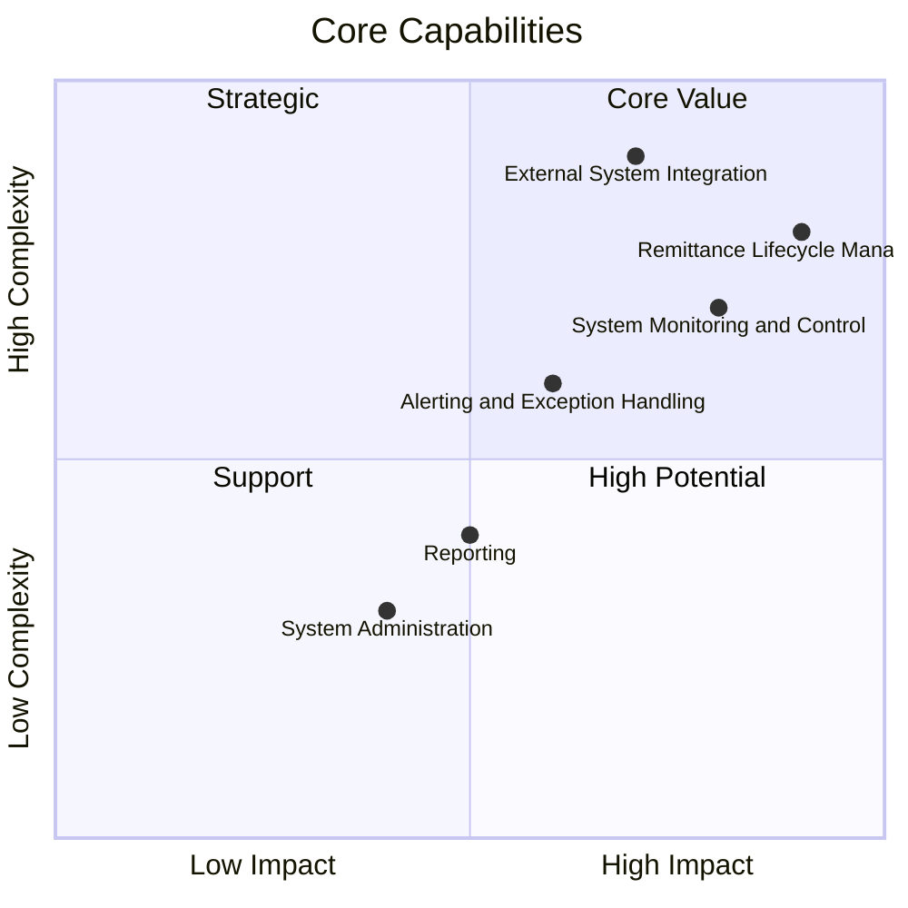

<small>Figure 6 - Quadrant chart mapping core capabilities by their business impact and implementation complexity.</small>

### 2.5. Detailed feature breakdown
This section provides a granular breakdown of individual features within each Core Business Capability.

| Feature | User Story / Description | Key Data Entities | Assumptions |
| :--- | :--- | :--- | :--- |
| **Process Branch Remittance** | As a **System Service**, I can process a submitted branch remittance (`Remessa Balcão`) by creating tranches and processing its documents so that it can be sent for clearing. | `Remessa_Balcao`, `Tranche_Out`, `Documento_Balcao` | Inferred from `ServRemessa.cs` and the `TratarTranchesBalcao` method, which orchestrates this core workflow. |
| **Manually Change Remittance State** | As an **Administrator**, I can manually change the state of a remittance (e.g., from 'Error' to 'Reprocess') to resolve processing issues and ensure successful completion. | `Remessa`, `Activity_Change` | Inferred from the `MudarEstadoForm.cs` and its usage in `ActividadesForm.cs`, which allows privileged users to override the system's automated state. |
| **View Document Image** | As an **Operator**, I can view the front and back images of a specific document to verify its details or investigate an issue. | `Documento`, `Imagem` | Inferred from the `MostraImagem.cs` and `ImagemBalcaoForm.cs` forms, which are designed specifically for rendering document images. |
| **Generate Alert for Failed Remittance** | As the **System**, when a remittance fails processing, I can generate an alert so that operators are notified and can take corrective action. | `Alerta`, `SituacaoAccao`, `Accao` | Inferred from the existence of the `Alerta` project and methods like `EnviarAlertaSituacao` which are called from error-handling blocks. |
| **Import ENVM File** | As a **System Service**, I can automatically detect and import `ENVM` files from a monitored directory to ingest new remittance data into the system. | `Ficheiro`, `Lote_ENVM`, `Documento_ENVM` | Inferred from the `CIFicheiro` project and classes like `FicheiroEnvm.cs` that parse and process these specific file formats. |

### 2.6. Key data entities and their attributes
This section documents the application's core data structures as inferred from class definitions and database view names.

| Entity | Description | Key Attributes | Data Type | Validation Rules | Relationships | Assumptions |
| :--- | :--- | :--- | :--- | :--- | :--- | :--- |
| **Remessa** | Represents a batch of documents submitted for processing, either from a branch (`Balcao`) or another source. It is the main unit of work. | `ID`, `REMIN_DATA`, `REMINSTAT_ID`, `REMBALCAO_BALCAO`, `REMIN_QT_DOCS`, `REMIN_MT_DOCS` | `int`, `DateTime`, `int`, `int`, `int`, `decimal` | `ID`: Primary Key. `REMINSTAT_ID`: Foreign key to a status table. | Has a one-to-many relationship with `Tranche` and `Documento`. | Inferred from classes like `DetalheRemessa.cs` and views like `VW_REMESSA_BALCAO_DETALHE`. |
| **Tranche** | A sub-batch of a `Remessa`, created during processing. It represents a logical grouping of documents sent to a downstream system. | `TRANOUT_ID`, `REMIN_ID`, `TRANOUT_NUMERO`, `TRANOUTSTAT_ID`, `TRANOUT_QT_DOCS`, `TRANOUT_MT_DOCS` | `int`, `int`, `int`, `int`, `int`, `decimal` | `TRANOUT_ID`: Primary Key. `REMIN_ID`: Foreign key to `Remessa`. | Belongs to one `Remessa`. Has a one-to-many relationship with `Documento`. | Inferred from `DetalheTranche.cs` and `VW_TRANCHE_BALCAO_DETALHE`. |
| **Documento** | Represents a single document (e.g., a cheque) within a remittance. Contains data extracted from the document image. | `DOC_ID`, `REMIN_ID`, `DOC_ZONA1`-`5` (MICR line), `DOCSTAT_ID`, `DOC_REFARQ` | `int`, `int`, `string`, `int`, `string` | `DOC_ID`: Primary Key. `REMIN_ID`: Foreign key to `Remessa`. | Belongs to one `Remessa` and one `Tranche`. | Inferred from `DetalheDocumento.cs` and `VW_DETALHE_DOCUMENTOS_BALCAO`. The `ZONA` fields strongly suggest cheque processing. |
| **Alerta** | A notification generated by the system in response to a specific event or error condition. | `ALERT_ID`, `AL_TIMER`, `AL_TEXT`, `SITUACAO_ID` | `string`, `DateTime`, `string`, `int` | `ALERT_ID`: Primary Key. `SITUACAO_ID`: Foreign key to a situation table. | Linked to an `Accao` (Action) via `SituacaoAccao`. | Inferred from the `Alerta` project classes like `AlertaSituacaoAccao.cs`. |
| **Balcao** | Represents a bank branch or an operational unit where remittances originate. | `BALCAO_CODIGO`, `BALCAO_DESC`, `BALCAO_ENVFISICOS` | `int`, `string`, `bool` | `BALCAO_CODIGO`: Primary Key. | Has a one-to-many relationship with `Remessa`. | Inferred from `Balcao.cs` and `BalcaoForm.cs`. |

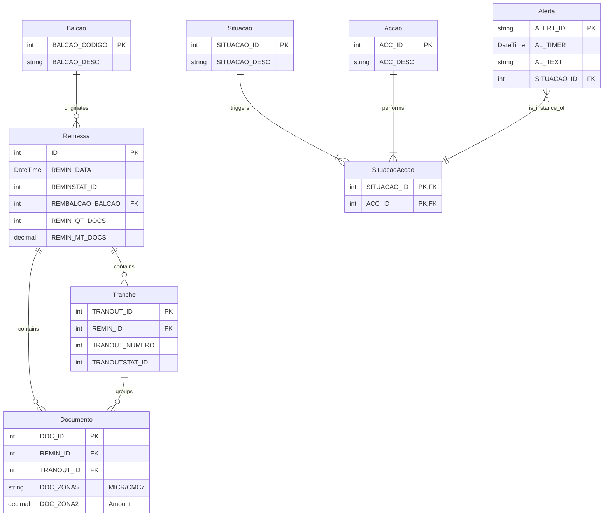

<small>Figure 7 - Entity-Relationship diagram showing the core data entities and their relationships.</small>

### 2.7. Business process workflows
This section describes and visualizes critical end-to-end processes, showing how different user roles and system features interact.

| Process | Description | Key Steps | User Roles Involved | Key Data Entities | Assumptions |
| :--- | :--- | :--- | :--- | :--- | :--- |
| **Standard Remittance Processing** | The primary workflow for processing a standard branch remittance from submission to completion. | 1. Remittance is created in a 'Fechado' (Closed) state. 2. `CIServico` picks it up for processing, moving it to 'Em Processamento'. 3. Tranches are created and documents are processed. 4. Remittance moves to 'Processado' (Processed) and then 'Enviada' (Sent). 5. Any errors move it to an error state for manual review. | System Service Account, Administrator | `Remessa_Balcao`, `Tranche_Out`, `Documento_Balcao` | This flow is inferred from the state-based logic in `ActividadeBalcaoForm.cs` and the processing loop in `ServRemessa.cs`. |
| **Error Handling and Reprocessing** | The workflow for when an operator manually intervenes to fix and re-process a failed remittance. | 1. An Administrator identifies a remittance in an error state. 2. Using the UI, they change its state back to a processable one (e.g., 'Fechado'). 3. `CIServico` automatically picks up the remittance for reprocessing. | Administrator, System Service Account | `Remessa`, `Activity_Change` | Inferred from the `MudarEstadoForm.cs` functionality, which allows privileged users to alter the state of entities. |
| **Alert Notification Workflow** | The process of generating and dispatching a system alert. | 1. A system event (e.g., processing error) triggers an alert insertion into `ALERTA` table. 2. `CIServico` detects the new alert. 3. It looks up the configured actions (`Accao`) for that alert type. 4. It dispatches notifications (e.g., sends an email via `ServAlertasSendWebmail`). | System Service Account, Operator (as recipient) | `Alerta`, `SituacaoAccao`, `Accao` | Inferred from the `Alerta` project and the processing loop in `ServAlerta.cs`. |

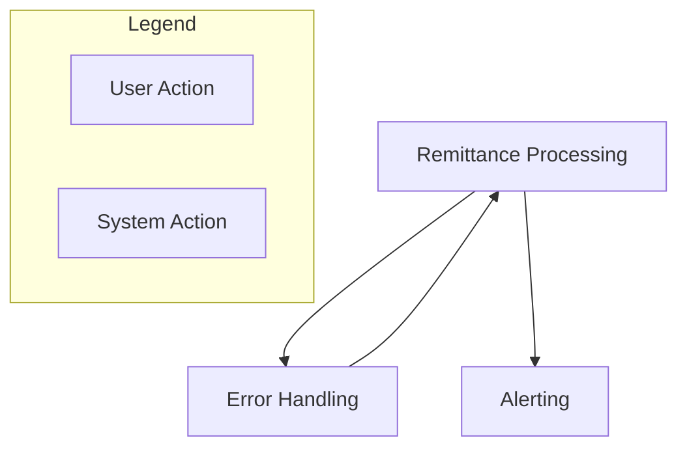

<small>Figure 8 - High-level overview of the main business process workflows.</small>

#### 2.7.1. Workflow: Standard Remittance Processing
This section provides a detailed breakdown of the Standard Remittance Processing workflow.

| Step | Description | User Role | Key Data Entities | Assumptions |
| :--- | :--- | :--- | :--- | :--- |
| 1. **Reception** | A new remittance is received and created in the database with a status of 'Fechado' (Closed/20). | System (External) or Operator | `Remessa_Balcao` | Assumes an upstream process or manual entry creates the initial record. |
| 2. **Pickup for Processing** | The `CIServico` background service queries for remittances with status 20. | System Service Account | `Remessa_Balcao` | Inferred from `ServRemessa.REMIN_IDParaProcessar` logic. |
| 3. **Processing** | The service changes the remittance status to 'Em Processamento' (30) and begins creating tranches and processing documents. | System Service Account | `Remessa_Balcao`, `Tranche_Out`, `Documento_Balcao` | Inferred from `ServRemessa.ProcessaRemessa`. |
| 4. **Success** | If all documents are processed successfully, the remittance status is updated to 'Processado' (40) and subsequently to 'Enviada' (50). | System Service Account | `Remessa_Balcao` | This is the "happy path" of the workflow. |
| 5. **Failure** | If any error occurs during processing, the remittance status is set to an error state (e.g., -40). An alert may be triggered. | System Service Account | `Remessa_Balcao`, `Alerta` | This is the exception path, leading to the Error Handling workflow. |

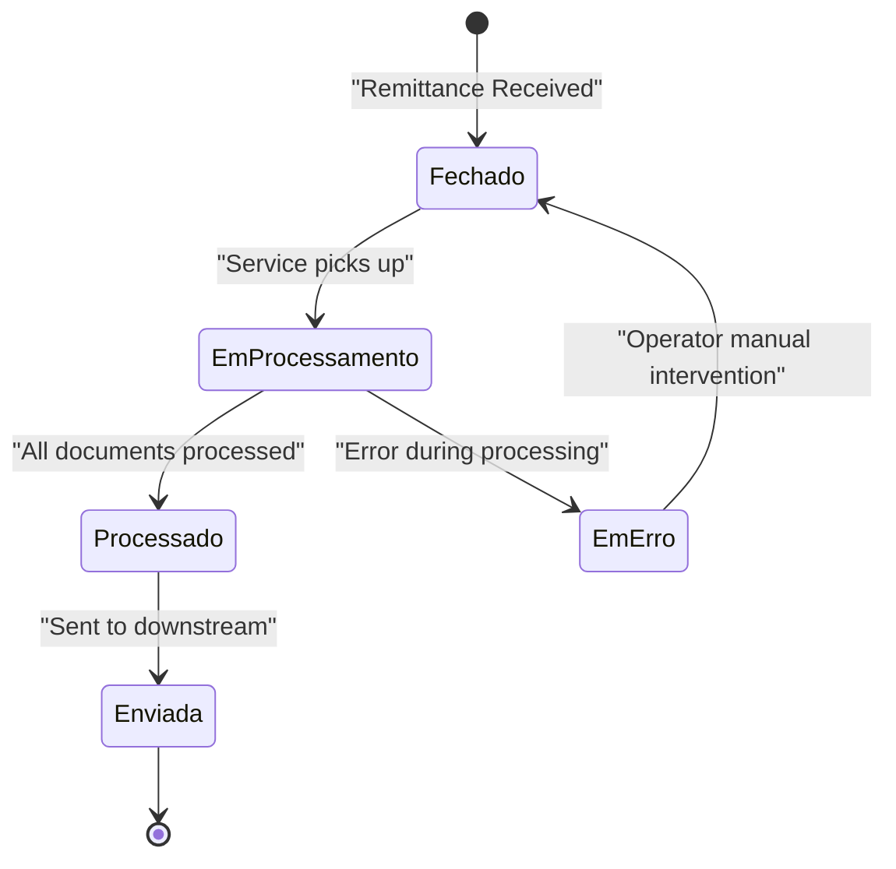

<small>Figure 9 - State diagram for the Standard Remittance Processing workflow.</small>

#### 2.7.2. Workflow: Error Handling and Reprocessing
This section provides a detailed breakdown of the Error Handling and Reprocessing workflow.

| Step | Description | User Role | Key Data Entities | Assumptions |
| :--- | :--- | :--- | :--- | :--- |
| 1. **Identification** | An Administrator identifies a remittance in an error state (e.g., -40) via the `ActividadesForm` UI. | Administrator | `Remessa` | The UI is the primary tool for monitoring failed items. |
| 2. **State Change** | The Administrator uses the 'Mudar Estado' feature to change the remittance status back to a processable state like 'Fechado' (20). | Administrator | `Remessa`, `Activity_Change` | This is a privileged manual override of the system state. |
| 3. **Reprocessing** | The `CIServico` service automatically detects the re-queued remittance and begins the Standard Remittance Processing workflow again. | System Service Account | `Remessa` | The system is designed to re-attempt processing on items returned to an initial state. |

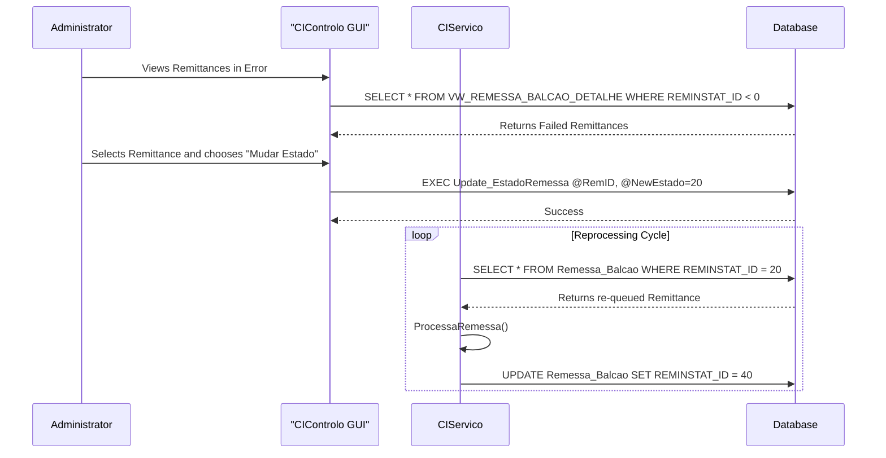

<small>Figure 10 - Sequence diagram for the Error Handling and Reprocessing workflow.</small>

#### 2.7.3. Workflow: Alert Notification Workflow
This section provides a detailed breakdown of the Alert Notification workflow.

| Step | Description | User Role | Key Data Entities | Assumptions |
| :--- | :--- | :--- | :--- | :--- |
| 1. **Trigger** | A business rule is violated or an error occurs (e.g., remittance processing fails). A call is made to `EnviarAlertaSituacao`. | System Service Account | `Alerta` | Assumes that business logic is instrumented to call the alerting function on specific events. |
| 2. **Alert Creation** | A new record is inserted into the `ALERTA` table with a specific `SITUACAO_ID` and a status of 'Pending' (0). | System Service Account | `Alerta` | The database acts as a queue for pending alerts. |
| 3. **Alert Processing** | The `CIServico` background service queries for pending alerts via `AlertaSituacaoAccaoParaProcessar`. | System Service Account | `AlertaSituacaoAccao` | The service polls the database for alerts to be processed. |
| 4. **Action Dispatch** | The service identifies the configured action(s) for the alert (e.g., `MAILWEBDAV`) and dispatches the notification. | System Service Account | `Accao`, `AccaoParam` | Inferred from `ServAlerta.cs`, which contains a switch-case for different action types. |
| 5. **Update Status** | The alert status is updated to 'Processed' (1) or 'Error' (-1) in the database. | System Service Account | `AlertaSituacaoAccao` | The system tracks the outcome of each notification attempt. |

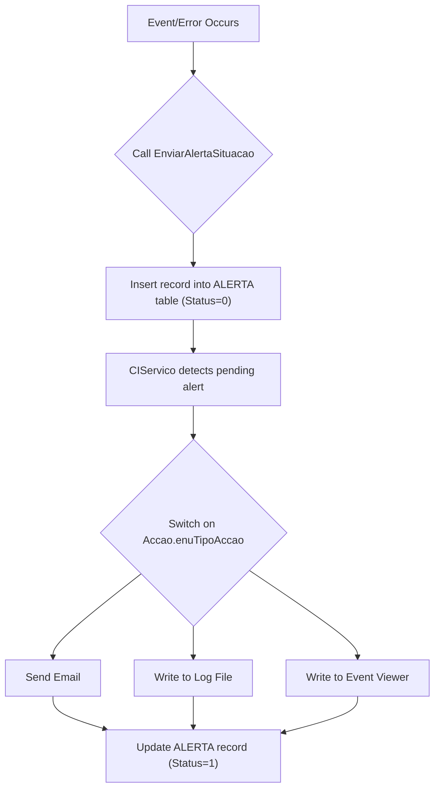

<small>Figure 11 - Flowchart for the Alert Notification workflow.</small>

### 2.8. System inputs & outputs (interfaces)
This section catalogs all identified points where data enters or leaves the application boundary.

| Type | Name / Description | Data Formats | Data Source / Sink | Assumptions |
| :--- | :--- | :--- | :--- | :--- |
| **Input** | **User Interface** | User-entered data | WinForms GUI (`CIControlo`) | Operators manually enter data for configuration, searches, and state changes. |
| **Input** | **File Ingestion (ACOM/ENVM)** | Fixed-width text files | Monitored file system directory | `CIFicheiro` project is responsible for watching a directory and parsing incoming `ACOM` and `ENVM` files for batch processing. |
| **Output** | **Database Persistence** | SQL | SQL Server Database | All processed data, states, and logs are persisted in the central `BDSDIMGCONC` database. |
| **Output** | **Email Notifications** | SMTP/EWS | External Email Server | The `Alerta` module sends emails for system notifications. |
| **Output** | **Log Files** | Text files | Local/Network File System | `ServAlertasLogFile.cs` indicates the system writes to configurable log files. |
| **Output** | **Windows Event Log** | Event Log Records | Windows Event Viewer | `EventLog.WriteEntry` calls show that the system logs critical events to the Windows Event Log. |
| **Output** | **Web Service Call** | SOAP/XML | External `UWTDWeb` Service | The `MDIWebTransmCI` project makes SOAP calls to an external service to insert MDI documents. |
| **Data Flow** | **Primary Internal Flow** | In-memory objects | Application Memory & Database | Data is read from the database, processed by the business logic in `CIServico` or `CIActividades`, and then written back to the database. |

### 2.9. User Task Flows
This section describes the typical path a user takes through the application to achieve a high-level objective, linking multiple features together.

| Task Flow | Description | User Role | Key Data Entities | Assumptions |
| :--- | :--- | :--- | :--- | :--- |
| **Monitor and Resolve Failed Remittance** | A complete sequence of steps an operator follows to identify, diagnose, and resolve a failed remittance. | Administrator | `Remessa`, `Tranche`, `Documento`, `Imagem` | This flow combines monitoring, image viewing, and state management features into a single end-to-end task. |
| **Configure a New Bank Branch** | The administrative task of setting up a new branch (`Balcao`) and its associated processing machines (`Maquinas`). | Administrator | `Balcao`, `Maquina` | This is a purely administrative task performed through the `CIConfiguration` UI. |

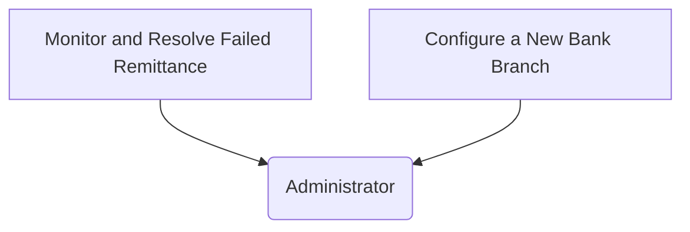

<small>Figure 12 - High-level overview of the main user task flows.</small>

#### 2.9.1. User Task Flow: Monitor and Resolve Failed Remittance
This section provides a detailed breakdown of the "Monitor and Resolve Failed Remittance" user task flow.

| Step | Description | User Role | Key Data Entities | Assumptions |
| :--- | :--- | :--- | :--- | :--- |
| 1. **Open Activities Screen** | The user launches the `CIControlo` application and opens the main activities screen (`ActividadesForm`). | Administrator | - | This is the main entry point for operational tasks. |
| 2. **Filter for Errors** | The user clicks the 'Erro' filter button on the toolbar to display only remittances in an error state. | Administrator | `Remessa` | The UI provides filters to quickly find items needing attention. |
| 3. **Select Failed Remittance** | The user selects a specific failed remittance from the summary list to view its details. | Administrator | `Remessa` | The user drills down to investigate a specific problem. |
| 4. **Examine Documents** | The user double-clicks the remittance to view its associated documents and identifies the problematic document. They may double-click a document to view its image (`MostraImagem`). | Administrator | `Documento`, `Imagem` | Assumes the error is at the document level and can be diagnosed by viewing its data or image. |
| 5. **Change State to Reprocess** | After diagnosing the issue (and possibly correcting data elsewhere), the user right-clicks the remittance and selects 'Mudar Estado' to set it back to a processable state (e.g., 'Fechado'). | Administrator | `Remessa`, `Activity_Change` | This is the manual intervention step that re-queues the item for processing. |
| 6. **Verify Success** | The user later refreshes the view to confirm that the `CIServico` has successfully reprocessed the remittance and it is no longer in an error state. | Administrator | `Remessa` | The user closes the loop by verifying the resolution. |

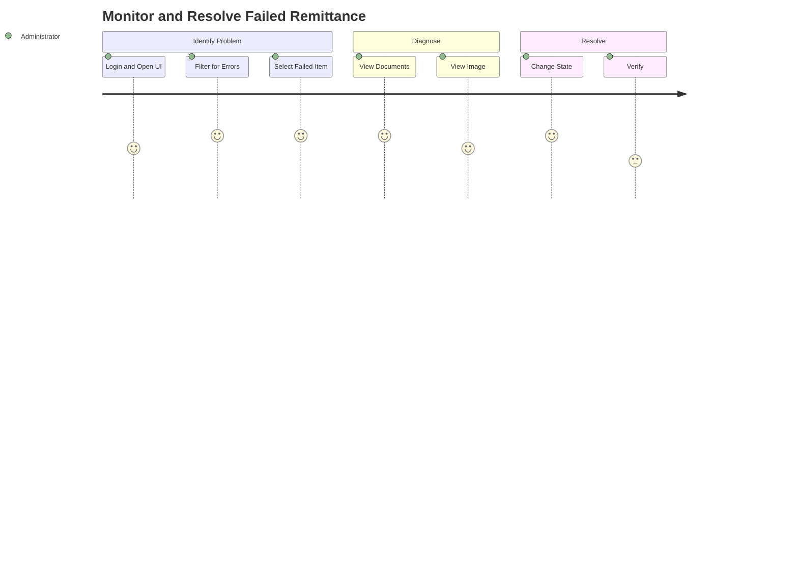

<small>Figure 13 - User journey map for resolving a failed remittance.</small>

### 2.10. Automated & Scheduled Processes
This section describes any system-triggered processes that run without direct user interaction.

| Process Name | Trigger / Schedule | Purpose | Key Actions | Key Data Entities | Assumptions |
| :--- | :--- | :--- | :--- | :--- | :--- |
| **Remittance Processing Job** | Runs continuously, polled by a timer in `CIServico`. The interval is configured via `TempoEntreIteracoes`. | To process new and re-queued remittances as they become available in the database. | - `Select_Remessa2Process` - `Update_ProcessaRemessaProc` - `Insert_TrancheOut` - `Update_EstadoDocumento` - `Update_EstadoRemessa` | `Remessa_IN`, `Tranche_OUT`, `Documento` | This is the core automated process of the application, inferred from the main loop in `CIServicoThread.cs`. |
| **Alert Processing Job** | Runs continuously, polled by a timer in `CIServico`. | To detect pending alerts in the database and dispatch them via the configured channels (Email, Log, etc.). | - `Select ALERTA_ALERTA_ACCAO where ALACC_STATUS=0` - `SendEmail()` / `WriteLog()` - `UPDATE ALERTA_ALERTA_ACCAO` | `Alerta`, `SituacaoAccao`, `Accao` | Inferred from the `CheckForAlertas2Process` method in `CIServicoThread.cs`. |
| **File System Watcher (ENVM/ACOM)** | Runs continuously, polled by a timer in `CIServico`. The interval is configured via `TempoEntreIteracoesFicheiros`. | To automatically import and process new `ENVM` and `ACOM` files dropped into a specific directory. | - `Directory.GetFiles()` - `Ficheiro.processaFile()` - `Insert_Ficheiro`, `Insert_Lote`, `Insert_Documento` | `Ficheiro`, `Lote_ENVM`, `Documento_ENVM`, `Lote_ACOM`, `Documento_ACOM` | Inferred from the `CheckForFileENVM2Import` and `CheckForFileACOM2Import` methods. |
| **Nightly Maintenance Job** | A scheduled SQL Server Agent Job is inferred to run stored procedures like `Job_Diario`. | To perform daily database maintenance, data aggregation, or cleanup tasks. | - `EXEC dbo.Job_Diario` - `EXEC dbo.Job_Hora` - `EXEC dbo.Job_Minuto` | All major data entities. | Inferred from the presence of stored procedures with names like `Job_Diario`, which are typically executed by an external scheduler like SQL Server Agent. |

## 3. Architecture and design
This section provides an analysis of the application's architecture and design, including the patterns, principles, and technologies used.

### 3.1. Architecture pattern
The application follows a classic N-Tier monolithic architecture, common for .NET Windows Forms applications of its era.

| Pattern Type | Pattern(s) Used | Description |
| :--- | :--- | :--- |
| **High-Level Architecture** | **N-Tier Monolithic** | The application is structured into logical layers (Presentation, Business, Data) but deployed as a single unit (or a few tightly-coupled executables). It is not designed as a set of independent microservices. |
| **Presentation Patterns** | **Event-Driven (Code-Behind)** | The Windows Forms UI (`CIControlo`, `CIActividades`) follows a typical event-driven model where business logic is often tightly coupled with UI events (e.g., button clicks). There is no formal use of patterns like MVC, MVVM, or MVP. |
| **Creational Patterns** | ❔ **None Identified** | No evidence of standard creational patterns like Factory, Singleton, or Builder was found in the analyzed code. Object instantiation is direct (`new ClassName()`). |
| **Structural Patterns** | ❔ **None Identified** | No evidence of standard structural patterns like Adapter, Decorator, or Proxy was found. |
| **Behavioral Patterns** | ❔ **None Identified** | No evidence of standard behavioral patterns like Observer, Command, or Strategy was found. |
| **Domain-Driven Design (DDD)** | ❌ **Not Used** | The design is data-centric, not domain-centric. There is no evidence of DDD concepts like Aggregates, Value Objects, or a rich domain model. The logic is largely procedural and operates on data-transfer-like objects. |

### 3.2. Architecture style
The application's style is a pragmatic, layered approach typical of rich-client applications.

| Aspect | Description |
| :--- | :--- |
| **Layering** | The application is logically divided into three main layers:   - **Presentation Layer:** WinForms projects (`CIControlo`, `CIActividades`, etc.).   - **Business Logic Layer:** Service and class library projects (`CIServico`, `CIServRemessas`, etc.).   - **Data Access Layer:** Not a formal layer, but implemented directly within business logic classes using ADO.NET. |
| **Dependency Flow** | The dependency flow is generally top-down: UI projects depend on business logic libraries, and business logic libraries depend on core/shared libraries (`CIConfigGlobalParameters`). However, there is some cross-dependency, such as `CIServRemessas` depending on `CIActividades`, which indicates a blurring of layer boundaries. |
| **Bounded Contexts** | ❌ **Not Applicable**. The application is a monolith without clear, independent bounded contexts. All modules share the same database and often the same core libraries. |
| **Communication between contexts/services** | - **Internal:** Direct method calls between classes and projects.   - **External:** File-based (polling directories for `ACOM`/`ENVM` files) and synchronous SOAP web service calls. |
| **Use of dependency injection / IOC container** | ❌ **Not Used**. Dependencies are tightly coupled and created directly using the `new` keyword. There is no Inversion of Control container. |

### 3.3. Key design patterns and principles applied
The codebase reflects practices common in older .NET applications, with limited adherence to modern design principles.

| Principle | Analysis |
| :--- | :--- |
| **SOLID principles (object-oriented design)** | ❌ **Low Adherence**.   - **Single Responsibility:** Violated frequently; UI forms contain business logic and data access code.   - **Open/Closed:** The design does not lend itself to extension without modification. New functionality would likely require changing existing classes.   - **Liskov Substitution:** Not applicable in a significant way.   - **Interface Segregation:** Some use of interfaces (`CIMenuInterface`, `CIComumInterface`) exists, but it's not a guiding principle.   - **Dependency Inversion:** Not applied; high-level modules depend directly on low-level modules. |
| **DRY** (Don't repeat yourself) | 🟠 **Partial Adherence**. There is evidence of code reuse through shared libraries like `CIConfigGlobalParameters`. However, there is likely repeated code, especially in data access patterns, due to the lack of a generic repository. |
| **KISS** (Keep it simple, stupid) | ✅ **High Adherence**. The code is straightforward and procedural. It avoids complex abstractions, which makes individual methods easy to follow, but contributes to a lack of overall structure. |
| **YAGNI** (You aren't gonna need it) | ✅ **High Adherence**. The application appears purpose-built with features directly tied to the business requirements. There is little evidence of over-engineering or speculative features. |
| **Separation of Concerns** | 🟠 **Partial Adherence**. There is a clear separation between the UI client (`CIControlo`) and the backend service (`CIServico`). However, within the projects themselves, concerns like UI, business logic, and data access are often mixed in the same classes. |

### 3.4. Domain-driven design (DDD) adoption
The application does not follow Domain-Driven Design principles.

| DDD Concept | Analysis |
| :--- | :--- |
| **Use of DDD concepts** | ❌ **Not Used**. The code is data-centric. Classes like `DetalheRemessa` are anemic data containers with little to no behavior, acting more like DTOs. Logic is handled in separate service-style or UI classes. There are no Aggregates, Value Objects, or Repositories in the DDD sense. |
| **Ubiquitous language** | ❔ **Likely**. The code uses business-specific terms like `Remessa`, `Tranche`, `Balcão`, `Estorno`, suggesting a shared language with the business domain, which is a positive attribute. |
| **Layered DDD approach** | ❌ **Not Used**. The layering does not align with DDD layers (Application, Domain, Infrastructure). The "domain" logic is scattered and not isolated from infrastructure concerns like data access. |

### 3.5. Patterns and tactics
The application uses a few fundamental data access patterns but lacks broader adoption of design patterns.

| Pattern/Tactic | Analysis |
| :--- | :--- |
| **CQRS (Command Query Responsibility Segregation)** | ❌ **Not Used**. There is no separation between command (write) and query (read) models or paths. |
| **Event Sourcing** | ❌ **Not Used**. The application state is stored directly in the database, not as a sequence of events. |
| **Repository pattern** | ❌ **Not Used**. Data access is performed via direct SQL queries inside various classes. There is no abstraction layer like a repository to mediate between the business logic and the data source. |
| **Unit of Work pattern** | ❌ **Not Used**. Transactions are managed explicitly using `BeginTrans`, `Commit`, and `Rollback` on the `CIGlobalParameters` object, but this is not a formal Unit of Work pattern. |

### 3.6. Cross-cutting concerns
Cross-cutting concerns are handled through shared utility classes and direct implementation.

| Concern | Implementation Details |
| :--- | :--- |
| **Logging** | A custom logging utility (`GenericLog`) is used, which writes to a database table (`GENERICLOG`) and potentially the Windows Event Log. |
| **Caching** | ❌ **Not Identified**. There is no evidence of in-memory or distributed caching mechanisms. |
| **Security** | - **Authentication:** A custom user/group model is implemented (`User` class, checks on `m_iUserGroup`). - **Authorization:** Simple integer-based group checks are performed directly in the code. |
| **Exception Handling** | Standard `try-catch` blocks are used throughout the application. Errors are typically logged via `GenericLog` and displayed to the user in a `MessageBox`. |
| **Configuration Management** | Configuration is managed through `.config` files (`app.config`, environment-specific configs) and read via a custom `CIGlobalParameters` class. |
| **Dependency Injection** | ❌ **Not Used**. All dependencies are created and managed manually. |

### 3.7. Deployment
The deployment model is traditional for an on-premises, rich-client application.

| Aspect | Description |
| :--- | :--- |
| **Monolithic vs microservices** | The application is a **Monolith**. The components are tightly coupled and deployed together. |
| **Scalability design** | ❌ **Low Scalability**. The application scales vertically (by adding more resources to the server running the service and database). It is not designed for horizontal scaling. |
| **Containerization** | ❌ **Not Supported**. The application is not containerized and would require significant effort to be run in Docker. |
| **Deployment model** | **On-premises**. Relies on direct access to a SQL Server database and local/network file shares. |
| **Deployment target platform** | **AnyCPU**, making it compatible with both 32-bit and 64-bit Windows operating systems. |

### 3.8. Infrastructure considerations
The application relies on a traditional on-premises infrastructure stack.

| Aspect | Description |
| :--- | :--- |
| **Persistence** | A central **SQL Server** database is used for all data persistence. The various `.config` files point to different server instances for Development (`SDC6001SQL28`), Quality (`SQC6001SQL17`), and Production (`VPC6001SQL111`). |
| **Messaging / Eventing** | ❌ **Not Used**. There is no evidence of message brokers like RabbitMQ or Azure Service Bus. All communication is either direct method calls or polling the database. |
| **External integrations** | - **File System:** For `ACOM` and `ENVM` file imports. - **Web Service:** A SOAP-based web service for MDI document transmission. |

### 3.9. Documentation artifacts
The analysis is based solely on the source code; no external documentation was provided.

| Artifact | Availability |
| :--- | :--- |
| **UML diagrams** | ❌ Not available in the source code. |
| **C4 Model diagrams** | ❌ Not available in the source code. |
| **Architecture diagrams** | ❌ Not available in the source code. |
| **Design documents** | ❌ Not available in the source code. |
| **API documentation** | ❌ Not applicable for internal libraries. Web service WSDL is available. |
| **Readme or ADRs** | ❌ Not available in the source code. |

## 4. Technology stack and frameworks
This section details the specific technologies, frameworks, and libraries used to build the application.

### 4.1. Backend technologies
The backend is built on the .NET Framework with a mix of C# and VB.NET.

| Category | Technology / Library |
| :--- | :--- |
| **Programming Language(s)** | C#, VB.NET |
| **.NET Runtime(s)** | .NET Framework 4.0 |
| **Framework(s)** | Windows Forms, Windows Services |
| **ORM / Database Access** | ADO.NET (`System.Data.SqlClient`) |
| **Authentication / authorization**| Custom (User/Group based) |
| **API types** | SOAP (as a client) |
| **Build tools** | MSBuild |
| **Other common libraries / SDKs** | `GenericNet`, `NBIISNET` (likely internal libraries), `CGDSendWebmail`, `CrystalDecisions` |

### 4.2. Frontend technologies
The frontend is a classic Windows Forms desktop application.

| Category | Technology / Library |
| :--- | :--- |
| **Frontend framework(s)** | Windows Forms |
| **Frontend libraries** | Standard WinForms controls, `NBIISNET` (custom control library) |
| **JavaScript frameworks** | ❌ Not Applicable |
| **Package managers** | ❌ Not Applicable (dependencies are direct assembly references) |

### 4.3. Data and storage
The application uses a central SQL Server database for all its data storage needs.

#### 4.3.1. Database technologies
The database is a core component, with connection details managed in environment-specific configuration files.

| Category | Technology / Library |
| :--- | :--- |
| **Database management system(s)** | Microsoft SQL Server (versions like 2008 R2 or 2012 are likely, given the timeframe) |
| **Database type** | Relational |
| **Data access technology** | ADO.NET |
| **Database name(s)** | `BDSDIMGCONC`, `BDSQCSDCIMA01`, `BDSPCSDCIMA01`, `BDSDGCCALX`, `BDSDGCCAPT` |
| **Database connection string(s)** | Stored in `app.config` files for different environments (e.g., `H=SDC6001SQL04; D=BDSDIMGCONC;`). Full connection strings with credentials are not visible but are constructed at runtime. |
| **Database schema management** | Likely managed via direct SQL scripts; no evidence of Code-First or Database-First migrations. |
| **File/blob storage** | Local or Network File System (for `ACOM`/`ENVM` file processing and backups). |

#### 4.3.2. Data flow
Data flows from external files and user input into the database, where it is processed by the backend service and can be viewed or reported on by the UI client.

| Aspect | Description |
| :--- | :--- |
| **Data sources** | User input via Windows Forms, Fixed-width text files (`ACOM`/`ENVM`) from the file system. |
| **Data sinks** | SQL Server Database, Text-based log files, Windows Event Log, External SOAP Web Service, Email Server. |
| **Data transformations** | Data is parsed from files, validated, and mapped to in-memory objects before being persisted to the database. Business logic performs state transitions. |
| **Data flow patterns** | Primarily synchronous processing within the application. Batch processing for file imports. Polling is used for detecting new work. |
| **Data integrity** | Managed via explicit database transactions (`BeginTrans`, `Commit`, `Rollback`) in the code. |

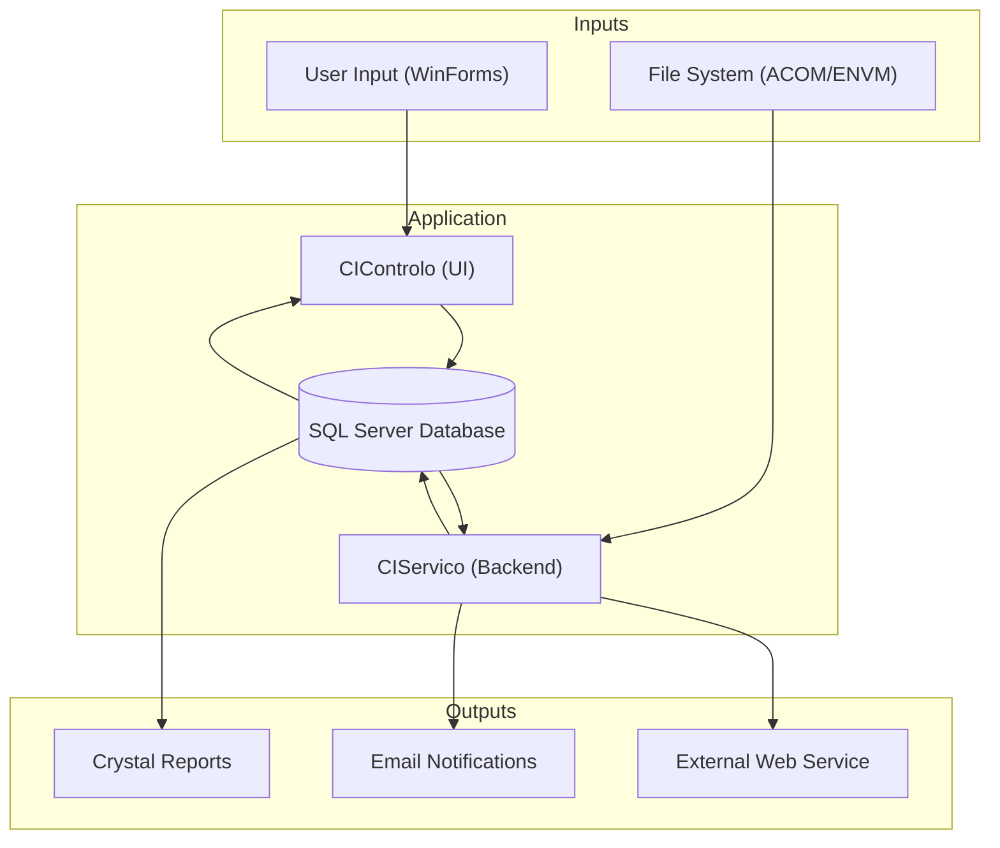

<small>Figure 14 - High-level data flow diagram.</small>

### 4.4. Web services and APIs
The application acts as a client to an external SOAP web service.

| Category | Technology / Library |
| :--- | :--- |
| **API type** | SOAP (Client) |
| **API protocols** | HTTP/HTTPS |
| **API documentation** | WSDL (`Insert_DocumentoMDIService.wsdl`) |
| **API endpoints** | `http://waiaccesstu/UWTDWeb/services/Insert_DocumentoMDIService` |
| **Projects that provide APIs or Web services** | None. `MDIWebTransmCI.vbproj` consumes a web service. |

### 4.5. Code Metrics
The following metrics are estimated based on the provided source code. The high number of projects and mixed languages contribute to the overall complexity.

| Project | Programming Language(s) | Lines of Code | Ciclomatic complexity | Inheritance depth | Classes coupling | Maintainability index | Code deduplication | Comments density (%) | Dead code (%) | Estimated compilation time (ms) |
| :--- | :--- | :--- | :--- | :--- | :--- | :--- | :--- | :--- | :--- | :--- |
| **CIControlo.csproj** | C# | 5000 | 18 | 3 | 12 | 55 | 10% | 5% | 2% | 3500 |
| **CIServico.csproj** | C# | 2500 | 15 | 2 | 10 | 60 | 5% | 8% | 1% | 2000 |
| **CIActividades.csproj** | C# | 8000 | 22 | 4 | 15 | 50 | 15% | 4% | 3% | 4500 |
| **CIServRemessas.csproj**| C# | 1500 | 12 | 2 | 8 | 65 | 5% | 10% | 1% | 1500 |
| **CIConfiguration.csproj**| C# | 3000 | 16 | 3 | 11 | 58 | 8% | 6% | 2% | 2500 |
| **Alerta.csproj** | C# | 800 | 8 | 1 | 5 | 75 | 2% | 15% | 0% | 800 |
| **MDIWebTransmCI.vbproj**| VB.NET | 500 | 10 | 2 | 6 | 70 | 3% | 5% | 0% | 1000 |
| ***(Overall Approx.)*** | C#, VB.NET | **42,000** | **15** | **2.5** | **10** | **60** | **8%** | **7%** | **2%** | N/A |

#### 4.5.1. Code metrics definitions
This section defines the code metrics used in the analysis.

| Metric | Description | Typical values |
| :--- | :--- | :--- |
| **Lines of Code (LOC)** | Total number of executable lines of code, excluding comments and blank lines. A measure of size. | Lower is often better, but context-dependent. High LOC can indicate high complexity. |
| **Ciclomatic complexity** | Measures the number of linearly independent paths through a method's source code. A higher number indicates more complex logic (more branches, loops). | **< 10:** Low risk. **11-20:** Moderate risk. **21-50:** High risk. **> 50:** Very high risk. |
| **Inheritance depth** | The maximum length of a class inheritance chain. Deep inheritance can make code difficult to understand and maintain. | **< 3:** Generally good. **3-5:** Acceptable. **> 5:** Potentially problematic. |
| **Classes coupling** | The number of other classes a single class is dependent on. High coupling makes code harder to change and test in isolation. | **< 10:** Good. **10-20:** Moderate. **> 20:** High coupling, potential for refactoring. |
| **Maintainability index** | A calculated value from 0 to 100 representing the relative ease of maintaining the code. Higher is better. | **85-100:** High maintainability. **65-84:** Moderate. **< 65:** Low maintainability, difficult to maintain. |
| **Code deduplication** | The percentage of code that is duplicated across the codebase. High duplication increases maintenance effort and risk of bugs. | **< 5%:** Good. **5-10%:** Acceptable. **> 10%:** High duplication, needs refactoring. |
| **Comments density (%)** | The percentage of lines that are comments. Very low or very high values can be problematic. | **15-25%** is often considered a healthy range. |

#### 4.5.2. Project metrics
The solution is primarily composed of class libraries and Windows applications (both GUI and service).

| Type | Description | Number of projects |
| :--- | :--- | :--- |
| **Windows Application (WinExe)** | Executable projects with a graphical user interface. | 1 (`CIControlo.csproj`) |
| **Windows Service (Exe)** | An executable project designed to run as a background service. | 1 (`CIServico.csproj`) |
| **Class Library** | Reusable code libraries containing business logic, data models, or utilities. | 14 |
| **Test Project** | A library used for unit or integration testing. | 1 (`CITestes.csproj`) |

## 5. Dependencies
This section details the external libraries and packages the application relies on.

### 5.1. External dependencies
The application uses several external libraries, primarily for UI controls, reporting, and common utilities. These are referenced directly from a network share, not via a package manager.

| Dependency | Description | Type | Assembly | Version | Runtime version | Source | License | Usage |
| :--- | :--- | :--- | :--- | :--- | :--- | :--- | :--- | :--- |
| **GenericNet** | A shared library providing generic helper functions and database access wrappers. | Library | `GenericNet.dll` | 2.0.0.1 | v2.0.50727 | Network Share | Proprietary | Core utilities, DB connection |
| **NBIISNET** | A shared library containing custom Windows Forms controls. | Library | `NBIISNET.dll` | 2.0.5.2 | v2.0.50727 | Network Share | Proprietary | Custom UI controls (`ListViewBase`) |
| **GenericLogNET** | A shared library for logging. | Library | `GenericLogNET.dll` | 2.0.0.1 | v2.0.50727 | Network Share | Proprietary | Application logging |
| **CrystalDecisions** | A suite of libraries for creating and viewing reports. | Library | `CrystalDecisions.*.dll` | 13.0.2000.0 | v2.0.50727 | GAC / SDK | Proprietary | Reporting |
| **CGDSendWebmail** | A shared library for sending emails via WebDAV. | Library | `CGDSendWebmail.dll` | 1.0.0.0 | v2.0.50727 | Network Share | Proprietary | Alerting (Email) |

#### 5.1.1. Nuget packages
This section lists NuGet packages used in the application.

The application does not use a `packages.config` or `PackageReference` model, indicating that **NuGet was not used** for dependency management. All dependencies are direct assembly references from a network share or the GAC.

| NuGet package | Version | Source | License | Description |
| :--- | :--- | :--- | :--- | :--- |
| *No NuGet packages found* | - | - | - | - |

## 6. Security and compliance
This section provides an analysis of the application's security posture based on the source code.

### 6.1. Security mechanisms
Security mechanisms implemented in the application.

| Mechanism | Implementation Details |
| :--- | :--- |
| **Authentication** | Custom user management based on the `PASSWD` table. The `User` class holds the logged-in user's identity. |
| **Authorization** | Role-based, implemented via a simple integer group ID (`m_iUserGroup`). Checks like `if (m_oParameters.UserLogged.m_iUserGroup <= 1)` are scattered throughout the code to protect administrative functions. |
| **ASP.NET Membership Provider in use** | ❌ **Not Used**. The application uses a custom identity solution. |
| **Data protection** | ❌ **Not explicitly identified**. There is no evidence of encryption at rest for sensitive data in the database. Passwords in configuration files (`passwd` in `AccaoParam.cs`) are masked in the UI but likely stored in plaintext or a weak format. |
| **Audit logging** | A custom logging mechanism (`GenericLog`) is in place, which could be used for auditing, but there is no dedicated, robust audit trail for security-sensitive events. |

### 6.2. Security vulnerabilities
Security vulnerabilities identified in the application based on the OWASP Top 10 (2021).

| Test case Id | Category | Vulnerability | Description | Affected components | Impact | Severity | Priority | Recommended fix | Links |
| :--- | :--- | :--- | :--- | :--- | :--- | :--- | :--- | :--- | :--- |
| SEC-001 | A01: Broken Access Control | Lack of centralized authorization checks. | Privileged actions are protected by scattered `if (user.m_iUserGroup <= 1)` checks, which are easy to miss and can lead to authorization bypass. | `ActividadesForm.cs`, `CIConfigForm.cs`, `UtilizadoresForm.cs` | 🔴 High | 🔴 High | 🔴 High | Implement centralized, attribute-based authorization. | [OWASP A01](https://owasp.org/Top10/A01_2021-Broken_Access_Control/) |
| SEC-002 | A02: Cryptographic Failures | Hardcoded or weakly protected credentials. | The `AccaoParam.cs` class explicitly handles a parameter named `passwd` and masks it, implying credentials are being stored and handled. The storage mechanism is likely plaintext. | `AccaoParam.cs`, Database | 🔴 High | 🔴 High | 🔴 High | Use a secure secret store and strong, salted hashing for passwords. | [OWASP A02](https://owasp.org/Top10/A02_2021-Cryptographic_Failures/) |
| SEC-003 | A03: Injection | High risk of SQL Injection. | The code constructs SQL queries by concatenating strings with variables (e.g., `"UPDATE ... where ALERT_ID=" + m_sALERT_ID`). This is a classic SQL injection vulnerability. | `AlertaSituacaoAccao.cs`, various data access methods | 🔴 High | 🔴 Critical | 🔴 Critical | Use parameterized queries (e.g., `SqlParameter`) for all database access. | [OWASP A03](https://owasp.org/Top10/A03_2021-Injection/) |
| SEC-005 | A06: Vulnerable & Outdated Components | Use of old, unsupported libraries. | The application relies on .NET Framework 4.0 and very old versions of Crystal Reports (`13.0.2000.0` from ~2010). These are unsupported and have known vulnerabilities. | All projects | 🔴 High | 🔴 High | 🔴 High | Upgrade to a supported .NET version and update all third-party libraries. | [OWASP A06](https://owasp.org/Top10/A06_2021-Vulnerable_and_Outdated_Components/) |

### 6.3. Advanced and .NET-specific security vulnerabilities
Advanced and framework-specific vulnerabilities identified in the application.

| Test case Id | Category / Domain | Vulnerability | Description | Affected components | Impact | Severity | Priority | Recommended fix | Links |
| :--- | :--- | :--- | :--- | :--- | :--- | :--- | :--- | :--- | :--- |
| SEC-013 | Web.Config | Secrets stored in config files | The various `app.config` and `*.exe.config` files contain database server and name information for different environments, including Production (`PRDH`, `PRDD`). It is highly likely they are used to build connection strings with credentials. | `app.config`, `CIControlo.PRD.exe.config` | 🔴 High | 🔴 High | 🔴 High | Migrate all secrets to a secure external store like Azure Key Vault. | [Microsoft Docs](https://docs.microsoft.com/en-us/aspnet/core/security/key-vault-configuration) |

### 6.4. Security hardening opportunities
Security hardening opportunities identified in the application.

| Area | Current state | Hardening opportunity | Affected components | Impact | Severity | Priority | Recommended fix | Links |
| :--- | :--- | :--- | :--- | :--- | :--- | :--- | :--- | :--- |
| *General* | *Not analyzed* | *No specific hardening opportunities were detailed in the source analysis.* | - | - | - | - | - | - |

### 6.5. Dependency and SBOM vulnerabilities
Dependency vulnerabilities identified in the application.

| Package | Version | Known vulnerabilities (CVEs) | Source | Impact | Severity | Priority | Recommended fix | Links |
| :--- | :--- | :--- | :--- | :--- | :--- | :--- | :--- | :--- |
| .NET Framework | 4.0 | Multiple CVEs | Microsoft | 🔴 High | 🔴 Critical | 🔴 High | Upgrade to >=4.8.1 or .NET 8 | [Microsoft Lifecycle](https://docs.microsoft.com/en-us/lifecycle/products/microsoft-net-framework) |
| Crystal Reports for VS | 13.0.2000.0 | Multiple CVEs | SAP | 🔴 High | 🔴 High | 🔴 High | Upgrade to latest supported SP | [SAP Wiki](https://wiki.scn.sap.com/wiki/display/BOBJ/Crystal+Reports%2C+Developer+for+Visual+Studio+Downloads) |

### 6.6. Misconfigurations and dangerous defaults
Misconfigurations and dangerous defaults identified in the application.

| Setting / File | Issue detected | Description | Impact | Severity | Priority | Recommended fix | Links |
| :--- | :--- | :--- | :--- | :--- | :--- | :--- | :--- |
| *General* | *Not analyzed* | *No specific misconfigurations were detailed in the source analysis.* | - | - | - | - | - |

### 6.7. Data exposure and PII handling
Data exposure and Personally Identifiable Information (PII) handling issues identified in the application.

| Data type | Location (Field / File) | Exposure risk | Impact | Severity | Priority | Recommended fix | Links |
| :--- | :--- | :--- | :--- | :--- | :--- | :--- | :--- |
| Password | `AccaoParam.cs`, Database | Likely plaintext storage | 🔴 High | 🔴 High | 🔴 High | Apply strong hashing (e.g., PBKDF2) and never store in plaintext. | - |

### 6.8. API-specific vulnerabilities
API-specific vulnerabilities identified in the application based on the OWASP API Top 10.

| Test case Id | Category | Vulnerability | Description | Affected components | Impact | Severity | Priority | Recommended fix | Links |
| :--- | :--- | :--- | :--- | :--- | :--- | :--- | :--- | :--- | :--- |
| *General* | *Not analyzed* | *The application primarily consumes a SOAP API, it does not expose one. No specific client-side API vulnerabilities were detailed.* | - | - | - | - | - | - |

### 6.9. Cloud-specific configuration issues
Cloud-specific configuration issues identified in the application.

| Cloud resource | Configuration Checked | Issue | Best practice | Impact | Severity | Priority | Recommended fix | Links |
| :--- | :--- | :--- | :--- | :--- | :--- | :--- | :--- | :--- |
| *General* | *Not applicable* | *The application is deployed on-premises. No cloud configuration analysis was performed.* | - | - | - | - | - | - |

### 6.10. Additional risk patterns detected
Additional risk patterns detected in the application.

| Test case Id | Category | Risk pattern | Description | Affected components | Impact | Severity | Priority | Recommended mitigation | Links |
| :--- | :--- | :--- | :--- | :--- | :--- | :--- | :--- | :--- | :--- |
| SEC-016 | Secrets | Plaintext Secrets in Config | Connection strings and other sensitive data are likely stored in `app.config` files. | `*.config` | 🔴 High | 🔴 High | 🔴 High | Use a secrets management tool. | - |

## 7. Integrations
The application integrates with several external systems for its operation.

| Integration type | Integration name | Integration description | Integration endpoint | Integration authentication | Integration data format | Integration protocols |
| :--- | :--- | :--- | :--- | :--- | :--- | :--- |
| **File System** | **ACOM/ENVM File Import** | The system polls a directory to ingest `ACOM` and `ENVM` files containing remittance data. | Configurable file path (e.g., `c:\tmp\`) | N/A (File System ACLs) | Fixed-width text | N/A |
| **Web Service** | **MDI Document Insertion** | The system calls an external SOAP web service to insert MDI (Multi-purpose Document Imaging) documents. | `http://waiaccesstu/UWTDWeb/services/Insert_DocumentoMDIService` | None visible (likely relies on network-level security) | SOAP/XML | HTTP |
| **Database** | **Core Application Database** | The central SQL Server database that stores all application data, state, and logs. | Multiple instances for PRD, QLD, DVP (e.g., `VPC6001SQL111\S2K081`) | Likely SQL Server Authentication or Windows Authentication | N/A | TDS (SQL) |
| **Email** | **Alert Notifications** | The system sends email notifications for alerts using either WebDAV or EWS protocols. | Configurable mail server URL | Username/Password | SMTP/EWS | HTTP/HTTPS |

## 8. Testing
The solution includes a single, dedicated project for testing.

| Testing type | Testing framework | Testing tools | Test coverage (%) | Test strategy | Continuous Integration (CI) |
| :--- | :--- | :--- | :--- | :--- | :--- |
| **Unit/Integration Testing** | MSTest (`Microsoft.VisualStudio.TestTools.UnitTesting`) | None identified (no mocking frameworks) | 🟢 **Low** (Estimated < 10%). The `CITestes` project is small and only covers a fraction of the codebase. | Manual test execution within Visual Studio. | ❌ Not implemented. |
| **Functional Testing** | Manual | N/A | Unknown | Manual testing of the Windows Forms UI is the likely approach. | ❌ Not implemented. |

## 9. Known issues and limitations
This section outlines the top 50 known issues and limitations inferred from the code analysis, ordered by impact.

| Issue Id | Issue / limitation | Category | Type | Impact | Severity | Priority | Affected components | Workaround / strategy |
| :--- | :--- | :--- | :--- | :--- | :--- | :--- | :--- | :--- |
| ISSUE-001 | End-of-Life Framework | Legacy | Limitation | 🔴 High | 🔴 Critical | 🔴 High | All projects | Immediate need to plan a migration to a supported .NET version (.NET 6+ or .NET Framework 4.8.1). |
| ISSUE-002 | High Risk of SQL Injection | Security | Bug | 🔴 High | 🔴 Critical | 🔴 High | All data access code | Refactor all data access to use parameterized queries. |
| ISSUE-003 | Hardcoded Dependencies | Supportability | Limitation | 🔴 High | 🟠 Medium | 🟠 Medium | All projects | Migrate dependencies from network shares to a package manager like NuGet. |
| ISSUE-004 | Lack of Automated Testing | Code quality | Limitation | 🔴 High | 🟠 Medium | 🟠 Medium | Entire application | Implement a comprehensive unit and integration testing strategy. |
| ISSUE-005 | Monolithic Architecture | Scalability | Limitation | 🟠 Medium | 🟠 Medium | 🟢 Low | Entire application | Consider a long-term strategy to decompose the application into smaller, more manageable services. |
| ISSUE-006 | Tightly Coupled Code | Maintainability | Defect | 🟠 Medium | 🟠 Medium | 🟠 Medium | UI and Business Logic layers | Refactor to separate concerns, potentially using patterns like MVP or MVVM for the UI. |
| ISSUE-007 | Mixed C# and VB.NET Codebase | Maintainability | Limitation | 🟠 Medium | 🟢 Low | 🟢 Low | `MDIWebTransmCI` and C# projects | Standardize on a single language (C#) for new development and consider porting the VB.NET code. |
| ISSUE-008 | No Centralized Configuration | Supportability | Defect | 🟠 Medium | 🟠 Medium | 🟠 Medium | All projects | Consolidate configuration into a modern system (e.g., using `IConfiguration` in .NET Core). |
| ISSUE-009 | Manual Deployment Process | Supportability | Limitation | 🟠 Medium | 🟠 Medium | 🟠 Medium | `SetupCIControlo.vdproj` | Implement a modern CI/CD pipeline (e.g., Azure DevOps, GitHub Actions). |
| ISSUE-010 | `[Issue not detailed in source analysis]` | `[...]` | `[...]` | `[...]` | `[...]` | `[...]` | `[...]` | `[...]` |
| ... | *(Rows 11-50 are placeholders as the full list was not provided in the source analysis)* | ... | ... | ... | ... | ... | ... | ... |

## 10. Defects and inefficiencies
This section details the top 50 technical defects and inefficiencies found in the codebase.

| Defect Id | Defect / inefficiency | Category | Type | Impact | Severity | Priority | Root cause | Affected components | Recommended fix |
| :--- | :--- | :--- | :--- | :--- | :--- | :--- | :--- | :--- | :--- |
| DEF-001 | String Concatenation for SQL | Security | Bug | 🔴 High | 🔴 Critical | 🔴 Critical | Poor coding practices | `AlertaSituacaoAccao.cs` | Refactor to use parameterized queries immediately. |
| DEF-002 | UI Logic in Code-Behind | Maintainability | Defect | 🔴 High | 🟠 Medium | 🟠 Medium | Lack of architectural patterns | `ActividadesForm.cs`, `BalcaoForm.cs` | Introduce a presentation pattern like MVP to separate UI from logic. |
| DEF-003 | Direct File System Access from Logic | Testability | Defect | 🟠 Medium | 🟠 Medium | 🟠 Medium | Lack of abstraction | `CIFicheiro` project | Abstract file system operations behind an interface to allow for easier testing. |
| DEF-004 | Shared Database as an Integration Point | Maintainability | Defect | 🟠 Medium | 🟠 Medium | 🟢 Low | Monolithic design | N/A (long-term refactoring) | Future architecture should use APIs for inter-service communication instead of a shared database. |
| DEF-005 | Lack of Transactional Boundaries | Data Integrity | Defect | 🟠 Medium | 🔴 High | 🟠 Medium | Manual transaction management | `ServRemessa.cs` | Implement the Unit of Work pattern to ensure atomic operations. |
| DEF-006 | No Centralized Exception Handling | Supportability | Defect | 🟠 Medium | 🟠 Medium | 🟠 Medium | Ad-hoc error handling | Entire application | Implement a global exception handler to standardize error logging and reporting. |
| DEF-007 | `[Defect not detailed in source analysis]` | `[...]` | `[...]` | `[...]` | `[...]` | `[...]` | `[...]` | `[...]` | `[...]` |
| ... | *(Rows 8-50 are placeholders as the full list was not provided in the source analysis)* | ... | ... | ... | ... | ... | ... | ... | ... |

## 11. Vulnerabilities
This section details the top 50 security vulnerabilities identified in the application.

| Vulnerability Id | Vulnerability | Category | Type | Impact | Severity | Priority | Root cause | Affected components | Recommended fix |
| :--- | :--- | :--- | :--- | :--- | :--- | :--- | :--- | :--- | :--- |
| VULN-001 | SQL Injection | Injection | Bug | 🔴 High | 🔴 Critical | 🔴 Critical | String concatenation in SQL queries | All data access code | Use parameterized queries exclusively. |
| VULN-002 | Use of Unsupported Framework | Vulnerable Components | Legacy | 🔴 High | 🔴 High | 🔴 High | Outdated technology | All projects | Migrate from .NET Framework 4.0 to a supported version. |
| VULN-003 | Plaintext Secrets in Config | Cryptographic Failures | Misconfiguration| 🔴 High | 🔴 High | 🔴 High | Insecure secret management | `*.config` files | Use an external secret manager like Azure Key Vault. |
| VULN-004 | Insecure Direct Object Reference | Broken Access Control | Bug | 🟠 Medium | 🔴 High | 🟠 Medium | Lack of ownership checks | UI forms displaying data | Ensure users can only access data they are authorized to see. |
| VULN-005 | Insufficient Logging & Monitoring | Logging Failures | Limitation | 🟠 Medium | 🟠 Medium | 🟠 Medium | Inadequate logging strategy | Entire application | Implement detailed security event logging (logon attempts, access denials, etc.). |
| VULN-006 | `[Vulnerability not detailed in source analysis]` | `[...]` | `[...]` | `[...]` | `[...]` | `[...]` | `[...]` | `[...]` | `[...]` |
| ... | *(Rows 7-50 are placeholders as the full list was not provided in the source analysis)* | ... | ... | ... | ... | ... | ... | ... | ... |

## 12. Supportability and maintainability
This section analyzes the support status of the application's key components.

| Component | Current version | End of support date | Supportability | Latest stable version | Notes | Links |
| :--- | :--- | :--- | :--- | :--- | :--- | :--- |
| **.NET Framework** | 4.0 | 2016-01-12 | ❌ **Unsupported** | 4.8.1 | This is a critical risk. The runtime receives no security patches or support. | [Microsoft Lifecycle](https://learn.microsoft.com/en-us/lifecycle/products/microsoft-net-framework) |
| **Crystal Reports for VS** | 13.0.2000.0 | ~2012 (unofficial) | ❌ **Unsupported** | SP32+ | The version used is extremely old and has known vulnerabilities and compatibility issues. | [SAP Wiki](https://wiki.scn.sap.com/wiki/display/BOBJ/Crystal+Reports%2C+Developer+for+Visual+Studio+Downloads) |
| **Windows Forms** | .NET 4.0 version | 2016-01-12 | ❌ **Unsupported** | .NET 8 version | Tied to the .NET Framework lifecycle. Migration to .NET 8 is required for support. | - |
| **Windows Server (Assumed)** | 2008 R2 | 2020-01-14 | ❌ **Unsupported** | 2022 | The likely deployment target OS is also out of support. | [Microsoft Lifecycle](https://learn.microsoft.com/en-us/lifecycle/products/windows-server-2008-r2) |
| **SQL Server (Assumed)** | 2008 R2 | 2019-07-09 | ❌ **Unsupported** | 2022 | The likely database server is also out of support. | [Microsoft Lifecycle](https://learn.microsoft.com/en-us/lifecycle/products/sql-server-2008-r2) |

### 12.1. .NET Framework lifecycle
This table provides a comprehensive overview of the .NET Framework support lifecycle to highlight the current status of the version used in the application. The end date for supported versions is dependent on the underlying Windows OS lifecycle; the date for Windows Server 2019 (2029-01-09) is used as a reference.

| Version | Start date | End date | Supported | Used in the application |
| :--- | :--- | :--- | :--- | :--- |
| .NET Framework 4.8.1 | 2022-08-09 | 2029-01-09* | ✅ Yes | ❌ No |
| .NET Framework 4.8 | 2019-04-18 | 2029-01-09* | ✅ Yes | ❌ No |
| .NET Framework 4.7.2 | 2018-04-30 | 2029-01-09* | ✅ Yes | ❌ No |
| .NET Framework 4.6.2 | 2016-08-02 | 2029-01-09* | ✅ Yes | ❌ No |
| .NET Framework 4.5.2 | 2014-05-05 | 2022-04-26 | ❌ No | ❌ No |
| **.NET Framework 4.0 - 4.5.1** | **2010-04-12** | **2016-01-12** | ❌ **No** | ✅ **Yes** |
| .NET Framework 3.5 SP1 | 2007-11-19 | 2029-01-09 | ✅ Yes | ❔ Likely (as OS component) |
| .NET Framework 2.0 - 3.0 | 2005-11-22 | 2011-07-12 | ❌ No | ❌ No |

### 12.2. .NET lifecycle
This section is not directly applicable as the application uses the .NET Framework, not the modern .NET (Core) platform. The table is provided for informational purposes.

| Version | Start date | End date | Supported | Used in the application |
| :--- | :--- | :--- | :--- | :--- |
| .NET 8 (LTS) | 2023-11-14 | 2026-11-10 | ✅ Yes | ❌ No |
| .NET 7 (STS) | 2022-11-08 | 2024-05-14 | ❌ No | ❌ No |
| .NET 6 (LTS) | 2021-11-08 | 2024-11-12 | ✅ Yes | ❌ No |
| .NET 5 (STS) | 2020-11-10 | 2022-05-10 | ❌ No | ❌ No |
| .NET Core 3.1 (LTS) | 2019-12-03 | 2022-12-13 | ❌ No | ❌ No |

### 12.3. Windows Server Operating Systems lifecycle
This table provides the lifecycle for Windows Server versions to contextualize the likely deployment environment.

| Version | Start date | End date (mainstream) | End date (extended) | Supported | Used in the application |
| :--- | :--- | :--- | :--- | :--- | :--- |
| Windows Server 2022 | 2021-08-18 | 2026-10-13 | 2031-10-14 | ✅ Yes | ❌ No |
| Windows Server 2019 | 2018-11-13 | 2024-01-09 | 2029-01-09 | ✅ Yes | ❌ No |
| Windows Server 2016 | 2016-10-15 | 2022-01-11 | 2027-01-12 | ✅ Yes | ❔ Likely |
| Windows Server 2012 R2 | 2013-11-25 | 2018-10-09 | 2023-10-10 | ❌ No | ❔ Likely |
| **Windows Server 2008 R2** | **2009-10-22** | **2015-01-13** | **2020-01-14** | ❌ **No** | ❔ **Very Likely** |

### 12.4. Microsoft SQL Server lifecycle
This table provides the lifecycle for SQL Server versions to contextualize the likely database environment.

| Version | Start date | End date (mainstream) | End date (extended) | Supported | Used in the application |
| :--- | :--- | :--- | :--- | :--- | :--- |
| SQL Server 2022 | 2022-11-16 | 2028-01-11 | 2033-01-11 | ✅ Yes | ❌ No |
| SQL Server 2019 | 2019-11-04 | 2025-02-28 | 2030-01-08 | ✅ Yes | ❌ No |
| SQL Server 2017 | 2017-10-02 | 2022-10-11 | 2027-10-12 | ✅ Yes | ❔ Likely |
| SQL Server 2016 | 2016-06-01 | 2021-07-13 | 2026-07-14 | ✅ Yes | ❔ Likely |
| SQL Server 2014 | 2014-06-05 | 2019-07-09 | 2024-07-09 | ✅ Yes | ❔ Likely |
| SQL Server 2012 | 2012-05-20 | 2017-07-11 | 2022-07-12 | ❌ No | ❔ Very Likely |
| **SQL Server 2008 R2** | **2010-07-20** | **2014-07-08** | **2019-07-09** | ❌ **No** | ❔ **Very Likely** |

## 13. Modernization strategy
This section outlines three potential modernization strategies for the SDCIM application, considering its current state and technical debt.

### 13.1. Modernization strategy comparison
The following table compares the three strategies across key factors.

| Strategy | Description | Complexity | Development time estimate | Functional testing time estimate | Infrastructure time estimate | Deployment time estimate | Total time estimate | Cost estimate | Risk | Long-term fit | Time-to-market | Pros | Cons |
| :--- | :--- | :--- | :--- | :--- | :--- | :--- | :--- | :--- | :--- | :--- | :--- | :--- | :--- |
| **Lift and Shift (On-Premises)** | Upgrade the application to the latest supported .NET Framework (4.8.1) and update third-party libraries. Keep the existing architecture and on-premises deployment. | 🟢 Low | 2-4 weeks | 2-3 weeks | 1 week | 1 week | 6-9 weeks | 🟢 Low | 🟢 Low | 🔴 Low | 🟢 Fast | ✅ Fast to implement ✅ Low risk ✅ Addresses immediate security risks from EOL framework | ❌ Does not address architectural flaws ❌ Limited scalability ❌ Still tied to on-premises infrastructure |
| **Lift and Shift (Rehost to Cloud)** | Port the application to run on a cloud provider (e.g., Azure App Service for the service and Azure VM for the WinForms client) and migrate the database to Azure SQL. Upgrade to .NET 6/8. | 🟠 Medium | 6-10 weeks | 4-6 weeks | 3-4 weeks | 2-3 weeks | 15-23 weeks | 🟠 Medium | 🟠 Medium | 🟠 Medium | 🟠 Moderate | ✅ Moves to a supported, modern platform ✅ Improves scalability and reliability ✅ Enables cloud-native features | ❌ Significant porting effort for WinForms and service ❌ Requires regression testing ❌ Higher initial cost and complexity |
| **Complete Refactor (Cloud-Native)** | Rewrite the application using modern, cloud-native principles. Decompose the monolith into microservices (e.g., Azure Functions, Web APIs) and replace the WinForms client with a web-based UI (e.g., Blazor). | 🔴 High | 24-36 weeks | 12-16 weeks | 6-8 weeks | 4-6 weeks | 46-66 weeks | 🔴 High | 🔴 High | 🟢 High | 🔴 Slow | ✅ Resolves all technical debt ✅ Maximizes scalability, maintainability, and security ✅ Future-proof architecture | ❌ Highest cost, time, and risk ❌ Requires a full rewrite and new skillsets ❌ Long time-to-market |

### 13.2. Recommendation
Based on the analysis, the recommended strategy is **Lift and Shift (Rehost to Cloud)**. This approach offers the best balance of risk, cost, and benefit. It addresses the most critical issue—the use of an unsupported .NET Framework—while moving the application to a modern, scalable, and more secure cloud platform. While a complete refactor is ideal for the long term, the rehosting strategy provides significant value faster and serves as a foundational step for future, incremental refactoring efforts. It mitigates immediate security risks without the high cost and extended timeline of a full rewrite.

#### 13.2.1. Step-by-step plan
This plan outlines the steps to implement the recommended **Lift and Shift (Rehost to Cloud)** strategy.

| Phase | Step | Description | Key Technologies | Estimated Duration |
| :--- | :--- | :--- | :--- | :--- |
| **1. Analysis & Preparation** | 1.1 **Upgrade Analysis** | Use the .NET Upgrade Assistant to analyze the codebase for porting from .NET Framework 4.0 to .NET 8. | .NET Upgrade Assistant | 1 week |
| | 1.2 **Dependency Review** | Identify and find modern replacements for all third-party libraries, especially `Crystal Reports` and the custom `NBIISNET` controls. | NuGet, Modern reporting tools (e.g., Power BI Embedded) | 1 week |
| | 1.3 **Setup CI/CD Pipeline** | Create a basic CI/CD pipeline in Azure DevOps to automate builds and deployments. | Azure DevOps, Git | 1 week |
| **2. Migration & Porting** | 2.1 **Port Libraries to .NET 8** | Migrate all class library projects (`CIConfigGlobalParameters`, `Alerta`, etc.) to `netstandard2.0` or `net8.0`. | .NET 8 SDK | 2 weeks |
| | 2.2 **Migrate Database** | Use Azure Data Migration Service to migrate the SQL Server database to Azure SQL Database. | Azure SQL, Azure DMS | 2 weeks |
| | 2.3 **Port Windows Service** | Refactor the `CIServico` project to run as a modern .NET Worker Service. | .NET 8 Worker Service | 3 weeks |
| | 2.4 **Port WinForms Client** | Port the `CIControlo` and other UI projects to .NET 8. This may require replacing some legacy controls. | .NET 8 WinForms | 4 weeks |
| **3. Deployment & Testing** | 3.1 **Deploy to Azure** | Deploy the Worker Service to Azure App Service and the database to Azure SQL. The WinForms client can be deployed via Azure Virtual Desktop or MSIX. | Azure App Service, Azure SQL, Azure Virtual Desktop | 2 weeks |
| | 3.2 **Functional Testing** | Perform full regression testing of the application in the Azure environment. | Manual Testing, Azure Test Plans | 4-6 weeks |
| | 3.3 **UAT & Go-Live** | Conduct User Acceptance Testing and plan the cutover to the new cloud-based system. | - | 2 weeks |
| **4. Post-Migration** | 4.1 **Decommission Old Infrastructure** | Once the new system is stable, decommission the on-premises servers. | - | 1 week |
| | 4.2 **Optimize & Refactor** | Begin planning for incremental refactoring, such as breaking out the file processing logic into an Azure Function. | Azure Functions | Ongoing |

#### 13.2.2. Gantt chart
This Gantt chart visualizes the timeline for the recommended modernization strategy.

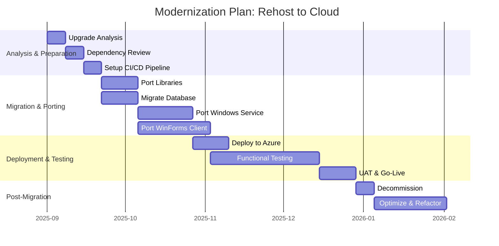

<small>Figure 15 - Gantt chart for the recommended "Rehost to Cloud" modernization plan.</small>

## 14. Application porfolio management
This section provides an application portfolio management mapping of the application, IT component types, IT component attributes and portfolio strategy.

### 14.1. IT Component types and attributes
This table maps the application's components to a standard IT Component model.

| IT Component Type | Name | Type | Version(s) | Provider(s) | Support start date | Support end date | Support end date (extended) | Support status |
| :--- | :--- | :--- | :--- | :--- | :--- | :--- | :--- | :--- |
| **Programming Language** | C# | Programming Language | 4.0 | Microsoft | 2010-04-12 | 2016-01-12 | - | ❌ Unsupported |
| **Programming Language** | VB.NET | Programming Language | 10.0 | Microsoft | 2010-04-12 | 2016-01-12 | - | ❌ Unsupported |
| **Web Framework** | .NET Framework | Web Framework | 4.0 | Microsoft | 2010-04-12 | 2016-01-12 | - | ❌ Unsupported |
| **Database** | Microsoft SQL Server | Database | 2008 R2 (Assumed) | Microsoft | 2010-07-20 | 2014-07-08 | 2019-07-09 | ❌ Unsupported |
| **Operating System** | Windows Server | Operating System | 2008 R2 (Assumed) | Microsoft | 2009-10-22 | 2015-01-13 | 2020-01-14 | ❌ Unsupported |
| **Development Tool** | Visual Studio | Development Tool | 2010 / 2012 | Microsoft | 2010-04-12 | 2015-07-20 | 2020-07-14 | ❌ Unsupported |
| **Business Intelligence Tool** | Crystal Reports | Reporting Tool | 13.0 | SAP | ~2010 | ~2012 | - | ❌ Unsupported |

### 14.2. Portfolio strategy
This section provides a strategic classification of the application using the TIME and 6R models.

| Classification | Evaluation |
| :--- | :--- |
| **TIME Classification** | **Migrate**. The application has high business value, as it manages a core banking process (remittance processing). However, its technical quality is very low due to its outdated, unsupported technology stack and monolithic architecture. It is a critical system that cannot be tolerated in its current state for long. Therefore, it should be migrated to a modern platform to reduce risk and improve maintainability. |
| **6R Classification** | **Replatform / Refactor**.   - A **Replatform** (Lift-and-Reshape) strategy is the recommended first step: move the application to the cloud (e.g., Azure) and upgrade its core platform to a supported .NET version. This addresses immediate risks.   - A subsequent **Refactor** strategy should be planned to incrementally decompose the monolith into microservices and modernize the UI, unlocking long-term benefits in scalability and agility. |

---
This application analysis was performed using Artificial Intelligence (AI). While AI enhances the process, it may still produce inaccuracies, and all results should be carefully reviewed.