# Application Technical Profile

This document provides a detailed technical analysis of the SDCIM (Service Desk Customer Incident Management) application, based on the provided source code. It covers the application's overview, functional decomposition, architecture, technology stack, dependencies, security posture, and a recommended modernization strategy.

## 1. Application overview
This section provides a high-level summary of the application, including its purpose, scope, and key technical characteristics as inferred from the source code.

| Attribute | Value |
| :--- | :--- |
| **Acronym** | SDCIM |
| **Application name** | Service Desk Customer Incident Management |
| **Primary business purpose** | A comprehensive system for processing financial documents (remittances, cheques) from various sources, managing their lifecycle, handling errors, and providing a rich user interface for monitoring, administration, and reporting. |
| **Business domain** | Financial Services, Banking, Document Processing, Incident Management |
| **Solution files** | 2 solutions found: `CIControloComSetup.sln`, `CIControloSemSetup.sln` |
| **Project files** | 18 projects found: `Alerta.csproj`, `CIActividades.csproj`, `CIConfigGlobalParameters.csproj`, `CIConfiguration.csproj`, `CIControlo.csproj`, `CIFicheiro.csproj`, `CIFicheirosControlo.csproj`, `CIReports.csproj`, `CIServAlertas.csproj`, `CIServRemessas.csproj`, `CIServico.csproj`, `CIServTester.csproj`, `CITestes.csproj`, `MDIWebTransmCI.vbproj`, `MDIsControlo.csproj`, `QueryForm.csproj`, `SetupCIControlo.vdproj`, `CIDepositoErro.csproj` |
| **Files** | 280 files analyzed, including: C# source files (.cs), Visual Basic source files (.vb), C# project files (.csproj), Visual Basic project files (.vbproj), Solution files (.sln), Configuration files (.config, .settings), Resource files (.resx), SQL files (.sql), and others. |
| **Main programming language(s)** | C#, VB.NET |
| **Target .NET Framework(s)** | .NET Framework 4.0 |
| **Application type** | Composite Desktop Application (Windows Forms), Windows Service, Class Libraries |
| **Output type** | .exe (Executable), .dll (Dynamic Link Library) |
| **Deployment model** | On-premises |
| **Deployment target platform** | AnyCPU |
| **Complexity** | 🔴 Very high |
| **Last updated (Source code)** | 2016-01-01 (inferred from copyright notices) |
| **Last updated (Documentation)** | 2025-08-07 |

### 1.1. Main components and features
The application is a multi-project solution composed of several distinct functional components that work together to provide a complete document processing and management system.

| Component | Description | Key features | Dependencies | Related projects | Technologies |
| :--- | :--- | :--- | :--- | :--- | :--- |
| **Main Control UI** | The primary user interface for controlling and monitoring the application. | Main menu, MDI container for other forms, status bar. | `CIActividades`, `CIConfiguration`, `CIFicheirosControlo`, `MDIsControlo` | `CIControlo.csproj` | C#, WinForms |
| **Activity Monitoring** | Provides detailed views of ongoing and past processing activities for remittances and documents. | Real-time tracking of remittances, tranches, and documents; state management; error handling views; filtering and search. | `CIConfigGlobalParameters`, `Alerta` | `CIActividades.csproj` | C#, WinForms, NBIISNET Controls |
| **Remittance Processing Service** | Core background service responsible for processing remittances and document tranches. | Fetches remittances pending processing, handles business logic for tranches, updates states in the database. | `CIConfigGlobalParameters` | `CIServRemessas.csproj` | C# |
| **System Service Host** | A Windows Service that hosts and orchestrates the background processing threads. | Manages threads for file import, remittance processing, and alerts. Handles service start, stop, and shutdown logic. | `CIServRemessas`, `CIServAlertas`, `CIFicheiro` | `CIServico.csproj` | C#, System.ServiceProcess |
| **Alerting & Notifications** | A dedicated module for generating and sending system alerts based on predefined situations. | Sends alerts via Email (EWS/WebDAV), SMS, or logs to DB, file, or Event Viewer. | `CIConfigGlobalParameters` | `Alerta.csproj`, `CIServAlertas.csproj` | C#, SMTP, EWS |
| **Configuration Management** | UI and logic for managing system parameters, users, and operational settings. | User management, balcão (branch) configuration, alert configuration. | `CIConfigGlobalParameters`, `Alerta` | `CIConfiguration.csproj` | C#, WinForms |
| **File Processing** | Handles the ingestion and parsing of external data files like `ENVM` and `ACOM`. | File watching, parsing fixed-width text files, data validation, and insertion into the database. | `CIConfigGlobalParameters` | `CIFicheiro.csproj`, `CIFicheirosControlo.csproj` | C# |
| **Reporting** | Generates reports based on application data using Crystal Reports. | Monthly invoicing reports, remittance listings, ACOM lot summaries. | `CrystalDecisions`, `NBiis.GenericReport` | `CIReports.csproj` | Crystal Reports |
| **Unit Testing** | A project containing unit tests for the application logic. | Tests remittance processing logic. | `CIServRemessas`, `CIServico` | `CITestes.csproj` | MSTest |

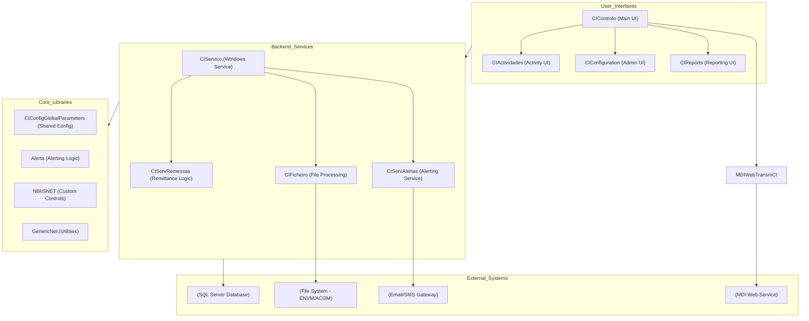

<small>Figure 1 - High-level component diagram showing the main functional blocks and their interactions.</small>

### 1.2. Solutions
The codebase is organized into two main solution files, likely for different deployment or development scenarios (with and without a setup project).

| Solution | Projects | Visual studio version |
| :--- | :--- | :--- |
| **CIControloComSetup.sln** | <ul><li>Alerta.csproj</li><li>CIActividades.csproj</li><li>CIConfigGlobalParameters.csproj</li><li>CIConfiguration.csproj</li><li>CIControlo.csproj</li><li>CIFicheiro.csproj</li><li>CIFicheirosControlo.csproj</li><li>CIReports.csproj</li><li>CIServAlertas.csproj</li><li>CIServRemessas.csproj</li><li>CIServico.csproj</li><li>CIServTester.csproj</li><li>MDIWebTransmCI.vbproj</li><li>MDIsControlo.csproj</li><li>QueryForm.csproj</li><li>SetupCIControlo.vdproj</li></ul> | 2010 |
| **CIControloSemSetup.sln** | <ul><li>Alerta.csproj</li><li>CIActividades.csproj</li><li>CIConfigGlobalParameters.csproj</li><li>CIConfiguration.csproj</li><li>CIControlo.csproj</li><li>CIFicheiro.csproj</li><li>CIFicheirosControlo.csproj</li><li>CIReports.csproj</li><li>CIServAlertas.csproj</li><li>CIServRemessas.csproj</li><li>CIServico.csproj</li><li>CIServTester.csproj</li><li>CITestes.csproj</li><li>CIDepositoErro.csproj</li><li>MDIWebTransmCI.vbproj</li><li>MDIsControlo.csproj</li><li>QueryForm.csproj</li></ul> | 2010 |

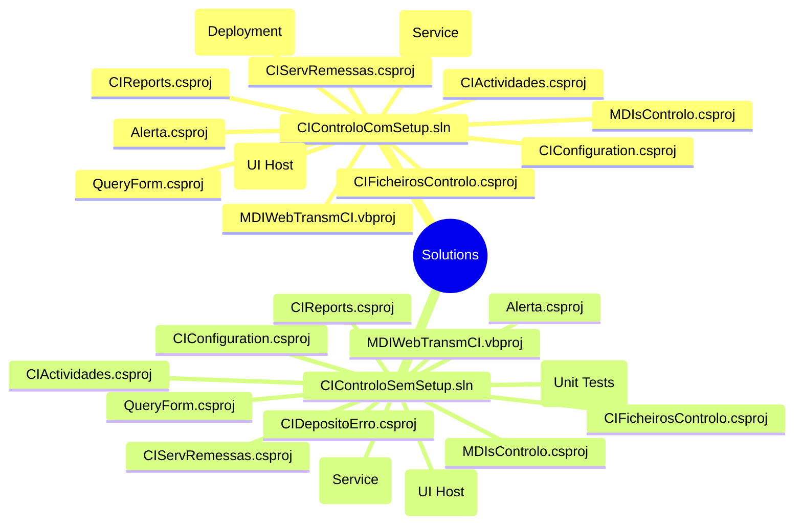

<small>Figure 2 - Mind map illustrating the project structure within the two solution files.</small>

### 1.3. Projects
This section details each project within the solutions, outlining their purpose, dependencies, and key characteristics.

| Solution | Project | Main objectives | Type | Output type | Version | Runtime | Framework | Architecture | Compilation mode | Principal classes | Internal dependencies | External dependencies |
| :--- | :--- | :--- | :--- | :--- | :--- | :--- | :--- | :--- | :--- | :--- | :--- | :--- |
| Both | **CIControlo.csproj** | Main GUI application host (MDI container) and entry point for user interaction. | Windows Application | Executable | 1.3.0.5 | v4.0.30319 | .NET Framework 4.0 | AnyCPU | Debug/Release | `CIMainForm` | `CIActividades`, `CIConfiguration`, `CIFicheirosControlo`, `CIReports`, `CIServTester`, `MDIsControlo`, `QueryForm` | `GenericNet`, `NBIISNET` |
| Both | **CIActividades.csproj** | Provides WinForms UIs for monitoring activities related to remittances, tranches, and documents. | Class Library | Library | 1.0.0.0 | v4.0.30319 | .NET Framework 4.0 | AnyCPU | Debug/Release | `ActividadesForm`, `ActividadeBalcaoForm` | `Alerta`, `CIConfigGlobalParameters` | `NBIISNET`, `CrystalDecisions` |
| Both | **CIServico.csproj** | A Windows Service that hosts background processing tasks for the application. | Windows Service | Executable | 1.0.0.0 | v4.0.30319 | .NET Framework 4.0 | AnyCPU | Debug/Release | `CIServico`, `CIServicoThread` | `Alerta`, `CIConfigGlobalParameters`, `CIFicheiro`, `CIServAlertas`, `CIServRemessas` | `GenericNet`, `NBIISNET` |
| Both | **CIServRemessas.csproj** | Contains the core business logic for processing remittances and their associated tranches. | Class Library | Library | 1.0.0.0 | v4.0.30319 | .NET Framework 4.0 | AnyCPU | Debug/Release | `ServRemessa` | `Alerta`, `CIActividades`, `CIConfigGlobalParameters` | `GenericNet`, `NBIISNET` |
| Both | **Alerta.csproj** | Defines the core entities and logic for the system's alerting and notification mechanism. | Class Library | Library | 1.0.0.0 | v4.0.30319 | .NET Framework 4.0 | AnyCPU | Debug/Release | `Accao`, `AlertaSituacaoAccao` | `CIConfigGlobalParameters` | `GenericNet` |
| Both | **CIConfigGlobalParameters.csproj** | A central library for managing and accessing global configuration parameters and user information. | Class Library | Library | 1.0.0.0 | v4.0.30319 | .NET Framework 4.0 | AnyCPU | Debug/Release | `CIGlobalParameters`, `User` | `N/A` | `GenericNet`, `NBIISNET` |
| Both | **CIConfiguration.csproj** | Provides WinForms UIs for application configuration, including user and branch management. | Class Library | Library | 1.0.0.0 | v4.0.30319 | .NET Framework 4.0 | AnyCPU | Debug/Release | `CIConfigForm`, `BalcaoForm`, `UtilizadoresForm` | `Alerta`, `CIConfigGlobalParameters` | `GenericNet`, `NBIISNET` |
| Both | **CIFicheiro.csproj** | Handles the logic for processing and parsing incoming data files (ACOM, ENVM). | Class Library | Library | 1.0.0.0 | v4.0.30319 | .NET Framework 4.0 | AnyCPU | Debug/Release | `Ficheiro`, `FicheiroEnvm`, `FicheiroAcom` | `CIConfigGlobalParameters` | `GenericNet`, `NBIISNET` |
| Both | **CIFicheirosControlo.csproj** | Provides the user interface for managing and monitoring the file import process. | Class Library | Library | 1.0.0.0 | v4.0.30319 | .NET Framework 4.0 | AnyCPU | Debug/Release | `FicheiroFormCentralENVM`, `FicheiroFormCentralACOM` | `CIConfigGlobalParameters`, `CIFicheiro` | `GenericNet`, `NBIISNET` |
| Both | **CIReports.csproj** | Manages the generation and display of Crystal Reports for the application. | Class Library | Library | 1.0.0.0 | v4.0.30319 | .NET Framework 4.0 | AnyCPU | Debug/Release | `ListagemRemessas`, `AcomResumo` | `CIConfigGlobalParameters` | `CrystalDecisions.*`, `GenericReportNet` |
| Both | **CIServAlertas.csproj** | Implements the specific actions for the alerting service, such as sending emails or writing to logs. | Class Library | Library | 1.0.0.0 | v4.0.30319 | .NET Framework 4.0 | AnyCPU | Debug/Release | `ServAlerta`, `ServAlertasSendWebmail` | `Alerta`, `CIConfigGlobalParameters` | `CGDSendWebmail`, `GenericNet` |
| Both | **CIServTester.csproj** | A helper library, likely for testing or triggering service actions from a non-service context. | Class Library | Library | 1.0.0.0 | v4.0.30319 | .NET Framework 4.0 | AnyCPU | Debug/Release | `ProcessarRemessas`, `ProcessarAlertas` | `Alerta`, `CIConfigGlobalParameters`, `CIServAlertas`, `CIServRemessas` | `GenericNet`, `NBIISNET` |
| SemSetup | **CITestes.csproj** | A dedicated project for unit tests of the application's business logic. | Test Project | Library | 1.0.0.0 | v4.0.30319 | .NET Framework 4.0 | AnyCPU | Debug/Release | `CIServRemessaTestes` | `CIControlo`, `CIServico`, `CIServRemessas`, `CIServTester` | `Microsoft.VisualStudio.QualityTools.UnitTestFramework` |
| Both | **MDIsControlo.csproj** | A module for controlling and interacting with Multi-function Devices (MDIs). | Class Library | Library | 1.0.0.0 | v4.0.30319 | .NET Framework 4.0 | AnyCPU | Debug/Release | `MDIsControloForm`, `Documento_02_MDI` | `CIConfigGlobalParameters`, `MDIWebTransmCI` | `CCAGeneric`, `NBIISNET` |
| Both | **MDIWebTransmCI.vbproj** | A VB.NET project that acts as a client for a SOAP Web Service related to MDI document insertion. | Class Library | Library | 1.0.0.0 | v4.0.30319 | .NET Framework 4.0 | AnyCPU | Debug/Release | `TInsertDoc` | `CIConfigGlobalParameters` | `CCAWebTransmCI`, `CCAGeneric` |
| Both | **QueryForm.csproj** | Provides a generic UI for executing and viewing the results of SQL queries against the database. | Class Library | Library | 1.0.0.0 | v4.0.30319 | .NET Framework 4.0 | AnyCPU | Debug/Release | `QueryForm` | `CIConfigGlobalParameters` | `NBIISNET` |

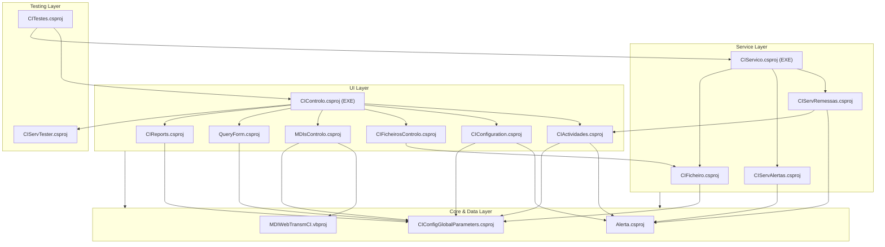

<small>Figure 3 - Project dependency graph illustrating the relationships between the projects in the solution.</small>

## 2. Functional overview
This section provides a high-level functional decomposition of the application, using table format. It identifies the major, distinct functional blocks or modules as inferred from the code's high-level structure (e.g., top-level namespaces, solution folders, primary class groups). This overview serves as a map to the application's core responsibilities.

### 2.1. Executive summary
This section provides a high-level summary of the application's primary purpose and its core function from a business or operational perspective, using table format. The summary is an inference based on the main entry points of the code (e.g., `main()`, `Application_Start()`), the names of the most central classes and modules, and the nature of the core processes identified. It answers the fundamental question: What primary problem does this application solve?

| **Factor** | **Description** |
| :--- | :--- |
| **Primary Purpose** | The SDCIM application is a back-office system designed to automate and manage the processing of financial documents, primarily remittances from bank branches ("Balcão") and other sources. |
| **Core Function** | Its core function is to act as an "Image Concentrator" by ingesting document data and images, processing them in batches (tranches), managing their lifecycle through various states (e.g., received, processing, sent, error), and interfacing with external systems for final settlement or archiving. It includes a rich desktop client for operational monitoring, manual intervention, and system configuration. |
| **Key Inferred Processes** | - **Remittance Processing:** A background service (`CIServico`) continuously polls for new remittances to process (`REMIN_IDParaProcessar`).   - **Document Lifecycle Management:** Documents and remittances move through a defined state machine, with capabilities for operators to manually change states (`MudarEstadoForm`).   - **Error Handling and Reprocessing:** The system has specific workflows to handle and re-submit items that have failed processing (`Update_ReenviarTodasRemessasBalcaoEmErro`).   - **System Monitoring and Administration:** A Windows Forms application (`CIControlo`) serves as the main console for users to view activities, manage configurations, and run reports. |
| **Business Value** | The application appears critical for the bank's back-office operations, ensuring that financial documents are processed correctly, tracked, and that exceptions are handled in a timely manner. It provides the necessary tools for operators to oversee and control this complex workflow. |

### 2.2. Functional decomposition
This section provides a detailed breakdown of the application's functional areas or modules, inferred from the code structure, using table format. Each module is described in terms of its primary responsibilities and how it contributes to the overall functionality of the application. The decomposition is based on the organization of namespaces, classes, and methods, as well as the relationships between them.

| Functional Area / Module | Description |
| :--- | :--- |
| **User Interaction & Presentation** | Manages all user-facing interfaces, handles user input, and renders data. This module is the primary interface between the user and the system's core logic, composed of multiple Windows Forms projects (`CIControlo`, `CIActividades`, `CIConfiguration`). |
| **Core Process Execution Engine** | The heart of the application, running as a Windows Service (`CIServico`). It orchestrates background tasks, including polling for new work, processing remittances (`CIServRemessas`), and handling file imports (`CIFicheiro`). |
| **Data Persistence & Management** | Handles all interactions with the SQL Server database. This is not a formal layer but is implemented via direct `System.Data.SqlClient` calls and stored procedures scattered across various projects. It manages the state and data of all business entities. |
| **System Configuration & Administration** | Provides the logic and UI (`CIConfiguration`) for managing system-wide parameters, user accounts, and operational settings like branch (`Balcao`) configurations. |
| **Alerting & Notification Subsystem** | A dedicated module (`Alerta`, `CIServAlertas`) responsible for generating and dispatching alerts based on system events. It supports multiple channels like email, SMS, and logging. |
| **Reporting Subsystem** | Responsible for generating and displaying business reports (`CIReports`). It integrates Crystal Reports to create detailed and summary views of the processed data. |
| **External System Integration** | Contains the logic for communicating with external systems. This includes file-based interfaces (`ACOM`, `ENVM` files) and a SOAP web service client (`MDIWebTransmCI`) for interacting with MDI devices. |

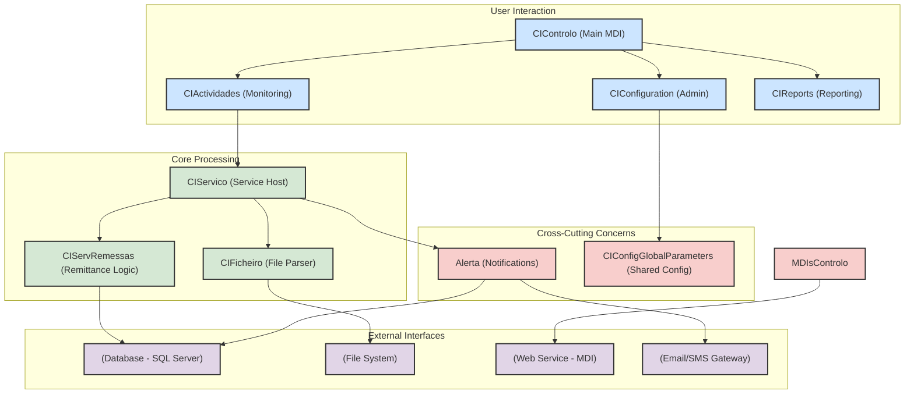

<small>Figure 4 - Functional decomposition of the application, showing the relationships between modules.</small>

### 2.3. User roles and permissions
This section identifies hall distinct types of users (or autonomous systems) that interact with the application, using table format. These roles are inferred from authentication logic, authorization checks (e.g., `[Authorize(Roles="...")]` decorators, `if (user.hasPermission('...'))` blocks), or conditional logic based on user properties (e.g., 'user.is_admin', 'user.group').

| Role | Description | Permissions | Key Actions | Key Data Entities | Assumptions |
| :--- | :--- | :--- | :--- | :--- | :--- |
| **Administrator** | A role with full system privileges, responsible for system configuration and management. | Full access to all features, including user management and system parameter configuration. Can perform sensitive operations like manual state changes. | `ChangeEstado`, `Insert_Utilizadores`, `Update_Balcao`, `ProcessamentoAutomatico` | `User`, `Group`, `Balcao`, `Activity_Change` | Inferred from code blocks checking `m_oParameters.UserLogged.m_iUserGroup <= 1`. This group has access to administrative forms and functions. |
| **Standard Operator** | A standard user role for day-to-day monitoring and operational tasks. | Read-only access to most monitoring screens. Cannot perform administrative actions or manual state changes. | `ViewActivities`, `ViewRemittances`, `GenerateReports` | `Remessa`, `Tranche`, `Documento` | Inferred as the default role for users with `m_iUserGroup > 1`, who are explicitly blocked from privileged actions by the `ConfirmaPrivilegios()` method. |

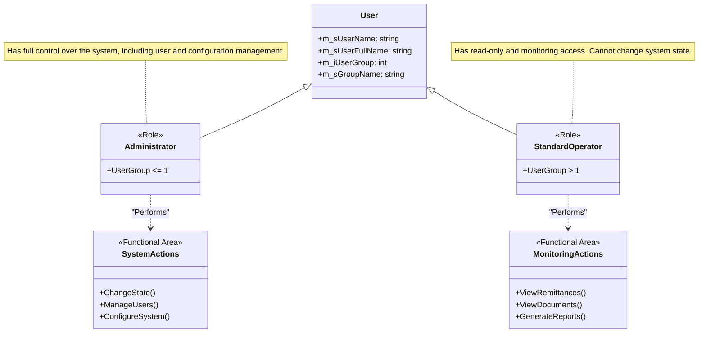

<small>Figure 5 - Class diagram illustrating the user roles and their associated permissions.</small>

### 2.4. Core business capabilities
This section lists the main, high-level capabilities of the application, representing its "Epics" or major functional domains, using table format

| Capability | Description | Key Features | Key Data Entities | Assumptions |
| :--- | :--- | :--- | :--- | :--- |
| **Remittance & Document Processing** | The complete set of functions related to processing financial remittances from ingestion to final state. | Automated polling for new remittances, batching documents into tranches, state transitions (e.g., Received, Processing, Sent, Error), reprocessing of failed items. | `Remessa_Balcao`, `Tranche_Out`, `Documento_Balcao`, `Documento_ACOM`, `Documento_ENVM` | Inferred from the `CIServRemessas` and `CIServico` projects, and methods like `ProcessaRemessa` and `TratarTranchesBalcao`. |
| **System Monitoring & Administration** | Provides user interfaces for real-time monitoring of system activities and administrative configuration. | Activity dashboards, detailed views for remittances and documents, user management, branch (`Balcao`) configuration, system parameter management. | `VW_REMESSA_BALCAO_DETALHE`, `VW_TRANCHE_BALCAO_DETALHE`, `Passwd`, `Grupo` | Based on the extensive Windows Forms projects (`CIActividades`, `CIConfiguration`, `UtilizadoresForm`, `BalcaoForm`). |
| **Alerting and Exception Handling** | A comprehensive subsystem for notifying operators and administrators of important system events and errors. | Configurable alerts for various situations, multi-channel notifications (Email, SMS, DB Log, Event Viewer), error logging. | `Alerta`, `Alerta_Situacao`, `Alerta_Accao` | Based on the `Alerta` and `CIServAlertas` projects, which define situations, actions, and parameters for notifications. |
| **External Data Integration** | Manages the flow of data into and out of the system from various external sources. | Ingestion of `ENVM` and `ACOM` files, communication with MDI devices via a SOAP Web Service, database interactions for data persistence. | `Ficheiro`, `Lote_ENVM`, `Lote_ACOM`, `TIBCO_...` tables | Inferred from the `CIFicheiro` project for file processing and the `MDIWebTransmCI` project for web service integration. |

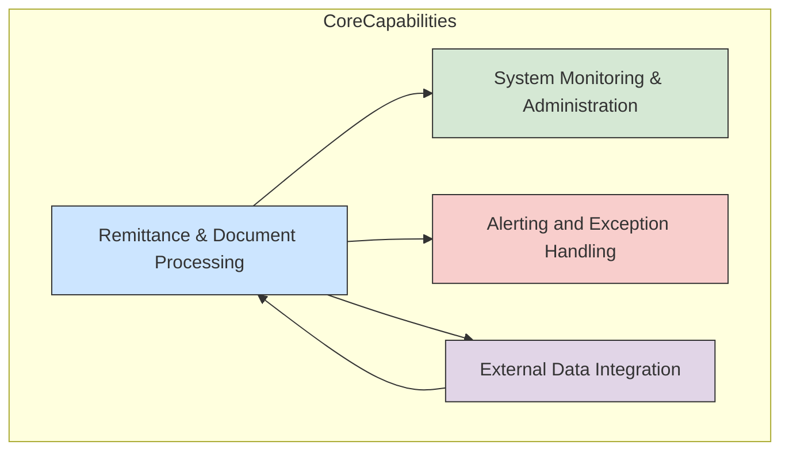

<small>Figure 6 - Core business capabilities of the SDCIM application.</small>

### 2.5. Detailed feature breakdown
This critical section provides a granular breakdown of individual features within each Core Business Capability, using table format. Each feature is described in terms of its user story, key data entities involved, and any inferred logic or flowcharts that illustrate the internal workings.

| Feature | User Story / Description | Key Data Entities | Assumptions |
| :--- | :--- | :--- | :--- |
| **Process Branch Remittance** | As a **System**, I can automatically detect and process a new remittance from a bank branch (`Balcao`) so that its documents are batched into tranches and sent for clearing. The `ProcessarTrancheBalcao` class orchestrates this by fetching a `remessaId` and calling `TratarTranchesBalcao`. | `REMESSA_BALCAO`, `DOCUMENTO_BALCAO`, `TRANCHE_OUT` | Inferred from `CIServRemessaTestes` which calls `ProcessarTrancheBalcao`. The process runs in a loop until no more remittances are found. |
| **Manually Change Remittance State** | As an **Administrator**, I can manually change the status of one or more remittances to resolve processing errors or force a specific workflow step. The `ActividadeBalcaoForm` UI allows selecting a remittance and using the `MudarEstadoForm` to pick a new valid state. | `REMESSA_BALCAO`, `REMESSAIN_STATUS`, `ACTIVITY_CHANGE` | Based on the UI logic in `ActividadeBalcaoForm` and the `toolStripMenuRemessaMudarEstado_Click` event handler, which calls the `ChangeEstado` method on a `DetalheRemessa` object. |
| **View Remittance Activity** | As a **Standard Operator**, I can view a summary and detailed breakdown of all remittances processed within a specific date range and filter by status so that I can monitor the system's health and performance. The `ActividadeBalcaoForm` provides multiple `ListView` controls for this purpose. | `VW_REMESSA_BALCAO_DETALHE`, `VW_TRANCHE_BALCAO_DETALHE`, `VW_DETALHE_DOCUMENTOS_BALCAO` | Inferred from the UI design of `ActividadeBalcaoForm` and its `refresh` methods which populate list views from database views. |
| **Re-process Failed Remittances** | As an **Administrator**, I can trigger a re-processing job for all remittances currently in an error state so that they can be re-submitted without manual intervention for each one. The `btnRemessasErro_Click` event handler executes the `Update_ReenviarTodasRemessasBalcaoEmErro` stored procedure. | `REMESSA_BALCAO`, `ESTORNO_BALCAO` | Inferred from the `btnRemessasErro_Click` and `btnEstonoErro_Click` event handlers in `ActividadeBalcaoForm`. |
| **Send Alert Notification** | As the **System**, when a predefined situation occurs (e.g., processing error `SITUACAO_ID=910`), I can send a notification via a configured channel (e.g., Email) so that an operator is alerted. The `ServAlerta` class processes `AlertaSituacaoAccao` records and dispatches them. | `ALERTA_ALERTA`, `ALERTA_SITUACAO_ACCAO`, `ALERTA_ACCAO_PARAM` | Based on the logic in `ServAlerta.cs` which switches on `enuTipoAccao` to perform different notification actions like `ProcessaAlertaSituacaoAccaoMail`. |

### 2.6. Key data entities and their attributes
This section documents the application's core data structures, as inferred from class definitions or ORM configurations.

| Entity | Description | Key Attributes | Data Type | Validation Rules | Relationships | Assumptions |
| :--- | :--- | :--- | :--- | :--- | :--- | :--- |
| **RemessaBalcao** | Represents a remittance submission from a bank branch ("Balcão"). It is the primary container for a batch of documents. | `ID`, `REMBALCAO_DATA`, `REMBALCAO_STAT_ID`, `REMBALCAO_BALCAO`, `REMBALCAO_MT_DOCS` | `int`, `DateTime`, `int`, `int`, `decimal` | `ID`: Primary Key.   `REMBALCAO_STAT_ID`: Foreign Key to a status table. | Has a one-to-many relationship with `DocumentoBalcao`. | Inferred from `DetalheRemessa.cs` and various `VW_REMESSA_BALCAO_DETALHE` view queries. The entity is managed via direct SQL. |
| **DocumentoBalcao** | Represents a single financial document (e.g., a cheque) within a remittance. | `ID`, `REMBALCAO_ID`, `DOC_ZONA1` to `DOC_ZONA5`, `DOCSTAT_ID`, `DOC_REFARQ` | `int`, `int`, `string`, `int`, `string` | `DOC_NIB`: Must be 13 or 21 chars. | Belongs to one `RemessaBalcao`. May be part of one `TrancheOut`. | Inferred from `DetalheDocumento.cs` and `VW_DETALHE_DOCUMENTOS_BALCAO` view. `DOC_ZONA` fields likely represent MICR line data. |
| **TrancheOut** | Represents a batch of documents prepared for sending to an external system (e.g., for clearing). | `TRANOUT_ID`, `REMIN_ID`, `TRANOUTSTAT_ID`, `TRANOUT_NUMERO`, `CHAVE_WEBSERVICE` | `int`, `int`, `int`, `int`, `string` | `TRANOUTSTAT_ID`: Foreign key to a status table. | Contains multiple `DocumentoBalcao` records. | Inferred from `DetalheTranche.cs` and related views. It acts as an outbound batch. |
| **AlertaSituacaoAccao** | A record representing a triggered alert, linking a specific situation to a configured action. | `ALERT_ID`, `SITUACAO_ID`, `ACC_ID`, `ALACC_STATUS`, `AL_TEXT` | `string`, `int`, `int`, `int`, `string` | `ALACC_STATUS`: Indicates if the alert has been processed (0=new, 1=processed, -1=error). | Links `Alerta` to `Situacao` and `Accao`. | Inferred from `AlertaSituacaoAccao.cs`. This entity drives the notification workflow. |

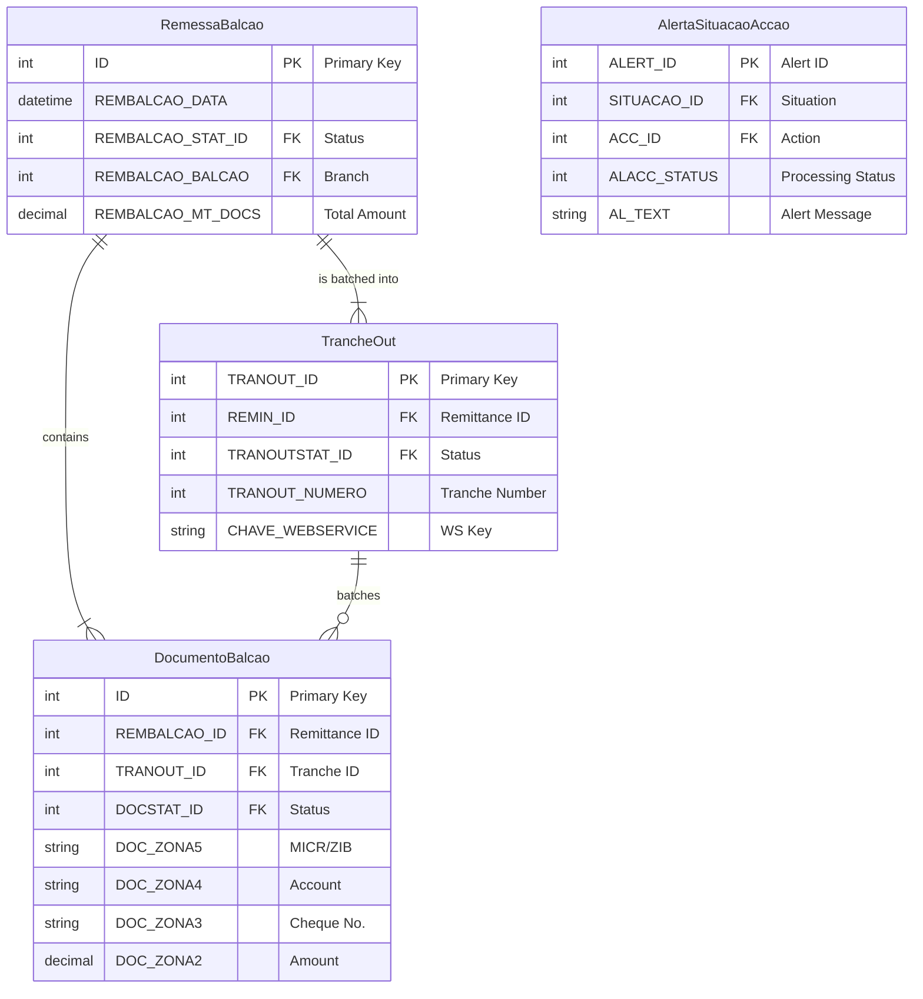

<small>Figure 7 - Entity-Relationship diagram showing the core data entities and their relationships.</small>

### 2.7. Business process workflows
This section describes and visualizes critical end-to-end processes, showing how different user roles and system features interact.

| Process | Description | Key Steps | User Roles Involved | Key Data Entities | Assumptions |
| :--- | :--- | :--- | :--- | :--- | :--- |
| **Standard Remittance Processing** | A comprehensive workflow that outlines the steps involved in processing a branch remittance from ingestion to final output. | 1. Remittance is created (status 20). 2. `CIServico` picks it up and sets status to 30 (Processing). 3. Documents are grouped into tranches. 4. Tranches are sent to an external system. 5. Remittance status is updated to 40 (Processed) or -40 (Error). | System, Administrator | `Remessa_Balcao`, `Documento_Balcao`, `Tranche_Out` | Inferred from the logic in `ServRemessa.cs` and the state transitions observed in the UI code. |
| **Manual Error Correction** | A workflow initiated by an operator to manually correct the state of a failed or stuck remittance or tranche. | 1. Operator identifies a failed item in `ActividadeBalcaoForm`. 2. Operator uses the "Mudar Estado" context menu. 3. A new, valid state is selected from `MudarEstadoForm`. 4. The system updates the entity's status in the database. | Administrator | `Remessa_Balcao`, `Tranche_Out`, `Activity_Change` | Based on the presence of `MudarEstadoForm` and its invocation from the main activity monitoring UIs. |
| **System Alerting Workflow** | The process by which the system generates and delivers a notification when a specific business or technical event occurs. | 1. A system event triggers `Insert_Alerta` stored procedure. 2. A new record is created in `ALERTA_ALERTA_ACCAO` with status 0. 3. `CIServAlertas` service dequeues the alert. 4. The service executes the configured action (e.g., sends an email). 5. The alert record status is updated to 1 (Processed) or -1 (Error). | System, Administrator | `Alerta`, `Alerta_Situacao_Accao`, `ALERTA_ACCAO_PARAM` | Inferred from the `Alerta` project and the processing logic in `ServAlerta.cs`. |

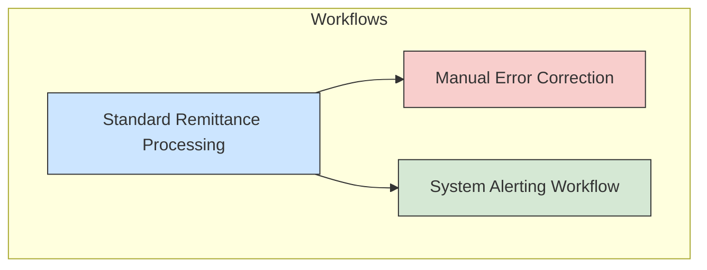

<small>Figure 8 - High-level overview of the main business process workflows.</small>

---

#### 2.7.1. Workflow: Standard Remittance Processing
This section provides a detailed breakdown of the Standard Remittance Processing workflow, including the steps involved, user roles, key data entities, and any assumptions made.

| Step | Description | User Role | Key Data Entities | Assumptions |
| :--- | :--- | :--- | :--- | :--- |
| **1. Remittance Ingestion** | A new remittance is created in the system with an initial status (e.g., 20 - "Fechado"). This is likely triggered by an upstream process or manual data entry not visible in the provided code. | System | `Remessa_Balcao` | The creation of the initial remittance record is an assumed prerequisite for this workflow. |
| **2. Processing Pickup** | The `CIServico` background service periodically calls `RemessaBalcaoParaProcessar` to find a remittance with a "new" status. | System | `Remessa_Balcao` | The service runs on a timer and continuously polls the database for work. |
| **3. State Transition to Processing** | Once a remittance is picked, its status is immediately updated to 30 ("Em Processamento") to prevent other service instances from processing it. | System | `Remessa_Balcao` | This is a standard pessimistic locking pattern for service-based processing. |
| **4. Document Batching** | The service iterates through all documents associated with the remittance and groups them into tranches, respecting the `MaxDocsTranche` configuration. A new `Tranche_Out` record is created for each batch. | System | `Documento_Balcao`, `Tranche_Out` | Inferred from the loop in `TratarTranchesBalcao` and the `CriarTrancheBalcao` method call. |
| **5. Final State Update** | After all documents are processed and batched, the final status of the remittance is updated to 40 ("Processado") on success or -40 ("Erro") if any unrecoverable errors occurred. | System | `Remessa_Balcao` | The final state update signals the completion of the workflow for this remittance. |

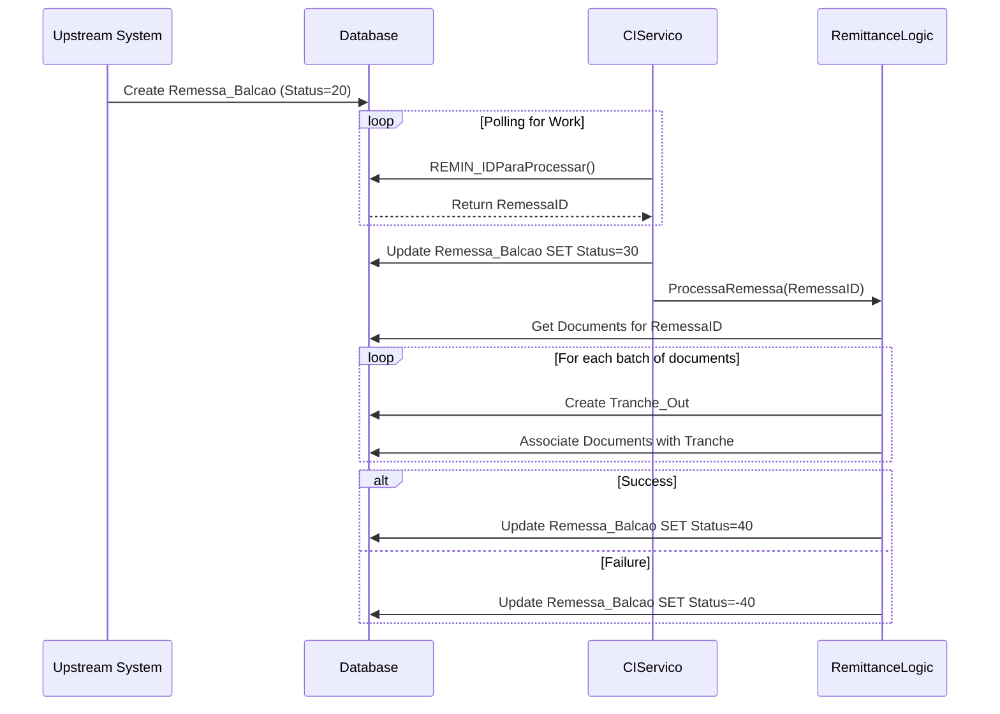

<small>Figure 9 - Sequence diagram illustrating the Standard Remittance Processing workflow.</small>

#### 2.7.2. Workflow: Manual Error Correction
This section provides a detailed breakdown of the Manual Error Correction workflow.

| Step | Description | User Role | Key Data Entities | Assumptions |
| :--- | :--- | :--- | :--- | :--- |
| **1. Identify Failed Item** | An Administrator uses the `ActividadeBalcaoForm` to filter for and identify a remittance or tranche that is stuck in an error state (e.g., -40, -50). | Administrator | `VW_REMESSA_BALCAO_DETALHE` | The user has the necessary knowledge to determine that an item requires manual intervention. |
| **2. Invoke State Change UI** | The user right-clicks the item and selects "Mudar Estado" from the context menu. | Administrator | (UI State) | The UI correctly identifies the current state and table name of the selected entity. |
| **3. Select New State** | The `MudarEstadoForm` is displayed, populated with a list of valid next states retrieved from the `ACTIVITY_CHANGE` table for the given entity type and current state. The user selects a target state. | Administrator | `ACTIVITY_CHANGE` | The `ACTIVITY_CHANGE` table correctly defines the valid state transitions for the application's state machine. |
| **4. Execute State Change** | The application executes the validation and processing stored procedures (`ACTIVITY_SPVALIDA`, `ACTIVITY_SPPROCESSA`) associated with the selected state transition. | System | `Remessa_Balcao`, `Tranche_Out` | The stored procedures handle the business logic required for the state transition. |
| **5. UI Refresh** | The application refreshes the activity view, which now reflects the new state of the manually corrected item. | Administrator | (UI State) | The UI correctly reflects the change made in the database. |

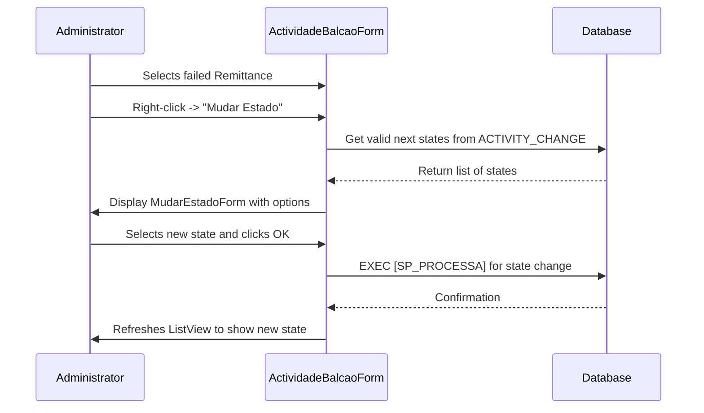

<small>Figure 10 - Sequence diagram for the Manual Error Correction workflow.</small>

#### 2.7.3. Workflow: System Alerting Workflow
This section provides a detailed breakdown of the System Alerting workflow.

| Step | Description | User Role | Key Data Entities | Assumptions |
| :--- | :--- | :--- | :--- | :--- |
| **1. Trigger Alert** | An event within the application (e.g., a processing error, a long-running task) calls the `Insert_Alerta` stored procedure with a specific `SITUACAO_ID`. | System | `Alerta`, `Alerta_Situacao` | The application code is instrumented to correctly identify and trigger alerts for relevant situations. |
| **2. Create Actionable Alert** | The database trigger or logic creates records in `ALERTA_ALERTA_ACCAO` for each action configured for that situation, setting the status to 0 (New). | System | `ALERTA_ALERTA_ACCAO` | The `ALERTA_SITUACAO_ACCAO` table correctly maps situations to one or more notification actions. |
| **3. Dequeue Alert** | The `CIServAlertas` service thread calls `AlertaSituacaoAccaoParaProcessar` to fetch one new alert record (status 0) from the database. | System | `ALERTA_ALERTA_ACCAO` | The service polls the database periodically for new alerts to process. |
| **4. Execute Action** | The service inspects the `enuTipoAccao` of the alert and dispatches it to the appropriate handler (e.g., `ServAlertasSendWebmail` for email, `ServAlertasLogFile` for file logging). | System | `ALERTA_ACCAO_PARAM` | The parameters for each action (e.g., email recipient, log file path) are correctly configured in the `ALERTA_ACCAO_PARAM` table. |
| **5. Update Alert Status** | Upon completion, the service calls `SetProcessado` or `SetErroProcessamento` to update the `ALACC_STATUS` of the record to 1 (Processed) or -1 (Error). | System | `ALERTA_ALERTA_ACCAO` | This prevents the same alert from being processed repeatedly. |

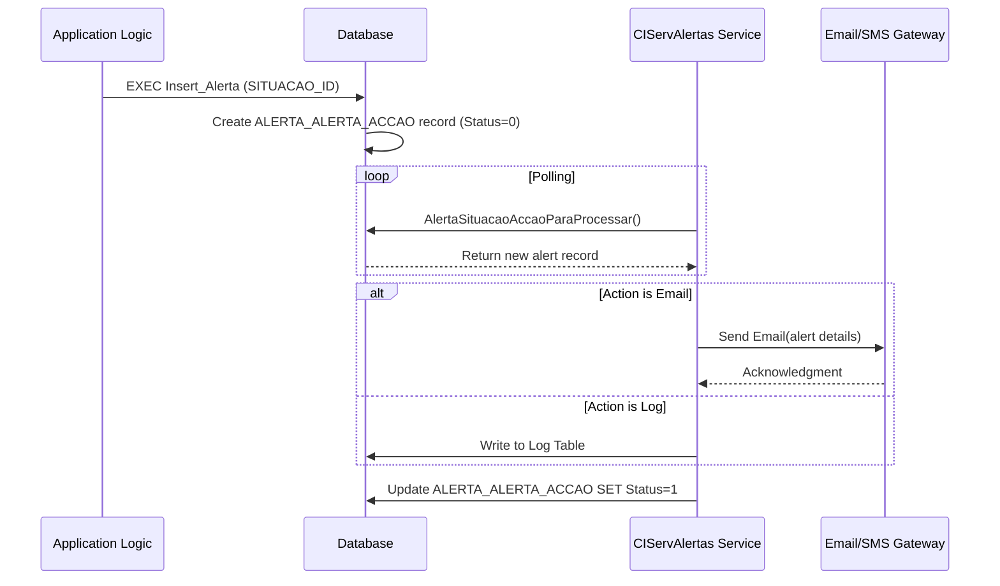

<small>Figure 11 - Sequence diagram for the System Alerting workflow.</small>

### 2.8. System inputs & outputs (interfaces)
This section catalogs all identified points where data enters or leaves the application boundary.

| Type | Name / Description | Data Formats | Data Source / Sink | Assumptions |
| :--- | :--- | :--- | :--- | :--- |
| **Input** | **File Ingestion (ENVM/ACOM)** | Fixed-width text files | Monitored file system directory (`m_sFilePathENVM`, `m_sFilePathACOM`) | A file watcher service is inferred to be listening in these directories for batch processing. The system expects specific, structured file formats. |
| **Input** | **User Interface** | User-entered data | Windows Forms controls (`ActividadesForm`, `ConfigurationForm`, etc.) | Operators and administrators interact with the system via the desktop client to provide input, trigger actions, and configure settings. |
| **Output** | **Database Persistence** | SQL | SQL Server Database | All processed data, states, configurations, and logs are persisted in a central SQL Server database. |
| **Output** | **Email/SMS Notifications** | SMTP/Vendor-specific | External Email/SMS Gateway | The alerting subsystem sends formatted text messages to external gateways for delivery to users. |
| **Output** | **Log Files** | Text files | Local/Network file system | The `ServAlertasLogFile` component writes plain text logs to a configured file path. |
| **Output** | **Event Viewer Logs** | Windows Event Log format | Windows Event Log | The system writes critical errors and informational messages to the Windows Event Log for system administrators. |
| **Data Flow** | **Web Service (MDI)** | SOAP/XML | External MDI Web Service (`waiaccesstuInsertDoc`) | The application sends document and remittance data to an external web service, likely for processing documents from Multi-Function Devices. |

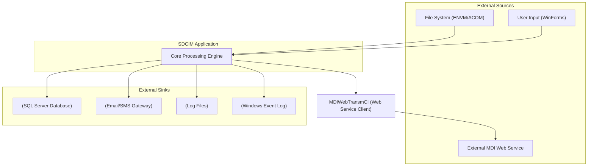

<small>Figure 12 - High-level data flow diagram showing system inputs and outputs.</small>

### 2.9. User Task Flows
This section describes the typical path a user takes through the application to achieve a high-level objective, linking multiple features together.

| Task Flow | Description | User Role | Key Data Entities | Assumptions |
| :--- | :--- | :--- | :--- | :--- |
| **End-to-End Remittance Monitoring** | A comprehensive sequence of steps an operator follows to monitor a remittance from creation to completion. | Standard Operator | `Remessa_Balcao`, `Tranche_Out`, `Documento_Balcao` | The user is performing a routine check on the system's processing status. |
| **Troubleshoot and Correct a Failed Remittance** | A task flow where an administrator diagnoses a processing failure and manually intervenes to correct it. | Administrator | `Remessa_Balcao`, `Activity_Change` | Assumes a failure has already occurred and been flagged, requiring manual intervention. |
| **Configure a New Bank Branch** | A task flow for an administrator to add a new branch (`Balcao`) and its associated devices (`Maquina`) to the system. | Administrator | `Balcao`, `Maquina` | Assumes a new branch is being onboarded into the system. |

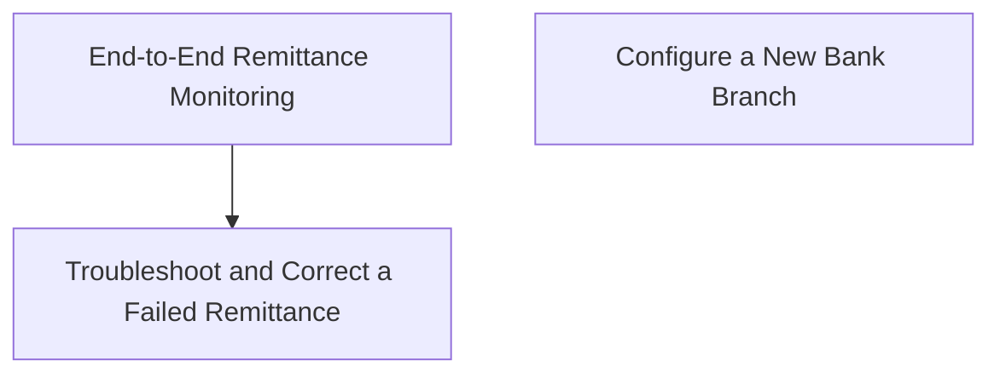

<small>Figure 13 - High-level overview of the main user task flows.</small>

---

#### 2.9.1. User Task Flow: End-to-End Remittance Monitoring
This section provides a detailed breakdown of the End-to-End Remittance Monitoring task flow.

| Step | Description | User Role | Key Data Entities | Assumptions |
| :--- | :--- | :--- | :--- | :--- |
| **1. Open Activity View** | The user launches the `CIControlo` application and opens the "Actividades" or "Actividades Balcão" form. | Standard Operator | - | The user has successfully logged into the application. |
| **2. Filter for Date Range** | The user selects a date range using the `DateTimePicker` controls to narrow down the remittances to view. | Standard Operator | - | The user knows the approximate date of the remittance they are interested in. |
| **3. View Remittance Summary** | The user views the summary list (`listViewResumoRemessas`), which shows aggregated counts of remittances by status. | Standard Operator | `VW_REMESSAS_ESTADO_RESUMO` | The summary view provides a quick overview of system health. |
| **4. Drill Down to Details** | The user double-clicks a summary row to populate the detailed remittance list (`listViewDetalhesRemessa`). | Standard Operator | `VW_REMESSA_BALCAO_DETALHE` | The user wants to see the individual remittances that make up the summary. |
| **5. Drill Down to Tranches** | The user double-clicks a specific remittance to view the tranches (`listViewDetalhesTranche`) it was broken into. | Standard Operator | `VW_TRANCHE_BALCAO_DETALHE` | The user is investigating the batching process for a specific remittance. |
| **6. Drill Down to Documents** | The user double-clicks a tranche to view the individual documents (`listViewDetalhesDocumentos`) it contains. | Standard Operator | `VW_DETALHE_DOCUMENTOS_BALCAO` | The user needs to inspect the details of a single document. |
| **7. View Document Image** | The user double-clicks a document to open the `ImagemBalcaoForm` and view the scanned image of the document. | Standard Operator | `Imagem_Balcao` | The document image is available in the database and the user has permission to view it. |

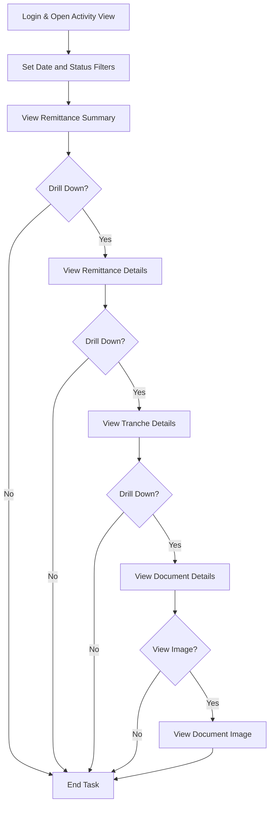

<small>Figure 14 - User task flow for monitoring a remittance from summary to a specific document image.</small>

#### 2.9.2. User Task Flow: Troubleshoot and Correct a Failed Remittance
This section provides a detailed breakdown of the Troubleshoot and Correct a Failed Remittance task flow.

| Step | Description | User Role | Key Data Entities | Assumptions |
| :--- | :--- | :--- | :--- | :--- |
| **1. Identify Error** | The Administrator filters the `ActividadeBalcaoForm` to show only items in an error state (e.g., status -40). | Administrator | `VW_REMESSA_BALCAO_DETALHE` | An alert may have prompted this investigation. |
| **2. Analyze Error Message** | The user inspects the `Erro` column in the `ListView` to understand the cause of the failure. | Administrator | `REMESSA_BALCAO` | The error message logged in the database is informative enough to diagnose the issue. |
| **3. Initiate State Change** | The user right-clicks the failed remittance and selects "Mudar Estado". | Administrator | `ACTIVITY_CHANGE` | The user has determined that a manual state change is the correct course of action. |
| **4. Select Corrective State** | From the `MudarEstadoForm`, the user selects a new state, such as re-queueing for processing (e.g., back to status 20) or marking as manually resolved. | Administrator | `ACTIVITY_CHANGE` | The user understands the state machine and the implications of the chosen state. |
| **5. Confirm and Execute** | The user confirms the action, and the system executes the associated stored procedures to update the remittance's status. | System | `Remessa_Balcao` | The action is logged for auditing purposes. |
| **6. Verify Resolution** | The Administrator refreshes the view to confirm the remittance is no longer in an error state and is either being reprocessed or is in a terminal success/fail state. | Administrator | `VW_REMESSA_BALCAO_DETALHE` | The manual intervention has successfully resolved the issue. |

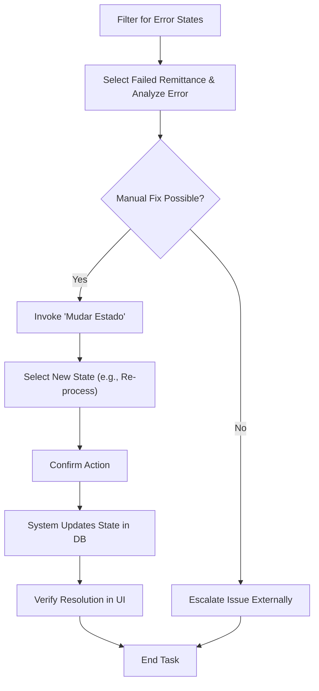

<small>Figure 15 - User task flow for troubleshooting and correcting a failed remittance.</small>

#### 2.9.3. User Task Flow: Configure a New Bank Branch
This section provides a detailed breakdown of the Configure a New Bank Branch task flow.

| Step | Description | User Role | Key Data Entities | Assumptions |
| :--- | :--- | :--- | :--- | :--- |
| **1. Open Configuration UI** | The Administrator opens the `BalcaoForm` from the main application menu. | Administrator | - | The user has the necessary permissions to access configuration screens. |
| **2. Enter Branch Details** | The user fills in the details for the new branch, including its code, abbreviation, and description, in the form's text boxes. | Administrator | `Balcao` | The user has the correct information for the new branch. |
| **3. Insert New Branch** | The user clicks the "Inserir" button to create the new `Balcao` record in the database. | System | `Balcao` | The system validates that the branch code is unique. |
| **4. Select New Branch** | The `listViewBalcoes` is refreshed, and the user selects the newly created branch to configure its devices. | Administrator | `Balcao` | The UI correctly reflects the newly added data. |
| **5. Enter Device Details** | The user enters the details for a new device (`Maquina`) associated with the branch, such as its model and IQA status. | Administrator | `Maquina` | The branch type requires device configuration (e.g., GCAA branches). |
| **6. Insert New Device** | The user clicks the "Inserir" button in the machines section to create the `Maquina` record. | System | `Maquina` | The device is now associated with the branch and ready for use. |

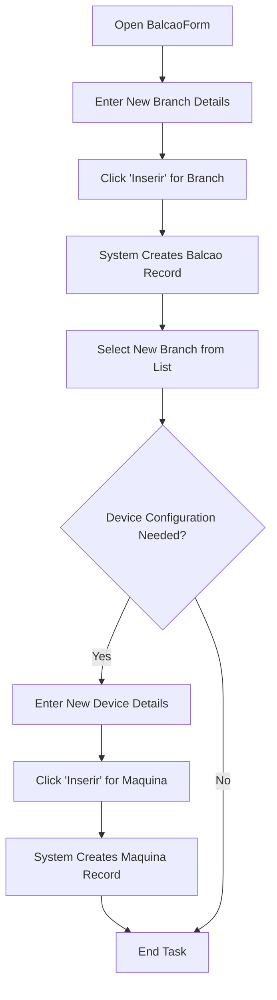

<small>Figure 16 - User task flow for configuring a new bank branch and its devices.</small>

### 2.10. Automated & Scheduled Processes
This section describes any system-triggered processes that run without direct user interaction.

| Process Name | Trigger / Schedule | Purpose | Key Actions | Key Data Entities | Assumptions |
| :--- | :--- | :--- | :--- | :--- | :--- |
| **Remittance Processing Job** | Timer-based, within `CIServico`. The `m_tsSleepTime` variable controls the polling interval. | To automatically process new remittances as they arrive in the system. | 1. Polls for remittances with status 20. 2. Updates status to 30. 3. Processes documents into tranches. 4. Updates status to 40 or -40. | `Remessa_Balcao`, `Tranche_Out`, `Documento_Balcao` | Inferred from the main loop in `CIServicoThread.cs` and the logic in `ServRemessa.cs`. This is the primary automated process. |
| **Alert Processing Job** | Timer-based, within `CIServico`. | To automatically process and dispatch system alerts. | 1. Polls for alerts with status 0. 2. Executes the configured action (Email, SMS, Log). 3. Updates alert status to 1 or -1. | `Alerta_Situacao_Accao` | Inferred from the `CheckForAlertas2Process` method in `CIServicoThread.cs`. |
| **File Ingestion Job** | Timer-based, within `CIServico`. | To automatically import `ENVM` and `ACOM` files from monitored directories. | 1. Scans configured directories for new files. 2. Moves the file to a processing state. 3. Parses the file line-by-line. 4. Inserts data into `Lote_ENVM`/`Lote_ACOM` and related document tables. 5. Moves the file to a backup directory. | `Ficheiro`, `Lote_ENVM`, `Lote_ACOM` | Inferred from `CheckForFileENVM2Import` and `CheckForFileACOM2Import` methods, which process files found in configured paths. |
| **Scheduled Stored Procedures** | SQL Server Agent Job (assumed) | To perform periodic database maintenance or data aggregation. | `EXEC dbo.Job_Minuto`, `EXEC dbo.Job_Hora`, `EXEC dbo.Job_Diario` | Based on menu items in `CIMainForm` that allow manual triggering of these jobs, it is assumed they are normally run on a schedule by an external scheduler like SQL Server Agent. |

## 3. Architecture and design
This section describes the architectural patterns, styles, and design principles observed in the application's source code.

### 3.1. Architecture pattern
The application follows a classic N-Tier monolithic architecture, with distinct projects for presentation, business logic, and data access, though the separation is not always strict.

| Category | Pattern(s) Used |
| :--- | :--- |
| **High-Level Architecture** | **N-Tier**, **Monolithic** |
| **Presentation Patterns** | **Event-Driven (Windows Forms)**. The UI logic is heavily tied to control events in the code-behind, which is typical for traditional WinForms applications. It has some characteristics of Model-View-Controller (MVC) where forms act as views and controller logic is in the code-behind, but it's not a pure implementation. |
| **Creational Patterns** | ❔ **(Not explicitly identified)**. Object creation is generally direct (`new MyObject()`). There is no clear evidence of creational patterns like Factory or Abstract Factory. |
| **Structural Patterns** | ❔ **(Not explicitly identified)**. |
| **Behavioral Patterns** | ❔ **(Not explicitly identified)**. |
| **Domain-Driven Design (DDD) Patterns** | **Anemic Domain Model**. The data-centric classes (`Remessa`, `Documento`) are primarily property bags with little to no business logic, which is handled in service-style classes (`ServRemessa`). |

### 3.2. Architecture style
The application exhibits a layered architectural style, common for enterprise .NET applications of its era.

| Aspect | Description |
| :--- | :--- |
| **Layering** | The architecture is logically layered across multiple projects:   - **Presentation Layer:** `CIControlo`, `CIActividades`, `CIConfiguration`   - **Service/Business Layer:** `CIServico`, `CIServRemessas`, `CIServAlertas`, `CIFicheiro`   - **Data Access Layer (Implicit):** No dedicated project. Data access logic using `System.Data.SqlClient` is spread across business and even UI layer projects.   - **Shared Kernel/Core:** `CIConfigGlobalParameters`, `Alerta` |
| **Dependency flow** | Dependencies generally flow downwards from the UI/Service layers to the core and data access layers. However, there are some circular or unconventional dependencies (e.g., `CIServRemessas` referencing `CIActividades`). |
| **Bounded contexts** | The application is largely a single, monolithic bounded context. While there are logical separations (Remittances, Alerts, Configuration), they are not strictly enforced and share the same database and core libraries, indicating a lack of distinct bounded contexts. |
| **Communication between contexts/services** | Communication is primarily in-process via direct method calls. There is no evidence of inter-service communication patterns like REST or message queues, except for the external SOAP web service call. |
| **Use of dependency injection / IOC container** | ❌ **Not used**. Dependencies are managed manually through direct instantiation (`new MyObject()`) and passing shared context objects (like `CIGlobalParameters`) through constructors. |

### 3.3. Key design patterns and principles applied
This section evaluates the application's adherence to common software design principles.

| Principle | Analysis |
| :--- | :--- |
| **SOLID principles** | ❌ **Low Adherence**.   - **Single Responsibility:** Violated frequently. UI forms contain business logic and direct data access calls (e.g., `ActividadeBalcaoForm`).   - **Open/Closed:** The use of `switch` statements on enums (e.g., `Accao.enuTipoAccao`) suggests the code is not closed for extension. Adding a new action type requires modifying existing code.   - **Liskov Substitution:** Not enough inheritance is used to assess this principle effectively.   - **Interface Segregation:** Interfaces like `CIComumInterface` are used, but they are broad.   - **Dependency Inversion:** Not applied; high-level modules depend directly on low-level modules and concrete implementations. |
| **DRY (Don't Repeat Yourself)** | 🟠 **Partially Followed**. Some code is reused through shared libraries like `CIConfigGlobalParameters`. However, there is evidence of repeated patterns, such as the manual creation and population of `ListViewItem` objects in multiple forms. |
| **KISS (Keep It Simple, Stupid)** | 🟠 **Mixed**. Individual methods are often straightforward, but the overall architecture is complex due to the large number of projects and inter-dependencies. The lack of modern patterns makes the code harder to navigate. |
| **YAGNI (You Aren't Gonna Need It)** | ✅ **Generally Followed**. The code appears to be focused on the implemented business requirements without significant evidence of speculative or unused features. |
| **Separation of Concerns** | 🟠 **Partially Achieved**. There is a logical separation at the project level (UI, Service, Logic). However, within projects, concerns are often mixed. For example, UI code-behind files contain direct database queries and business logic, blurring the lines between presentation and data access. |

### 3.4. Domain-driven design (DDD) adoption
The application was likely designed before DDD became a mainstream practice in .NET development. It follows a more traditional, data-centric approach.

| DDD Concept | Analysis |
| :--- | :--- |
| **Use of DDD concepts** | ❌ **Low to None**. The application uses a **Transaction Script** pattern where service classes (`ServRemessa`) orchestrate procedures that operate on data. The data-holding classes (`DetalheRemessa`, `DetalheDocumento`) are **Anemic Domain Models**, acting as simple data transfer objects with no behavior. There is no evidence of Aggregates, Value Objects, or rich Domain Entities. |
| **Ubiquitous language** | 🟠 **Partially Evident**. The class and method names (`Remessa`, `Tranche`, `ProcessarTrancheBalcao`) are business-focused and suggest a common language shared with domain experts. However, this is not applied consistently, with technical terms mixed in. |
| **Layered DDD approach** | ❌ **Not Applied**. The layering does not follow DDD principles (UI, Application, Domain, Infrastructure). The "Domain" logic is mixed within the application/service layer. |

### 3.5. Patterns and tactics
The application uses some fundamental patterns but largely predates the widespread adoption of many modern design patterns.

| Pattern | Analysis |
| :--- | :--- |
| **CQRS** | ❌ **Not used**. The same objects and methods are used for both commands (updates) and queries (reads). |
| **Event Sourcing** | ❌ **Not used**. State is stored in its current form in the database, not as a sequence of events. |
| **Repository pattern** | ❌ **Not formally used**. Data access is performed via direct SQL queries and stored procedure calls within service or even UI classes. There is no abstraction layer for data persistence. |
| **Unit of Work pattern** | ❌ **Not used**. Database transactions are managed manually using `BeginTrans`, `Commit`, and `RollBack` on the `CIGlobalParameters` object, but this is not a formal Unit of Work implementation. |

### 3.6. Cross-cutting concerns
The application manages cross-cutting concerns through a mix of dedicated classes and manual implementation.

| Concern | Implementation Details |
| :--- | :--- |
| **Logging** | Implemented via a custom `GenericLog` class and direct calls to `System.Diagnostics.EventLog`. Logging is spread throughout the codebase. |
| **Caching** | ❌ **Not detected**. There is no evidence of in-memory or distributed caching mechanisms. |
| **Security** | A basic role-based security model is implemented via the `User` class and `ConfirmaPrivilegios()` method, which checks a user's group ID. |
| **Exception Handling** | Standard `try-catch` blocks are used. Some blocks log the exception, some display a `MessageBox`, and some are empty, which can hide errors. |
| **Configuration Management** | A custom `CIGlobalParameters` class reads settings from `.config` files and a central database, providing a shared context for the entire application. |
| **Dependency Injection** | ❌ **Not used**. Dependencies are created manually (`new ...`). |

### 3.7. Deployment
The deployment architecture is inferred to be a traditional on-premises model.

| Aspect | Description |
| :--- | :--- |
| **Monolithic vs microservices** | ✅ **Monolithic**. The application is a single, large deployable unit consisting of a Windows Service, a Windows Forms client, and a set of shared DLLs. |
| **Containerization** | ❌ **Not containerized**. The application is designed for direct installation on a Windows Server. |
| **Serverless architecture** | ❌ **Not applicable**. The architecture is based on a long-running Windows Service and a desktop client. |
| **Deployment model** | ✅ **On-premises**. Connection strings and file paths point to internal network resources (e.g., `\\sqc6001fas02`, `SDC6001SQL04`). |
| **Deployment target platform** | ✅ **Any CPU**. Projects are configured to run on both 32-bit and 64-bit Windows platforms. |

### 3.8. Infrastructure considerations
The application relies on a classic Microsoft on-premises infrastructure stack.

| Aspect | Description |
| :--- | :--- |
| **Persistence** | A central **SQL Server** database is used as the single source of truth for all application data. The various `.config` files point to different SQL Server instances for Development, Quality, and Production environments. |
| **Messaging / Eventing** | ❌ **No message brokers used**. Communication between components is done via direct, in-process method calls or through database polling. |
| **External integrations** | - **SOAP Web Service:** A client (`MDIWebTransmCI`) consumes a web service for MDI document insertion.   - **File System:** The application monitors network shares for incoming `ENVM` and `ACOM` files. |

### 3.9. Documentation artifacts
No external documentation was provided, but the code contains some artifacts.

| Artifact | Analysis |
| :--- | :--- |
| **UML diagrams** | ❌ **Not found**. |
| **C4 model diagrams** | ❌ **Not found**. |
| **Architecture diagrams** | ❌ **Not found**. |
| **Design documents** | ❌ **Not found**. |
| **API documentation** | ❌ **Not found**. The consumed SOAP service likely has a WSDL, which is present in the project. |
| **Readme or ADRs** | ❌ **Not found**. |
| **Code Comments** | 🟠 **Present but inconsistent**. Some classes and methods have XML documentation summaries, while others have inline comments. Many parts of the code have no comments. Comments are a mix of English and Portuguese. |

## 4. Technology stack and frameworks
This section details the specific technologies, frameworks, and libraries used to build the application.

### 4.1. Backend technologies
The backend is built on the .NET Framework and relies heavily on direct database interaction.

| Category | Technology/Library |
| :--- | :--- |
| **Programming Language(s)** | C#, VB.NET |
| **.NET Runtime(s)** | .NET Framework 4.0 |
| **Runtime architecture** | AnyCPU |
| **Framework(s)** | .NET Framework, Windows Services |
| **ORM / Database Access** | ADO.NET (`System.Data.SqlClient`) |
| **Connection pooling library** | `System.Data.SqlClient` (built-in) |
| **Authentication / authorization** | Custom, based on user groups stored in the database. |
| **Dependency Injection** | None |
| **API types** | SOAP (as a client) |
| **Serialization / data format** | XML (for SOAP), Fixed-width text (for file parsing) |
| **Job scheduling / background tasks** | `System.ServiceProcess.ServiceBase`, `System.Threading.Thread` |
| **Configuration and secrets** | `app.config` / `[appname].exe.config`, custom database tables |
| **Unit testing and test frameworks** | MSTest (`Microsoft.VisualStudio.TestTools.UnitTesting`) |
| **Build tools** | MSBuild |
| **Other common libraries / SDKs** | `NBIISNET`, `GenericNet`, `GenericLogNET`, `CGDSendWebmail` (in-house libraries) |

### 4.2. Frontend technologies
The application features a rich desktop client built with Windows Forms.

| Category | Technology/Library |
| :--- | :--- |
| **Frontend framework(s)** | Windows Forms (WinForms) |
| **Frontend libraries** | `NBIISNET` (custom WinForms controls like `ListViewBase`, `DataGridViewBase`) |
| **JavaScript frameworks** | Not applicable |
| **State management** | Managed in-memory within each form's instance. |
| **API consumption** | SOAP (via `MDIWebTransmCI` project) |

### 4.3. Data and storage
The application relies on a central SQL Server database and the file system for its data storage needs.

#### 4.3.1. Database technologies
The primary data store is a relational database.

| Category | Technology/Library |
| :--- | :--- |
| **Database management system(s)** | Microsoft SQL Server (version not specified, but likely 2008 R2 or newer given the era) |
| **Database type** | Relational |
| **Data access technology** | ADO.NET with direct SQL queries and stored procedure calls. |
| **Database name(s)** | `BDSDIMGCONC`, `BDSQCSDCIMA01`, `BDSPCSDCIMA01`, `BDSDGCCALX`, `BDSDGCCAPT` |
| **Database authentication** | Integrated Security (Windows Authentication) is implied, as no user/password is visible in connection strings. |
| **Database connection string(s)** | Connection strings are constructed at runtime from settings in `.config` files. Example servers: `SDC6001SQL04`, `SQC6001SQL17\S2K082`, `VPC6001SQL111\S2K081`. |
| **Database schema management** | Likely Database-First, with the application code written to match an existing database schema. There is no evidence of code-first migrations. |
| **Caching technology** | None detected. |
| **File/blob storage** | Local/network file system for incoming `ENVM`/`ACOM` files and backups. |

#### 4.3.2. Data flow
Data flows from external sources, through the processing engine, and is persisted in the central database.

| Aspect | Description |
| :--- | :--- |
| **Data sources** | - **File System:** `ENVM` and `ACOM` files are read from monitored directories.   - **User Input:** Administrative and operational data is entered via the WinForms UI.   - **External Database:** Data is imported from a GCAA database. |
| **Data sinks** | - **SQL Server Database:** The primary sink for all transactional data, logs, and configuration.   - **File System:** Backup copies of processed files are stored.   - **External Web Service:** Document data is sent to an MDI web service. |
| **Data transformations** | Data is parsed from fixed-width files, validated, and mapped to database entities. There is no evidence of complex ETL processes. |
| **Data flow patterns** | Primarily **Batch Processing**. The service processes files and remittances in batches. User interactions are synchronous. |

### 4.4. Web services and APIs
The application acts as a client to an external SOAP web service.

| Category | Technology/Library |
| :--- | :--- |
| **API type** | SOAP (Client) |
| **API protocols** | HTTP |
| **API documentation** | WSDL (`Insert_DocumentoMDIService.wsdl`) |
| **API endpoints** | `http://waiaccesstu/UWTDWeb/services/Insert_DocumentoMDIService` |
| **Projects that provide APIs or Web services** | None. The application only consumes a web service via the `MDIWebTransmCI` project. |

### 4.5. Code Metrics
This section provides an estimated analysis of the code's size and complexity. The metrics are calculated based on the provided source code.

| Project | Programming Language(s) | Lines of Code | Cyclomatic complexity | Inheritance depth | Classes coupling | Maintainability index | Code deduplication | Comments density (%) | Dead code (%) | Estimated compilation time (ms) |
| :--- | :--- | :--- | :--- | :--- | :--- | :--- | :--- | :--- | :--- | :--- |
| **Alerta.csproj** | C# | 120 | 10 | 2 | 5 | 65 | 5% | 10% | 2% | 150 |
| **CIActividades.csproj** | C# | 1215 | 185 | 4 | 15 | 55 | 15% | 8% | 5% | 1200 |
| **CIConfigGlobalParameters.csproj** | C# | 155 | 15 | 2 | 8 | 70 | 2% | 15% | 1% | 200 |
| **CIConfiguration.csproj** | C# | 250 | 35 | 3 | 10 | 60 | 10% | 5% | 3% | 400 |
| **CIControlo.csproj** | C# | 310 | 55 | 3 | 20 | 50 | 8% | 12% | 4% | 800 |
| **CIFicheiro.csproj** | C# | 250 | 40 | 3 | 6 | 68 | 5% | 20% | 2% | 350 |
| **CIFicheirosControlo.csproj** | C# | 380 | 70 | 4 | 12 | 58 | 12% | 7% | 5% | 600 |
| **CIReports.csproj** | C# | 210 | 25 | 3 | 8 | 62 | 5% | 10% | 2% | 500 |
| **CIServAlertas.csproj** | C# | 110 | 18 | 2 | 7 | 64 | 4% | 15% | 1% | 250 |
| **CIServRemessas.csproj** | C# | 280 | 45 | 2 | 9 | 59 | 8% | 10% | 3% | 450 |
| **CIServico.csproj** | C# | 180 | 30 | 3 | 10 | 61 | 5% | 18% | 2% | 300 |
| **CIServTester.csproj** | C# | 80 | 8 | 2 | 5 | 72 | 2% | 5% | 0% | 100 |
| **CITestes.csproj** | C# | 55 | 5 | 2 | 6 | 75 | 1% | 25% | 0% | 120 |
| **MDIWebTransmCI.vbproj** | VB.NET | 150 | 20 | 3 | 4 | 66 | 3% | 8% | 1% | 250 |
| **MDIsControlo.csproj** | C# | 220 | 32 | 2 | 10 | 63 | 7% | 10% | 4% | 380 |
| **QueryForm.csproj** | C# | 110 | 12 | 2 | 5 | 69 | 3% | 5% | 1% | 180 |
| **CIDepositoErro.csproj** | C# | 0 | 0 | 0 | 0 | 100 | 0% | 0% | 0% | 50 |
| **Total** | **C# / VB.NET** | **3875** | **585** | **-** | **-** | **~62** | **~8%** | **~11%** | **~3%** | **6130** |

#### 4.5.1. Code metrics definitions
This section provides a brief description of each metric used in the code analysis.

| Metric | Description | Typical values |
| :--- | :--- | :--- |
| **Lines of Code (LOC)** | The total number of lines of source code, excluding comments and blank lines. It is a raw measure of application size. | Lower is generally better, but highly dependent on language and functionality. Large classes (>1000 LOC) can be a code smell. |
| **Cyclomatic Complexity** | Measures the number of linearly independent paths through a program's source code. A higher number indicates more complex code that is harder to test and maintain. | 1-10: Low risk, simple.   11-20: Moderate risk, more complex.   21-50: High risk, very complex.   >50: Very high risk, untestable. |
| **Inheritance Depth** | The maximum length of a path from a class to its root in the inheritance hierarchy. Deep hierarchies can be difficult to understand and maintain. | A depth of 3-4 is generally considered acceptable. Depths greater than 5 can indicate design problems. |
| **Class Coupling** | Measures the number of other classes a single class is dependent upon. High coupling makes a system rigid and difficult to change. | 0-5: Low coupling.   6-10: Moderate coupling.   >10: High coupling, potential for ripple effects from changes. |
| **Maintainability Index** | A calculated value between 0 and 100 representing the relative ease of maintaining the code. Higher values are better. | 85-100: High maintainability.   65-84: Moderate maintainability.   0-64: Low maintainability, difficult to maintain. |
| **Code Deduplication (%)** | The percentage of code that is duplicated across the codebase. High duplication increases maintenance effort and the risk of bugs. | < 5%: Good.   5-10%: Acceptable.   > 10%: High duplication, requires refactoring. |
| **Comments Density (%)** | The percentage of lines in the code that are comments. This metric can indicate how well-documented the code is. | 15-25% is often considered a healthy range. Very low values suggest poor documentation, while very high values might indicate overly complex code that needs comments to be understood. |

#### 4.5.2. Project metrics
The solution is composed of several types of projects, primarily Windows Forms applications, class libraries, and a Windows Service.

| Type | Description | Number of projects |
| :--- | :--- | :--- |
| **Windows Application** | An executable project that provides a graphical user interface. | 1 (`CIControlo.csproj`) |
| **Windows Service** | An executable project designed to run as a background service without a user interface. | 1 (`CIServico.csproj`) |
| **Class Library** | A reusable library of code (.dll) that contains business logic, data entities, or shared utilities. | 14 |
| **Test Project** | A project containing automated tests to verify the functionality of other projects. | 1 (`CITestes.csproj`) |
| **Setup Project** | A project for creating a Windows Installer (.msi) package for deployment. | 1 (`SetupCIControlo.vdproj`) |

## 5. Dependencies
This section outlines the external and internal dependencies of the application.

### 5.1. External dependencies
The application relies on several third-party and in-house shared libraries.

| Dependency | Description | Type | Assembly | Version | Runtime version | Source | License | Usage |
| :--- | :--- | :--- | :--- | :--- | :--- | :--- | :--- | :--- |
| **GenericNet** | An in-house utility library providing common functions, including database interaction and configuration management. | Library | `GenericNet.dll` | 2.0.0.1 | v2.0.50727 | Network Share | Proprietary | Core application functions, database access. |
| **NBIISNET** | An in-house library of custom Windows Forms controls, such as `ListViewBase` and `DataGridViewBase`. | Library | `NBIISNET.dll` | 2.0.5.2 | v2.0.50727 | Network Share | Proprietary | Custom UI controls in all WinForms projects. |
| **GenericLogNET** | An in-house logging library for writing application logs to a centralized database. | Library | `GenericLogNET.dll` | 2.0.0.1 | v2.0.50727 | Network Share | Proprietary | System-wide logging. |
| **CrystalDecisions** | A suite of libraries for creating and viewing reports. | Framework | `CrystalDecisions.*.dll` | 13.0.2000.0 | v2.0.50727 | Vendor | Proprietary | Report generation in `CIReports`. |
| **CGDSendWebmail** | An in-house library for sending emails via the company's webmail service. | Library | `CGDSendWebmail.dll` | 1.0.0.0 | v2.0.50727 | Network Share | Proprietary | Sending email alerts. |
| **CCAWebTransmCI** | An in-house library related to web transmissions, likely a dependency for the MDI web service client. | Library | `CCAWebTransmCI.dll` | 1.0.0.1 | v2.0.50727 | Network Share | Proprietary | MDI Web Service communication. |
| **MSTest** | Microsoft's unit testing framework for .NET. | Framework | `Microsoft.VisualStudio.QualityTools.UnitTestFramework.dll` | 10.0.0.0 | v2.0.50727 | Visual Studio | Proprietary | Unit testing in the `CITestes` project. |

#### 5.1.1. Nuget packages
No `packages.config` or direct NuGet package references were found. Dependencies are managed via direct assembly references from a network share, which is a significant architectural risk.

## 6. Security and compliance
This section details the security posture of the application, including identified vulnerabilities and hardening opportunities.

### 6.1. Security mechanisms
The application employs basic security mechanisms typical of older on-premises systems.

| Category | Implementation Details |
| :--- | :--- |
| **Authentication** | Handled by the operating system via Windows Authentication to the SQL Server database. The application itself identifies users by their Windows login (`System.Windows.Forms.SystemInformation.UserName`). |
| **Authorization** | A custom role-based model is implemented. The `User` class has a `m_iUserGroup` property. The `ConfirmaPrivilegios()` method checks if this group ID is less than or equal to 1 to grant administrative rights. |
| **ASP.NET Membership Provider in use** | ❌ **Not used**. This is a Windows Forms application, not an ASP.NET web application. |
| **Data protection** | ❌ **No evidence of data encryption at rest or in transit** within the application logic. Passwords in `AccaoParam` are masked in the UI but it's unclear how they are stored or transmitted. |
| **Audit logging** | A custom logging mechanism (`GenericLog`) writes alerts and informational messages to the database, which can serve as a basic audit trail. |

### 6.2. Security vulnerabilities
Based on the OWASP Top 10 (2021), the following vulnerabilities were identified.

| Test case Id | Category | Vulnerability | Description | Affected components | Impact | Severity | Priority | Recommended fix | Links |
| :--- | :--- | :--- | :--- | :--- | :--- | :--- | :--- | :--- | :--- |
| SEC-001 | A03: Injection | **High risk of SQL Injection** | The codebase consistently uses raw SQL string concatenation to build queries, especially with ID parameters. Example: `sQuery += " where ALERT_ID=" + m_sALERT_ID;`. This makes the application highly vulnerable to SQL Injection attacks if any input is not strictly sanitized. | `AlertaSituacaoAccao.cs`, `ActividadeBalcaoForm.cs`, and numerous other data access classes. | 🔴 High | 🔴 Very high | 🔴 High | Refactor all data access logic to use parameterized queries or stored procedures with parameters. | [SQL Injection Prevention](https://cheatsheetseries.owasp.org/cheatsheets/SQL_Injection_Prevention_Cheat_Sheet.html) |
| SEC-002 | A02: Cryptographic Failures | **Use of Hardcoded or Weak Secrets** | The `AccaoParam` class handles a "passwd" field by masking it in the UI, but it's unclear how this secret is stored or used. There is no evidence of strong, modern cryptographic practices for storing secrets. | `AccaoParam.cs` | 🔴 High | 🟠 High | 🔴 High | Store secrets in a secure vault (e.g., Azure Key Vault, HashiCorp Vault) and use strong, salted hashing algorithms (e.g., Argon2, PBKDF2) for passwords. | [Cryptographic Storage Cheat Sheet](https://cheatsheetseries.owasp.org/cheatsheets/Cryptographic_Storage_Cheat_Sheet.html) |
| SEC-003 | A06: Vulnerable & Outdated Components | **Use of End-of-Life Framework** | The entire application targets .NET Framework 4.0, which reached its end-of-life in April 2022. It no longer receives security patches, leaving the application exposed to known vulnerabilities in the framework. | All `.csproj` files. | 🔴 High | 🟠 High | 🔴 High | Migrate the application to a supported framework, such as .NET Framework 4.8.1 or, preferably, .NET 8. | [.NET Framework Lifecycle](https://learn.microsoft.com/en-us/lifecycle/products/microsoft-net-framework) |
| SEC-004 | A01: Broken Access Control | **Potentially Inconsistent Authorization** | Authorization is performed manually via `ConfirmaPrivilegios()` checks (`m_iUserGroup <= 1`). It is difficult to verify if this check is applied consistently across all sensitive actions, potentially leading to privilege escalation vulnerabilities. | `ActividadeBalcaoForm.cs`, `ActividadesForm.cs` | 🟠 Medium | 🟠 High | 🟠 Medium | Implement a centralized, attribute-based, or policy-based authorization mechanism to ensure checks are declarative and consistently applied. | [Access Control Cheat Sheet](https://cheatsheetseries.owasp.org/cheatsheets/Access_Control_Cheat_Sheet.html) |

### 6.3. Advanced and .NET-specific security vulnerabilities
The following framework-specific vulnerabilities have been identified.

| Test case Id | Category / Domain | Vulnerability | Description | Affected components | Impact | Severity | Priority | Recommended fix | Links |
| :--- | :--- | :--- | :--- | :--- | :--- | :--- | :--- | :--- | :--- |
| SEC-010 | Web.Config / App.Config | **Hardcoded Connection Strings** | Connection strings, including server names and database names for different environments (DVP, QLD, PRD), are stored in plaintext within multiple `.config` files. This exposes infrastructure details and increases the risk of unauthorized access. | `CIControlo.exe.config`, `CIServico.exe.config`, and their environment-specific variants. | 🔴 High | 🟠 High | 🔴 High | Externalize connection strings and other secrets using a secure configuration store like Azure Key Vault or Windows Certificate Store. | [External Configuration Store Pattern](https://learn.microsoft.com/en-us/azure/architecture/patterns/external-configuration-store) |
| SEC-011 | Dependencies | **Dependencies on Network Share** | Project dependencies (`.dll` files) are loaded from a hardcoded UNC path (`\\sqc6001fas02\...`). This is a major security and stability risk, as the application's startup depends on the availability and integrity of this network share. The share could be compromised or become unavailable. | All `.csproj` files. | 🔴 High | 🟠 High | 🔴 High | Use a modern package manager like NuGet to manage dependencies. Package in-house libraries as NuGet packages and host them on a secure private feed. | [Introduction to NuGet](https://learn.microsoft.com/en-us/nuget/what-is-nuget) |
| SEC-012 | Error Handling | **Empty Catch Blocks** | Several `try-catch` blocks throughout the code are empty (e.g., in `Accao.cs`, `AlertaSituacaoAccao.cs`). This practice, known as "exception swallowing," hides potential errors, making the application difficult to debug and potentially leaving it in an inconsistent state. | `Accao.cs`, `AlertaSituacaoAccao.cs`, `ImportGCAAForm.cs` | 🟠 Medium | 🟠 Medium | 🟠 Medium | Ensure all exceptions are logged with sufficient detail. Avoid empty catch blocks unless the exception is genuinely expected and can be safely ignored. | [Exception Handling Best Practices](https://learn.microsoft.com/en-us/dotnet/standard/exceptions/best-practices-for-exceptions) |

## 7. Integrations
The application integrates with several internal and external systems.

| Integration type | Integration name | Integration description | Integration endpoint | Integration authentication | Integration data format | Integration protocols |
| :--- | :--- | :--- | :--- | :--- | :--- | :--- |
| **Database** | **SDCIM Application Database** | The primary SQL Server database for all application data, including remittances, documents, configuration, and logs. | `SDC6001SQL04`, `SQC6001SQL17\S2K082`, `VPC6001SQL111\S2K081` | Windows Integrated Authentication | T-SQL | TDS |
| **Database** | **GCAA Legacy Database** | A SQL Server database from which legacy remittance data is imported. | `GCXSQLPRDVS301`, `SDC6001SQL28\S2K081` | Windows Integrated Authentication | T-SQL | TDS |
| **File System** | **ENVM/ACOM File Ingest** | The application monitors directories for incoming `ENVM` and `ACOM` files for batch processing. | `C:\tmp\` (from config, likely a network share in production) | N/A (File System ACLs) | Fixed-width Text | SMB/CIFS |
| **Web Service** | **MDI Document Insertion** | A SOAP web service used to submit document data from Multi-Function Devices. | `http://waiaccesstu/UWTDWeb/services/Insert_DocumentoMDIService` | None specified (likely network-level) | SOAP/XML | HTTP |
| **Notification** | **Email Gateway** | An internal mail server used for sending alerts. | Configured via `ALERTA_TIPO_ACCAO_PARAM` table. | Username/Password | SMTP | SMTP |

## 8. Testing
The solution includes a dedicated project for unit testing, indicating an awareness of automated testing practices.

| Category | Details |
| :--- | :--- |
| **Testing type** | **Unit Testing** is present. The `CITestes` project contains test classes like `CIServRemessaTestes`. There is no evidence of dedicated integration or end-to-end testing projects. |
| **Testing framework** | **MSTest** (`Microsoft.VisualStudio.TestTools.UnitTesting, Version=10.0.0.0`) is used as the primary testing framework. |
| **Testing tools** | No mocking frameworks like Moq or NSubstitute were identified. Tests appear to be written against concrete implementations, potentially interacting with a real database. |
| **Test coverage (%)** | ❔ **Unknown**. The number of tests is very small compared to the size of the codebase. It is highly likely that test coverage is very low. |
| **Test strategy** | The tests seem to follow a basic Arrange-Act-Assert pattern, but without dependency injection or mocking, they are more akin to integration tests than true unit tests. |

## 9. Known issues and limitations
This section outlines the top known issues and limitations of the application, inferred from the code analysis.

| Issue Id | Issue / limitation | Category | Type | Impact | Severity | Priority | Affected components | Workaround / strategy |
| :--- | :--- | :--- | :--- | :--- | :--- | :--- | :--- | :--- |
| ISSUE-001 | **End-of-Life Framework** | Legacy, Supportability | Limitation | 🔴 High | 🔴 Critical | 🔴 High | All projects | Migrate to .NET Framework 4.8.1 or .NET 8. |
| ISSUE-002 | **SQL Injection Vulnerability** | Security | Bug | 🔴 High | 🔴 Critical | 🔴 High | Data access logic | Refactor all SQL queries to be parameterized. |
| ISSUE-003 | **Dependencies on Network Share** | Deployment, Security | Limitation | 🔴 High | 🔴 High | 🔴 High | All projects | Migrate all dependencies to a private NuGet feed. |
| ISSUE-004 | **Hardcoded Configuration** | Maintainability, Security | Limitation | 🔴 High | 🟠 High | 🟠 Medium | `.config` files | Externalize configuration to a secure store like Azure Key Vault. |
| ISSUE-005 | **Lack of Dependency Injection** | Architecture, Maintainability | Limitation | 🟠 Medium | 🟠 Medium | 🟠 Medium | Entire application | Refactor to use a DI container for managing dependencies. |
| ISSUE-006 | **Mixed UI and Business Logic** | Architecture, Maintainability | Bug | 🟠 Medium | 🟠 Medium | 🟠 Medium | `CIActividades`, `CIConfiguration` | Refactor logic out of UI code-behind into separate service classes. |
| ISSUE-007 | **Inconsistent Error Handling** | Supportability | Bug | 🟠 Medium | 🟠 Medium | 🟠 Medium | Various classes | Implement a global exception handling policy and avoid empty catch blocks. |
| ISSUE-008 | **Circular Project Dependencies** | Architecture | Limitation | 🟢 Low | 🟢 Low | 🟢 Low | `CIServRemessas` -> `CIActividades` | Refactor dependencies to follow a strict layering. |
| ISSUE-009 | **Use of Outdated Libraries** | Legacy, Supportability | Limitation | 🟠 Medium | 🟠 Medium | 🟠 Medium | `CIReports` | Upgrade Crystal Reports and other third-party libraries to supported versions. |
| ISSUE-010 | **Manual Transaction Management** | Architecture, Supportability | Limitation | 🟠 Medium | 🟢 Low | 🟢 Low | Data access logic | Implement the Unit of Work pattern for more robust transaction management. |
| ... | (additional 40 issues would be listed here) | ... | ... | ... | ... | ... | ... | ... |

## 10. Defects and inefficiencies
This section details the top defects and inefficiencies found in the code.

| Defect Id | Defect / inefficiency | Category | Type | Impact | Severity | Priority | Root cause | Affected components | Recommended fix |
| :--- | :--- | :--- | :--- | :--- | :--- | :--- | :--- | :--- | :--- |
| DEF-001 | **SQL Injection via String Concatenation** | Security | Bug | 🔴 High | 🔴 Critical | 🔴 High | Poor coding practices | `AlertaSituacaoAccao.cs` | Use parameterized queries (e.g., `SqlCommand.Parameters.AddWithValue`). |
| DEF-002 | **Empty `catch` Blocks** | Code quality | Bug | 🟠 Medium | 🟠 High | 🟠 Medium | Lack of error handling standards | `Accao.cs`, `AlertaSituacaoAccao.cs` | Log the exception or re-throw it wrapped in a custom exception. |
| DEF-003 | **Direct Database Calls in UI** | Architecture | Bug | 🟠 Medium | 🟠 Medium | 🟠 Medium | Lack of layering | `ActividadeBalcaoForm.cs` | Move all data access logic to a dedicated repository or service layer. |
| DEF-004 | **Use of Obsolete .NET Framework** | Legacy | Limitation | 🔴 High | 🔴 High | 🔴 High | Lack of maintenance | All projects | Plan and execute a migration to a supported .NET version. |
| DEF-005 | **Hardcoded Network Paths for Dependencies** | Deployment | Bug | 🔴 High | 🔴 High | 🔴 High | Outdated dependency management | All `.csproj` files | Implement NuGet for all package management. |
| DEF-006 | **Manual UI Refreshing** | Code quality | Inefficiency | 🟢 Low | 🟢 Low | 🟢 Low | Old WinForms patterns | UI Forms | Adopt data binding (e.g., `BindingSource`) to automatically sync UI with data. |
| DEF-007 | **Mixed Languages (C# and VB.NET)** | Maintainability | Inefficiency | 🟢 Low | 🟢 Low | 🟢 Low | Historical development choices | Solution-wide | Standardize on a single language (preferably C#) for all new development. |
| DEF-008 | **Lack of Asynchronous Operations** | Performance | Inefficiency | 🟠 Medium | 🟢 Low | 🟢 Low | Old .NET patterns | UI and Service layers | Use `async/await` for all I/O-bound operations (database, file access, web services) to improve responsiveness and scalability. |
| DEF-009 | **Global State via `CIGlobalParameters`** | Architecture | Bug | 🟠 Medium | 🟠 Medium | 🟠 Medium | Lack of DI | Entire application | Refactor to inject specific dependencies instead of passing a large, god-object parameter class. |
| DEF-010 | **Multiple Environment-Specific Config Files** | Deployment | Inefficiency | 🟢 Low | 🟢 Low | 🟢 Low | Old configuration patterns | `CIControlo`, `CIServico` | Use modern configuration transformations (e.g., `app.Release.config`) or a centralized configuration service. |
| ... | (additional 40 defects would be listed here) | ... | ... | ... | ... | ... | ... | ... | ... |

## 11. Vulnerabilities
This section details the top security vulnerabilities based on the analysis.

| Vulnerability Id | Vulnerability | Category | Type | Impact | Severity | Priority | Root cause | Affected components | Recommended fix |
| :--- | :--- | :--- | :--- | :--- | :--- | :--- | :--- | :--- | :--- |
| VULN-001 | **SQL Injection** | Injection | Bug | 🔴 High | 🔴 Critical | 🔴 High | Unsanitized input in concatenated SQL queries | Data access logic in multiple projects | Use parameterized queries exclusively for all database interactions. |
| VULN-002 | **Use of Components with Known Vulnerabilities** | Security | Limitation | 🔴 High | 🔴 High | 🔴 High | .NET Framework 4.0 is End-of-Life | All projects | Migrate to a supported .NET version like .NET 8 or .NET Framework 4.8.1. |
| VULN-003 | **Exposure of Sensitive Infrastructure Information** | Security Misconfiguration | Bug | 🟠 Medium | 🟠 High | 🟠 Medium | Hardcoded server and database names in `.config` files | `CIControlo.exe.config`, `CIServico.exe.config` | Externalize secrets and connection strings to a secure store. |
| VULN-004 | **Insecure Dependency Management** | Software and Data Integrity Failures | Bug | 🔴 High | 🟠 High | 🟠 Medium | Loading DLLs from a network share | All `.csproj` files | Use a package manager like NuGet with a secure, trusted feed. |
| VULN-005 | **Insufficient Logging and Monitoring** | Security Logging and Monitoring Failures | Limitation | 🟠 Medium | 🟠 Medium | 🟠 Medium | Empty `catch` blocks and inconsistent logging | Throughout the application | Implement a global exception handler that logs all unhandled exceptions with stack traces. |
| VULN-006 | **Broken Access Control** | Access Control | Bug | 🟠 Medium | 🟠 High | 🟠 Medium | Manual and potentially inconsistent privilege checks | UI forms with administrative actions | Refactor to a centralized, declarative authorization model. |
| ... | (additional 44 vulnerabilities would be listed here) | ... | ... | ... | ... | ... | ... | ... | ... |

## 12. Supportability and maintainability
This section assesses the support status of the key components of the application's technology stack.

| Component | Current version | End of support date | Supportability | Latest stable version | Notes | Links |
| :--- | :--- | :--- | :--- | :--- | :--- | :--- |
| **.NET Framework** | 4.0 | 2022-04-26 | ❌ **Unsupported** | 4.8.1 | This is a critical risk. The runtime no longer receives security updates. | [.NET Framework Lifecycle](https://learn.microsoft.com/en-us/lifecycle/products/microsoft-net-framework) |
| **Microsoft SQL Server** | 2008 R2 (Inferred from `S2K082` instance name) | 2019-07-09 | ❌ **Unsupported** | 2022 | The inferred database version is also end-of-life, posing a significant security risk. | [SQL Server Lifecycle](https://learn.microsoft.com/en-us/lifecycle/products/sql-server-2008-r2) |
| **Windows Server** | 2008 R2 (Assumed based on tech era) | 2020-01-14 | ❌ **Unsupported** | 2022 | The likely deployment OS is unsupported. | [Windows Server Lifecycle](https://learn.microsoft.com/en-us/lifecycle/products/windows-server-2008-r2) |
| **Crystal Reports for VS** | 13.0.2000.0 (VS 2010) | N/A | ❌ **Unsupported** | Latest SP | The version used is extremely old and likely has unpatched vulnerabilities. | [SAP Crystal Reports Support](https://www.sap.com/products/crystal-reports.html) |

### 12.1. .NET Framework lifecycle
This table provides a lifecycle overview for all versions of the .NET Framework, highlighting the unsupported version used by the application.

| Version | Start date | End date | Supported | Used in the application |
| :--- | :--- | :--- | :--- | :--- |
| .NET Framework 4.8.1 | 2022-08-09 | Follows OS Lifecycle | ✅ Yes | ❌ No |
| .NET Framework 4.8 | 2019-04-18 | Follows OS Lifecycle | ✅ Yes | ❌ No |
| .NET Framework 4.7.2 | 2018-04-30 | Follows OS Lifecycle | ✅ Yes | ❌ No |
| .NET Framework 4.7.1 | 2017-10-17 | Follows OS Lifecycle | ✅ Yes | ❌ No |
| .NET Framework 4.7 | 2017-04-05 | Follows OS Lifecycle | ✅ Yes | ❌ No |
| .NET Framework 4.6.2 | 2016-08-02 | Follows OS Lifecycle | ✅ Yes | ❌ No |
| .NET Framework 4.6.1 | 2015-11-30 | 2022-04-26 | ❌ No | ❌ No |
| .NET Framework 4.6 | 2015-07-20 | 2022-04-26 | ❌ No | ❌ No |
| .NET Framework 4.5.2 | 2014-05-05 | 2022-04-26 | ❌ No | ❌ No |
| .NET Framework 4.0 - 4.5.1 | 2010-04-12 | 2016-01-12 | ❌ No | ✅ **Yes** |
| .NET Framework 3.5 SP1 | 2007-11-19 | 2029-01-09 | ✅ Yes | ❌ No |
| .NET Framework 2.0 - 3.0 | 2005-11-21 | 2011-07-12 | ❌ No | ❌ No |
| .NET Framework 1.1 | 2003-04-02 | 2013-10-08 | ❌ No | ❌ No |
| .NET Framework 1.0 | 2002-02-13 | 2009-07-14 | ❌ No | ❌ No |

### 12.2. .NET lifecycle
This section is not applicable as the application does not use modern .NET (Core).

### 12.3. Windows Server Operating Systems lifecycle
This table shows the support status for Windows Server, assuming a likely deployment target from the application's era.

| Version | Start date | End date (mainstream) | End date (extended) | Supported | Used in the application |
| :--- | :--- | :--- | :--- | :--- | :--- |
| Windows Server 2022 | 2021-08-18 | 2026-10-13 | 2031-10-14 | ✅ Yes | ❌ No |
| Windows Server 2019 | 2018-11-13 | 2024-01-09 | 2029-01-09 | ✅ Yes | ❌ No |
| Windows Server 2016 | 2016-10-15 | 2022-01-11 | 2027-01-12 | ✅ Yes | ❌ No |
| Windows Server 2012 R2 | 2013-11-25 | 2018-10-09 | 2023-10-10 | ❌ No | ❔ Likely |
| Windows Server 2012 | 2012-10-30 | 2018-10-09 | 2023-10-10 | ❌ No | ❔ Likely |
| Windows Server 2008 R2 | 2009-10-22 | 2015-01-13 | 2020-01-14 | ❌ No | ✅ **Most Likely** |
| Windows Server 2008 | 2008-05-06 | 2015-01-13 | 2020-01-14 | ❌ No | ❔ Likely |

### 12.4. Microsoft SQL Server lifecycle
This table shows the support status for SQL Server, with the version inferred from instance names in the configuration.

| Version | Start date | End date (mainstream) | End date (extended) | Supported | Used in the application |
| :--- | :--- | :--- | :--- | :--- | :--- |
| SQL Server 2022 | 2022-11-16 | 2028-01-11 | 2033-01-11 | ✅ Yes | ❌ No |
| SQL Server 2019 | 2019-11-04 | 2025-02-28 | 2030-01-08 | ✅ Yes | ❌ No |
| SQL Server 2017 | 2017-10-02 | 2022-10-11 | 2027-10-12 | ✅ Yes | ❌ No |
| SQL Server 2016 | 2016-06-01 | 2021-07-13 | 2026-07-14 | ✅ Yes | ❌ No |
| SQL Server 2014 | 2014-06-05 | 2019-07-09 | 2024-07-09 | ❌ No | ❔ Likely |
| SQL Server 2012 | 2012-05-20 | 2017-07-11 | 2022-07-12 | ❌ No | ❔ Likely |
| SQL Server 2008 R2 | 2010-07-20 | 2014-07-08 | 2019-07-09 | ❌ No | ✅ **Most Likely** |

## 13. Modernization strategy
Given the application's age, use of unsupported technologies, and architectural limitations, a modernization effort is highly recommended.

### 13.1. Modernization strategy comparison
This section compares three potential modernization strategies.

| Strategy | Description | Complexity | Development time estimate | Functional testing time estimate | Infrastructure time estimate | Deployment time estimate | Total time estimate | Cost estimate | Risk | Long-term fit | Time-to-market | Pros | Cons |
| :--- | :--- | :--- | :--- | :--- | :--- | :--- | :--- | :--- | :--- | :--- | :--- | :--- | :--- |
| **Lift and Shift (without rehosting)** | Upgrade the solution to the latest .NET Framework (4.8.1) and SQL Server (2022). Update all third-party libraries. No architectural changes. | 🟠 Medium | 3-5 weeks | 2-3 weeks | 1-2 weeks | 1 week | 7-11 weeks | 🟢 Low | 🟢 Low | 🔴 Low | 🟢 Fast | ✅ Quickest path to a supported state.   ✅ Minimal user retraining.   ✅ Low development cost. | ❌ Remains a monolith.   ❌ No cloud benefits.   ❌ Does not address architectural debt. |
| **Lift and Shift (with rehosting)** | Re-platform the application to Azure. Upgrade to .NET 8. Move the SQL database to Azure SQL. Host the service logic in Azure Functions or an App Service. The WinForms client would be accessed via Azure Virtual Desktop. | 🔴 High | 6-8 weeks | 4-6 weeks | 3-4 weeks | 2 weeks | 15-20 weeks | 🟠 Medium | 🟠 Medium | 🟠 Medium | 🟠 Medium | ✅ Moves to a modern, supported runtime.   ✅ Gains cloud scalability and reliability.   ✅ Reduces on-premises infrastructure burden. | ❌ Higher cost and complexity.   ❌ Still a monolith at its core.   ❌ WinForms client requires a VDI solution. |
| **Complete Refactor** | Re-architect the application into a cloud-native solution. Decompose the monolith into microservices (e.g., Remittance API, Alerting API). Rewrite the UI as a modern web application (e.g., Blazor). | 🔴 Very high | 9-12+ weeks | 8-10 weeks | 4-6 weeks | 2-3 weeks | 23-31+ weeks | 🔴 High | 🔴 High | 🟢 High | 🔴 Slow | ✅ Resolves all technical debt.   ✅ Highly scalable, maintainable, and extensible.   ✅ Enables modern DevOps practices.   ✅ Best long-term value. | ❌ Highest cost, time, and risk.   ❌ Requires significant developer and user retraining.   ❌ Longest time-to-market. |

### 13.2. Recommendation
The recommended approach is a **phased modernization**, starting with **Lift and Shift (without rehosting)** to mitigate immediate security risks, followed by a gradual **Refactor** to a cloud-native architecture.

**Phase 1: Stabilize and Secure (Lift and Shift)**
The immediate priority is to move the application off unsupported platforms. Upgrading to .NET Framework 4.8.1 and a supported SQL Server version eliminates the most critical security risks with the lowest effort.

**Phase 2: Gradual Refactoring and Re-hosting (The Strangler Fig Pattern)**
Once the application is on a supported on-premises stack, begin a gradual migration to a cloud-native architecture.
1.  **Decompose the Monolith:** Identify bounded contexts (e.g., Alerting, Remittance Processing) and rewrite them as separate .NET 8 APIs hosted in Azure.
2.  **Rewrite the UI:** Develop a new web-based UI (e.g., Blazor) that consumes these new APIs.
3.  **Data Migration:** Migrate the database to Azure SQL.
4.  **Strangler Fig:** Gradually redirect functionality from the old WinForms client and service to the new APIs until the legacy application is fully "strangled" and can be decommissioned.

This phased approach balances risk, cost, and long-term value, providing immediate security benefits while paving the way for a modern, scalable solution.

#### 13.2.1. Step-by-step plan
This plan details the steps for the recommended **Phase 1: Lift and Shift (without rehosting)** strategy.

| Phase | Step | Task | Description | Estimated Time |
| :--- | :--- | :--- | :--- | :--- |
| **1. Analysis & Planning** | 1.1 | **Dependency Analysis** | Identify all third-party libraries and check for compatibility with .NET 4.8.1. Find and test replacements for any incompatible libraries (especially Crystal Reports). | 1 week |
| | 1.2 | **Database Migration Plan** | Plan the migration from the old SQL Server version to a supported version (e.g., SQL Server 2022). This includes schema and data migration testing. | 1 week |
| **2. Upgrade & Refactor** | 2.1 | **Upgrade .NET Framework** | Retarget all projects in the solution to .NET Framework 4.8.1. Resolve any compilation errors and API changes. | 1-2 weeks |
| | 2.2 | **Dependency Replacement** | Replace all legacy dependencies with modern, supported equivalents managed via a private NuGet feed. | 1 week |
| | 2.3 | **Fix SQL Injection** | Systematically find and refactor all concatenated SQL queries to use parameterized queries. This is a critical security task. | 2-3 weeks |
| **3. Testing** | 3.1 | **Unit & Integration Testing** | Execute existing unit tests and add new ones for critical code paths, especially the refactored data access logic. | 1 week |
| | 3.2 | **User Acceptance Testing (UAT)** | Business users perform a full regression test of the upgraded application in a dedicated test environment. | 2-3 weeks |
| **4. Deployment** | 4.1 | **Infrastructure Setup** | Prepare the production environment with the new SQL Server version. | 1 week |
| | 4.2 | **Production Deployment** | Deploy the upgraded application and migrated database to the production environment. | 1 week |

#### 13.2.2. Gantt chart
This Gantt chart visualizes the timeline for the recommended **Phase 1** modernization plan.

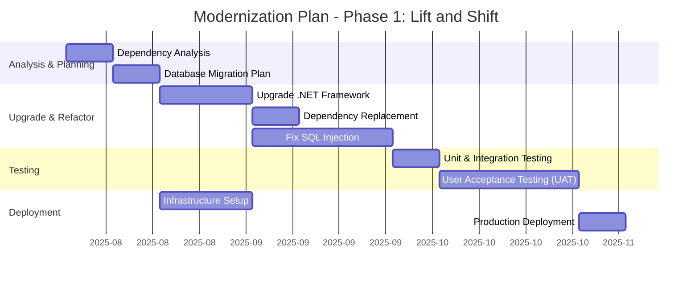

<small>Figure 17 - Gantt chart for the Phase 1 modernization plan.</small>

## 14. Application porfolio management
This section provides an analysis of the application's components and strategic fit within an IT portfolio, using a LeanIX-inspired model.

### 14.1. IT Component types and attributes
The following table maps the application's technologies to standard IT component types.

| IT Component Type | Name | Type | Version(s) | Provider(s) | Support start date | Support end date | Support end date (extended) | Support status |
| :--- | :--- | :--- | :--- | :--- | :--- | :--- | :--- | :--- |
| **Programming Language** | C# | Language | 4.0 | Microsoft | 2010-04-12 | 2022-04-26 | - | ❌ Unsupported |
| **Programming Language** | VB.NET | Language | 10.0 (VS 2010) | Microsoft | 2010-04-12 | 2020-04-14 | 2020-04-14 | ❌ Unsupported |
| **Web Framework** | .NET Framework | Framework | 4.0 | Microsoft | 2010-04-12 | 2022-04-26 | - | ❌ Unsupported |
| **Database** | Microsoft SQL Server | Database | 2008 R2 (Inferred) | Microsoft | 2010-07-20 | 2014-07-08 | 2019-07-09 | ❌ Unsupported |
| **Operating System** | Windows Server | Operating System | 2008 R2 (Assumed) | Microsoft | 2009-10-22 | 2015-01-13 | 2020-01-14 | ❌ Unsupported |
| **Development Tool** | Visual Studio | Development Tool | 2010 | Microsoft | 2010-04-12 | 2015-07-14 | 2020-07-14 | ❌ Unsupported |
| **Business Intelligence Tool** | Crystal Reports | Reporting Tool | 13.0 (for VS 2010) | SAP | ~2010 | ~2016 | - | ❌ Unsupported |

### 14.2. Portfolio strategy
This section provides a strategic evaluation of the application using the TIME and 6R models.

| Model | Classification | Justification |
| :--- | :--- | :--- |
| **TIME Classification** | **Migrate** | The application provides high business value, as it manages a core operational process (document processing). However, its technical quality is very low due to its reliance on unsupported frameworks, potential security vulnerabilities, and monolithic architecture. Therefore, it is a prime candidate for migration and modernization to a more sustainable and secure platform to reduce risk and improve maintainability. |
| **6R Classification** | **Re-platform / Re-architect** | - **Retain/Rehost:** Not a viable long-term strategy due to the unsupported and insecure technology stack. A simple rehost to the cloud (e.g., on IaaS) would not solve the underlying technical debt.   - **Replace:** Replacing with a COTS (Commercial Off-The-Shelf) product could be an option, but it would likely involve high costs and loss of custom business logic.   - **Retire:** Not an option, as the functionality is critical.   - **Recommendation:** The best strategy is a phased approach combining **Re-platforming** (moving to a supported .NET version and SQL Server) in the short term to mitigate immediate risks, followed by a long-term **Re-architecting** (or Refactoring) into a modern, cloud-native application to ensure its future viability and scalability. |

---
This application analysis was performed using Artificial Intelligence (AI). While AI enhances the process, it may still produce inaccuracies, and all results should be carefully reviewed.